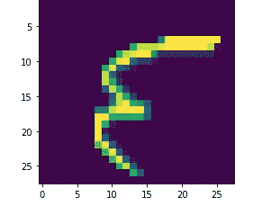
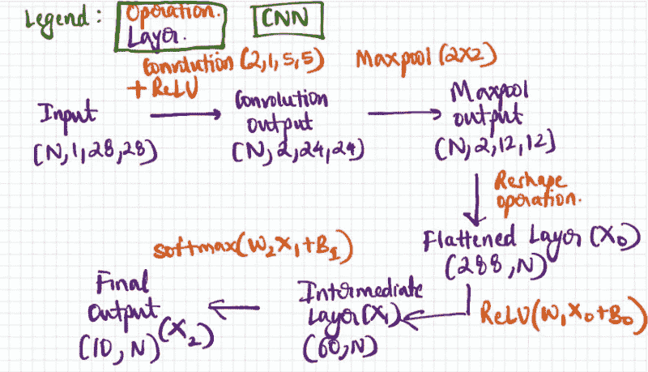

# 使用 NumPy Part V 的简单 CNN(通过最大池层和卷积滤波器的反向传播)

> 原文：<https://medium.com/analytics-vidhya/simple-cnn-using-numpy-part-v-back-propagation-through-max-pool-layer-convolutional-filter-7c434a7addd4?source=collection_archive---------17----------------------->



在之前的博文中，我试图解释以下内容

*   [介绍 CNN 和数据处理](/@PAdhokshaja/simple-cnn-using-numpy-part-i-introduction-data-processing-b6652615604d)
*   [卷积运算](/@PAdhokshaja/simple-cnn-using-numpy-part-ii-convolution-operation-b8c5a02b0844)
*   [ReLU、Maxpooling 和 Softmax](/@PAdhokshaja/simple-cnn-using-numpy-part-iii-relu-max-pooling-softmax-c03a3377eaf2)
*   [通过全连接层的反向传播](/@PAdhokshaja/simple-cnn-using-numpy-part-iv-back-propagation-through-fully-connected-layers-c5035d678307)

在这篇文章中，我将尝试通过最大池和卷积层来介绍反向传播。我们一直在计算梯度，直到第一个完全连接的层。让我们通过下面的手绘图片再次参观这个建筑



CNN 的体系结构

到目前为止，我们已经计算了展平层的梯度。

我们现在需要计算神经网络其余部分的梯度。

# 计算最大池层的坡度

假设第一个完全连接的层是最大池层的整形版本，我们只需要在第一个完全连接的层整形我们的渐变矩阵，回到最大池层的形状。相同的代码片段如下

```
delta_maxpool = delta_0.reshape(X_maxpool.shape)
```

# 计算卷积层的梯度

最大池操作使用固定大小的过滤器来提取与过滤器大小相同的图像区域中的最大像素值。该滤波器使用两个用户定义的参数在图像上移动:步幅和滤波器大小。

为了计算卷积层的梯度，我们需要将每个梯度元素移回卷积层中提取最大像素值的位置。

```
delta_conv = np.zeros(X_conv.shape)
for image in range(len(max_indices)):
     indices = max_indices[image]
     for p in indices:
          delta_conv[image:image+1,p[1],p[2],p[3]] = delta_maxpool[image:image+1,p[5],p[6],p[7]]
delta_conv = np.multiply(delta_conv,dReLU(X_conv))
```

# 计算卷积滤波器的梯度

现在我们已经找到了卷积层的梯度，我们需要计算卷积滤波器的梯度。这将用于优化每个学习步骤中的滤波器。

## 计算误差的简单伪代码

设 ***G*** 为卷积层的梯度矩阵。它的维数为(1，2，24，24)。设 ***I*** 为 shape (1，1，28，28)的输入图像。

1.  对于给定的通道 ***C*** 在 ***G*** 中，挑选一个元素
2.  使用步幅=1 的 5X5 过滤器创建 5X5 的图像输入块 ***I.***
3.  将选择的渐变元素与连续的块相乘，并将它们相加。
4.  连续相加操作后的结果矩阵是与卷积滤波器中的通道***【C】***相关联的梯度。
5.  对*中的其余通道重复步骤 1 至 4*

*上面的伪代码是针对单个图像的，我们需要对整批图像重复这个过程。*

*下面这张来自 [HackMD](https://hackmd.io/@bouteille/ByusmjZc8#III-Backward-propagation) 的 GIF 图更好地解释了这个过程*

**

*通过卷积滤波器反向传播的图解说明*

*假设我们必须通过像素找到卷积滤波器的梯度，这个过程将花费大量的时间和精力。解决这个问题的一个方法是使用 im2col()函数。*

## *快速计算卷积滤波器梯度的伪码*

*设 ***G*** 为卷积运算后该层的梯度矩阵。它的形状是(1，2，24，24)。让卷积滤波器的输入由 ***I*** 定义。它的形状是(1，1，28，28)。*

1.  *将输入图像转换为 im2col 格式；im2col 矩阵是 2D 矩阵，其中每一列是卷积滤波器的单个步长中覆盖的元素的展平向量。*
2.  *将误差矩阵 ***G*** 重塑为 2D 矩阵；每行是每个通道中误差的展平向量。*
3.  *将这两个矩阵相乘，重塑结果。*

*下面的代码片段展示了重塑渐变矩阵的函数*

```
*def error_layer_reshape(error_layer):
    test_array = error_layer
    test_array_new = np.zeros((test_array.shape[1],test_array.shape[0]*test_array.shape[2]*test_array.shape[3]))
    for i in range(test_array_new.shape[0]):
        test_array_new[i:i+1,:] = test_array[:,i:i+1,:,:].ravel()
    return test_array_new*
```

*查找卷积滤波器梯度的代码片段如下*

```
*X_batch_im2col = im2col(X=X_batch,conv1=conv1, stride=1, pad=0)
delta_conv = np.random.rand(10,2,24,24)
delta_conv_reshape = error_layer_reshape(delta_conv)
conv1_delta = (delta_conv_reshape@X_batch_im2col.T).reshape(2,1,5,5)*
```

# *有用的资源*

*   *[快速实现 CNN](https://hackmd.io/@bouteille/B1Cmns09I)*

# *反馈*

*感谢阅读！如果您有任何反馈/建议，请在下面留言/发邮件给我，地址是 padhokshaja@gmail.com*

# *下一篇文章*

*[综合起来](/@PAdhokshaja/simple-cnn-using-part-v-putting-it-all-together-b4210cd14487)*