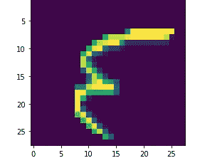

# 简单的 CNN 使用 NumPy 第六部分(把所有的放在一起)

> 原文：<https://medium.com/analytics-vidhya/simple-cnn-using-numpy-part-vi-putting-it-all-together-b4210cd14487?source=collection_archive---------13----------------------->



在之前的帖子中，我们讨论了以下内容

1.  [CNN 简介](/@PAdhokshaja/simple-cnn-using-numpy-part-i-introduction-data-processing-b6652615604d)
2.  [卷积运算](/@PAdhokshaja/simple-cnn-using-numpy-part-ii-convolution-operation-b8c5a02b0844)
3.  [ReLU 功能，最大池功能& Softmax 功能。](/@PAdhokshaja/simple-cnn-using-numpy-part-iii-relu-max-pooling-softmax-c03a3377eaf2)
4.  [通过全连接层的反向传播](/@PAdhokshaja/simple-cnn-using-numpy-part-iv-back-propagation-through-fully-connected-layers-c5035d678307)
5.  [通过卷积输出层、最大池层的反向传播&卷积滤波器](/@PAdhokshaja/simple-cnn-using-numpy-part-v-back-propagation-through-max-pool-layer-convolutional-filter-7c434a7addd4)

# 最终代码

1.  获取培训和测试数据

```
*'''*
*Input functionality*
*'''*

import pandas as pd
import numpy as np
data = pd.read_csv('../input/Kannada-MNIST/train.csv')

data = data.sample(frac=1)
*#print(int(data.shape[0]/2))*

data_first_half = data.head(30000)
data_second_half = data.tail(30000)

*### get 100 data points* 
*### making sure that the data  is balanced*

tmp = pd.DataFrame()
for label **in** range(10):
    if label==0:
        tmp = data_first_half[data_first_half['label']==label].head(600)
    else:
        temp = data_first_half[data_first_half['label']==label].head(600)
        tmp = pd.concat([tmp,temp])
data_balanced = tmp

tmp = pd.DataFrame()
for label **in** range(10):
    if label==0:
        tmp = data_second_half[data_second_half['label']==label].head(100)
    else:
        temp = data_second_half[data_second_half['label']==label].head(100)
        tmp = pd.concat([tmp,temp])
data_test = tmp
```

2.重塑列车和测试

```
*### Convert flattened input train data to image data*
data_balanced = data_balanced.sample(frac=1)
data_array = np.zeros((data_balanced.shape[0],1,28,28))
image_data = np.array(data_balanced.drop('label',axis=1))

for i **in** range(data_balanced.shape[0]):
    single_image = image_data[i,:].reshape(1,-1)
    single_image = single_image.reshape(-1,28)
    data_array[i,0,:,:] = single_image

data_array = data_array/255.

*### Convert flattened input test data to image data*
data_test = data_test.sample(frac=1)
data_test_input = np.zeros((data_test.shape[0],1,28,28))
image_data = np.array(data_test.drop('label',axis=1))

for i **in** range(data_test.shape[0]):
    single_image = image_data[i,:].reshape(1,-1)
    single_image = single_image.reshape(-1,28)
    data_test_input[i,0,:,:] = single_image
data_test_input = data_test_input/255.
```

3.一个热编码标签

```
*### Convert Labels to one hot encoding*

label = data_balanced['label'].tolist()
one_hot_encoding = np.zeros((data_balanced.shape[0],10))
for i **in** range(data_balanced.shape[0]):
    position = label[i]
    one_hot_encoding[i,position] = 1
```

4.Im2col 函数定义

```
def im2col(X,conv1, stride, pad):
    *"""*
 *Transforms our input image into a matrix.*

 *Parameters:*
 *- X: input image.*
 *- HF: filter height.*
 *- WF: filter width.*
 *- stride: stride value.*
 *- pad: padding value.*

 *Returns:*
 *-cols: output matrix.*
 *"""*
    *# Padding*
    X_padded = np.pad(X, ((0,0), (0,0), (pad, pad), (pad, pad)), mode='constant')
    X = X_padded
    new_height = int((X.shape[2]+(2*pad)-(conv1.shape[2]))/stride)+1
    new_width =  int((X.shape[3]+(2*pad)-(conv1.shape[3]))/stride)+1
    im2col_vector = np.zeros((X.shape[1]*conv1.shape[2]*conv1.shape[3],new_width*new_height*X.shape[0]))
    c = 0
    for position **in** range(X.shape[0]):

        image_position = X[position,:,:,:]
        for height **in** range(0,image_position.shape[1],stride):
            image_rectangle = image_position[:,height:height+conv1.shape[2],:]
            if image_rectangle.shape[1]<conv1.shape[2]:
                continue
            else:
                for width **in** range(0,image_rectangle.shape[2],stride):
                    image_square = image_rectangle[:,:,width:width+conv1.shape[3]]
                    if image_square.shape[2]<conv1.shape[3]:
                        continue
                    else:
                        im2col_vector[:,c:c+1]=image_square.reshape(-1,1)
                        c = c+1         

    return(im2col_vector)
```

5.最大池功能

```
def maxpool_multiple(input_image,stride=2):
    input_width = input_image.shape[3]
    input_height = input_image.shape[2]
    filter_width = 2
    filter_height = 2

    output_width = int((input_width-filter_width)/stride)+1
    output_height = int((input_height-filter_height)/stride)+1

    output_image = np.zeros((input_image.shape[0],input_image.shape[1],output_width,output_height))
    for i **in** range(output_image.shape[0]):
        output_image[i:i+1,:,:,:] = maxpool(input_image[i:i+1,:,:,:],stride=2)
    return output_image

def maxpool(input_image,stride=2):
    input_width = input_image.shape[3]
    input_height = input_image.shape[2]
    filter_width = 2
    filter_height = 2
    n_channels = input_image.shape[1]
    num_images = input_image.shape[0] 

    output_width = int((input_width-filter_width)/stride)+1
    output_height = int((input_height-filter_height)/stride)+1
    output = np.zeros((n_channels,output_width*output_height))
    c=0
    for height **in** range(0,input_height,stride):
        if height+filter_height<=input_height:
            image_rectangle = input_image[0,:,height:height+filter_height,:]
            for width **in** range(0,input_width,stride):
                if width+filter_width<=input_width:
                    image_square = image_rectangle[:,:,width:width+filter_width]
                    image_flatten = image_square.reshape(-1,1)
*#                     print(image_flatten)*
*#                     print('----')*
                    output[:,c:c+1] = np.array([float(max(i)) for i **in** np.split(image_flatten,n_channels)]).reshape(-1,1)
                    c+=1

    final_output = np.array(np.hsplit(output,1)).reshape((1,n_channels,output_height,output_width))

    return final_output
```

6.ReLU 函数、Softmax 函数&存储最大池索引的函数

```
def ReLU(x):
    return (x>0)*x def softmax(x):

    x_exp = np.exp(x-np.max(x))

    return x_exp/np.sum(x_exp,axis=0)def dReLU(x):
    return (x>0)*1.0def maxpool_indices(input_image,stride=2,filter_height=2, filter_width=2):
    positional_vector = []

    for channel **in** range(input_image.shape[1]):
        x = -1

        chosen_image_channel = input_image[:,channel,:,:]
        for height **in** range(0,chosen_image_channel.shape[1],stride):
            if height+stride<=chosen_image_channel.shape[1]:
                image_rectangle = chosen_image_channel[:,height:height+filter_height,:]
                x = x+1
                y = -1
                *#print('Value of x:',x)*
                for width **in** range(0,image_rectangle.shape[2],stride):
                    if width+stride<= image_rectangle.shape[2]:
                        y = y+1
                        *#print('Value of y:',y)*
                        image_square = image_rectangle[:,:,width:width+filter_width]

                        a,b,c = np.unravel_index(image_square.argmax(),image_square.shape)

                        positional_vector.append([0,channel,int(b)+height,int(c)+width,0,channel,x,y])
    return positional_vector

def maxpool_indices_multiple(input_image,stride=2,filter_height=2, filter_width=2):
    positional_vector =[]
    for i **in** range(input_image.shape[0]):
        positional_vector.append(maxpool_indices(input_image[i:i+1,:,:,:],stride=2,filter_height=2,filter_width=2))
    return positional_vector 
```

7.为反向传播重塑误差层

```
def error_layer_reshape(error_layer):
    test_array = error_layer
    test_array_new = np.zeros((test_array.shape[1],test_array.shape[0]*test_array.shape[2]*test_array.shape[3]))
    for i **in** range(test_array_new.shape[0]):
        test_array_new[i:i+1,:] = test_array[:,i:i+1,:,:].ravel()
    return test_array_new
```

8.培训和测试

```
*'''Simple Architecture for Digit Recognition*

*1) (1,1,28,28)*
*2) Convolution filter (2,1,5,5)*
*3) (Max Pool 2x2)*
*4) Fc layer (1,288)*
*5)Second FC (1,60)*
*6) Output Layer(1,10)*

*'''*

epochs = 50
batch_size = 128
batches = int(data_array.shape[0]/batch_size)

conv1 = np.random.randn(2,1,5,5)*np.sqrt(1./5.)
W1 = np.random.rand(60,288)/np.sqrt(288)
B0 = np.zeros((60,1))/np.sqrt(288)
W2 = np.random.rand(10,60)/np.sqrt(60)
B1 = np.zeros((10,1))/np.sqrt(60)
learning_rate = 0.001
*## Implementing Adam Optimizer*

beta1 = 0.9
beta2 = 0.995
momentum_w1 = 0
momentum_w2 = 0
momentum_b0 = 0
momentum_b1 = 0
momentum_conv1 = 0
velocity_w1 = 0
velocity_w2 = 0
velocity_b0 = 0
velocity_b1 = 0
velocity_conv1 = 0
for epoch_num **in** range(epochs):

    *'''*
 *Choose chunks of data based on batch size* 
 *'''*
    i = 0
    permutation = np.random.permutation(data_array.shape[0])
    data_array_train = data_array[permutation,:,:,:]
    one_hot_encoding_train = one_hot_encoding[permutation,:]
    for i **in** range(batches):
        start = i*batch_size
        end = min(start+batch_size,data_array.shape[0]-1)
        X_batch = data_array_train[start:end,:,:,:]
        y_batch = one_hot_encoding_train[start:end,:].T
        *### First Convolutional Layer*
        *#X_conv = conv2dim2col_multiple(input_image=X_batch,conv_filter=conv1,stride=1)*
        X_im2col = im2col(X=X_batch,conv1=conv1,stride=1,pad=0)
        conv1_reshaped = conv1.reshape(conv1.shape[0],-1)
        X_conv = conv1_reshaped@X_im2col
        X_conv = np.array(np.hsplit(X_conv,X_batch.shape[0])).reshape((X_batch.shape[0],conv1.shape[0],24,24))

        *### Pass through ReLU*

        X_relu = ReLU(X_conv)

        *### Pass Through Max Pool*

        X_maxpool = maxpool_multiple(X_relu,stride=2)

        *### Get the indices of maxpool*

        max_indices = maxpool_indices_multiple(X_relu,stride=2,filter_height=2, filter_width=2)

        *### Flatten the maxpool output*
        input_shape = X_maxpool.shape[0]
        num_channels = X_maxpool.shape[1]
        input_width = X_maxpool.shape[2]
        input_height = X_maxpool.shape[3]
        X_maxpool_flatten= np.zeros((input_width*input_height*num_channels,input_shape))
        for image **in** range(input_shape):
            X_maxpool_flatten[:,image:image+1] = X_maxpool[image:image+1,:,:,:].ravel().reshape(-1,1)

        *### Getting into fully connected layers*
        fc1 = ReLU(W1@X_maxpool_flatten+B0)
        final_fc = softmax(W2@fc1+B1)
*#         print('Sum of Final FC')*
*#         print(np.sum(final_fc))*
*#         print(final_fc)*
*#         break*
*#         print('Loss:')*
*#         print(cross_entropy(y=y_batch,y_hat=final_fc))*

        *### Calculating Loss Through Backprop*

        delta_2 = (final_fc-y_batch)
        delta_1 = np.multiply(W2.T@delta_2,dReLU(W1@X_maxpool_flatten+B0))
        delta_0 = np.multiply(W1.T@delta_1,1.0)

        dW1 = delta_1@X_maxpool_flatten.T
        dW2 = delta_2@fc1.T
        dB0 = np.sum(delta_1,axis=1,keepdims=True)
        dB1 = np.sum(delta_2,axis=1,keepdims=True)
*#         print('Delta 2')*
*#         print(delta_2)*

        *### Calculating Error for Last Layer before flattening*

        delta_maxpool = delta_0.reshape(X_maxpool.shape)

        *### Calculating Error for previous convolutional layer*

        delta_conv = np.zeros(X_conv.shape)
        for image **in** range(len(max_indices)):
            indices = max_indices[image]
            for p **in** indices:
                delta_conv[image:image+1,p[1],p[2],p[3]] = delta_maxpool[image:image+1,p[5],p[6],p[7]]
        delta_conv = np.multiply(delta_conv,dReLU(X_conv))

        *### using Im2col*
        X_batch_im2col = im2col(X=X_batch,conv1=conv1, stride=1, pad=0)
        delta_conv_reshape = error_layer_reshape(delta_conv)
        conv1_delta = (delta_conv_reshape@X_batch_im2col.T).reshape(2,1,5,5)

        momentum_w1 = beta1*momentum_w1 + ((1-beta1)*dW1)
        momentum_w2 = beta1*momentum_w2 + ((1-beta1)*dW2)
        momentum_b0 = beta1*momentum_b0 + ((1-beta1)*dB0)
        momentum_b1 = beta1*momentum_b1 + ((1-beta1)*dB1)
        momentum_conv1 = beta1*momentum_conv1 + ((1-beta1)*conv1_delta)
        velocity_w1 = beta2*velocity_w1 + ((1-beta2)*dW1**2)
        velocity_w2 = beta2*velocity_w2 + ((1-beta2)*dW2**2)
        velocity_b0 = beta2*velocity_b0 + ((1-beta2)*dB0**2)
        velocity_b1 = beta2*velocity_b1 + ((1-beta2)*dB1**2)
        velocity_conv1 = beta2*velocity_conv1 + ((1-beta2)*conv1_delta**2)

        *#conv1_delta = conv_filter_error_multiple(input_image=X_batch,error_layer=delta_conv,conv_filter=conv1,stride=1)*
        *#print('conv1 delta done')*
        *## Update Weights*
        conv1 = conv1 - learning_rate * momentum_conv1/np.sqrt(velocity_conv1+0.0000001)
        W1 = W1 - learning_rate*momentum_w1/np.sqrt(velocity_w1+0.0000001)
        W2 = W2 - learning_rate*momentum_w2/np.sqrt(velocity_w2+0.0000001)
        B0 = B0 - learning_rate*momentum_b0/np.sqrt(velocity_b0+0.0000001)
        B1 = B1 - learning_rate*momentum_b1/np.sqrt(velocity_b1+0.0000001)
        *#print('Back Prop Done!')*
        *#i+=1*

    X = data_array
    y = one_hot_encoding.T
    X_im2col = im2col(X=X,conv1=conv1,stride=1,pad=0)
    conv1_reshaped = conv1.reshape(conv1.shape[0],-1)
    X_conv = conv1_reshaped@X_im2col
    X_conv = np.array(np.hsplit(X_conv,X.shape[0])).reshape((X.shape[0],conv1.shape[0],24,24))

    *### Pass through ReLU*

    X_relu = ReLU(X_conv)

    *### Pass Through Max Pool*

    X_maxpool = maxpool_multiple(X_relu,stride=2)
    input_shape = X_maxpool.shape[0]
    num_channels = X_maxpool.shape[1]
    input_width = X_maxpool.shape[2]
    input_height = X_maxpool.shape[3]
    X_maxpool_flatten= np.zeros((input_width*input_height*num_channels,input_shape))
    for image **in** range(input_shape):
        X_maxpool_flatten[:,image:image+1] = X_maxpool[image:image+1,:,:,:].reshape(-1,1)  
    *### Getting into fully connected layers*
    fc1 = ReLU(W1@X_maxpool_flatten+B0)
    final_fc = softmax(W2@fc1+B1)

    *#### Test Data*
    X = data_test_input
    *#y = one_hot_encoding.T*
    X_im2col = im2col(X=X,conv1=conv1,stride=1,pad=0)
    conv1_reshaped = conv1.reshape(conv1.shape[0],-1)
    X_conv = conv1_reshaped@X_im2col
    X_conv = np.array(np.hsplit(X_conv,X.shape[0])).reshape((X.shape[0],conv1.shape[0],24,24))

    *### Pass through ReLU*

    X_relu = ReLU(X_conv)

    *### Pass Through Max Pool*

    X_maxpool = maxpool_multiple(X_relu,stride=2)
    input_shape = X_maxpool.shape[0]
    num_channels = X_maxpool.shape[1]
    input_width = X_maxpool.shape[2]
    input_height = X_maxpool.shape[3]
    X_maxpool_flatten= np.zeros((input_width*input_height*num_channels,input_shape))
    for image **in** range(input_shape):
        X_maxpool_flatten[:,image:image+1] = X_maxpool[image:image+1,:,:,:].reshape(-1,1)  
    *### Getting into fully connected layers*
    fc1 = ReLU(W1@X_maxpool_flatten+B0)
    final_fc_test = softmax(W2@fc1+B1)

    if epoch_num % 5  == 0:
        *### Getting accuracy*
        print('Epoch :', epoch_num)
        labels_predict = np.argmax(final_fc,axis=0)
        labels_df  = data_balanced[['label']]
        labels_predict = labels_predict.tolist()
        labels_predict = [int(value) for value **in** labels_predict]
        *#labels_df.loc[:,'label_predict'] = labels_predict*
        labels_df.insert(1,'label_predict',labels_predict)
        accuracy = np.sum(labels_df['label']==labels_df['label_predict'])/labels_df.shape[0]
        print('Train Accuracy')
        print(round(accuracy*100,2),"%")

        *### Test Accuracy*

        labels_predict = np.argmax(final_fc_test,axis=0)
        labels_df  = data_test[['label']]
        labels_predict = labels_predict.tolist()
        labels_predict = [int(value) for value **in** labels_predict]
        labels_df.insert(1,'label_predict',labels_predict)
        *#labels_df.loc[:,'label_predict'] = labels_predict*
        accuracy = np.sum(labels_df['label']==labels_df['label_predict'])/labels_df.shape[0]
        print('Test Accuracy')
        print(round(accuracy*100,2),"%")
        print('-------------------------')

*#       print(cross_entropy(y=y,y_hat=final_fc))*

print('Done!')
```

9.输出


测试和训练精度

# 结果

达到了 99%的训练精度和 95%的测试精度。代码可以在这里找到[。](https://www.kaggle.com/adhok93/cnn-using-numpy-new-version)