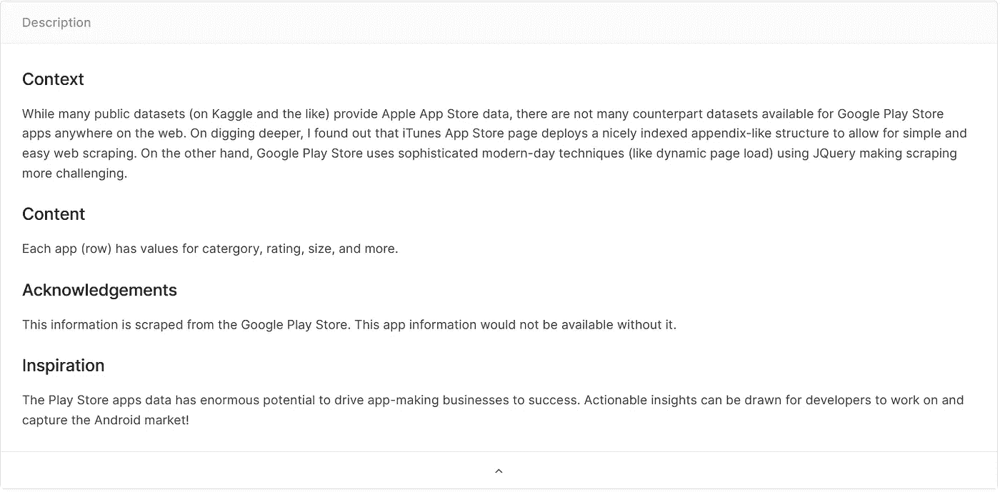
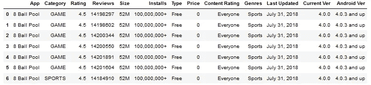
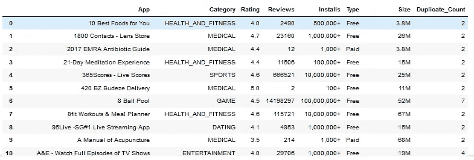
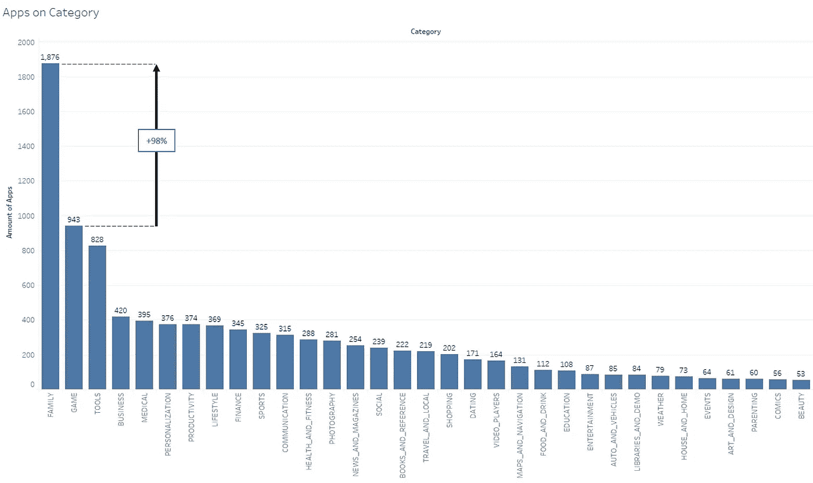
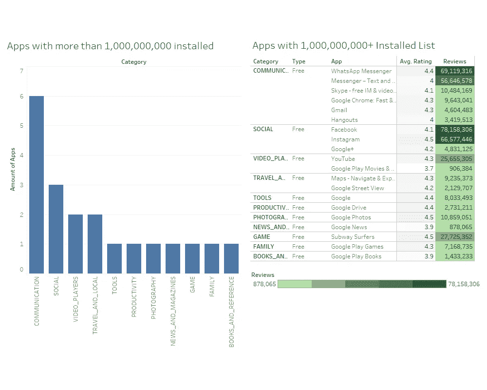
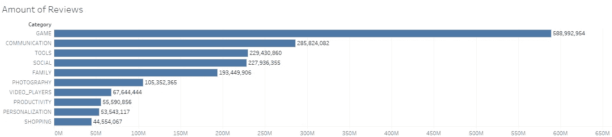
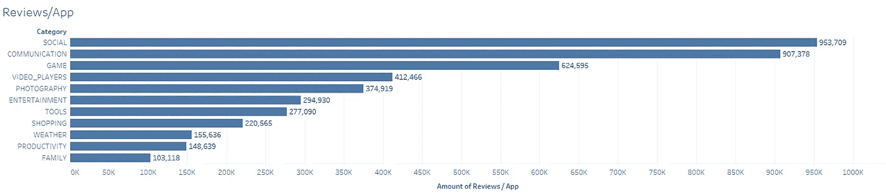
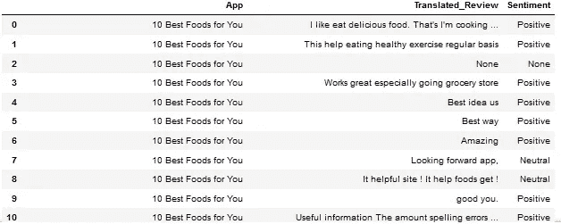
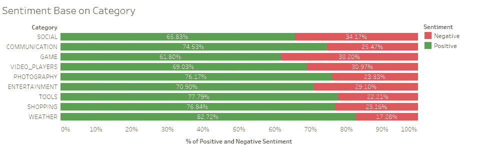
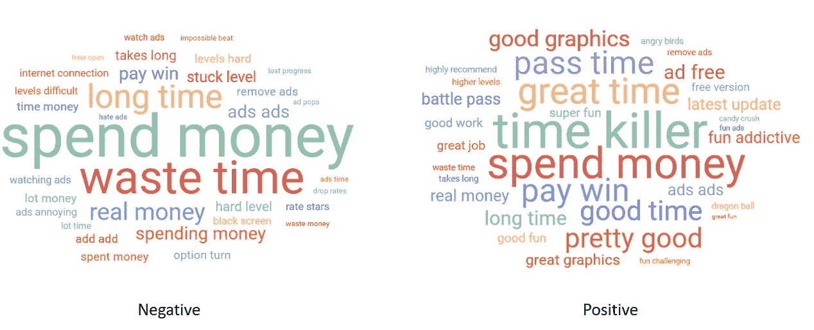

# 谷歌 Play 商店 App 上的简单数据分析

> 原文：<https://medium.com/analytics-vidhya/simple-data-analysis-on-google-play-store-app-8a1bad3da1ee?source=collection_archive---------4----------------------->

嗨！好吧，这是我的第一个中帖。在这篇文章中，我想分享我在数据分析方面的经验，这对于从原始数据集中提取洞察力很有用。这个分析是我的学习项目之一，因为我想提高我的分析技能。为了这个项目，我使用了一些工具和编程语言，如 python、SQL、Tableau、Orange 和 infogram.com(word cloud)。

[照片来源](https://developer.android.com/distribute/marketing-tools/brand-guidelines)

# 数据源详细信息

我们可以在这里找到数据来源和细节。数据集由两个表组成。第一个表名为“googleplaystore.csv ”,由 13 列组成(应用程序、类别、评级、评论、大小、安装、类型、价格、内容评级、流派)。同时，名为“Google playstore _ user _ reviews . CSV”的第二个表由 5 列组成(app、翻译评论、情感、情感极性、情感主观性)。

数据源描述

在本文中，我们将关注基于应用程序类别的见解。

# 预处理数据

获得数据集后，必须完成的下一步是预处理文本。预处理文本的目的是将原始数据整理成可供使用的分类数据。数据预处理过程可以包括许多事情，改变列中的数据类型、改变或操作空列、删除具有重复内容的数据等等。

在“googleplaystore1.csv”数据中，发现有几行有多个应用程序名称。关于使用哪些数据的决定可以咨询收集数据集的人。在类似下面的“8 球池”的情况下，我们将通过获取最高数量的评论来将每个应用程序放入一行。

8 个球池重复行

我们还可以提前确保哪些应用程序包含具有相同应用程序名称的行，并计算总重复数。从下面的数据中，总共获得了 1182 个重复行。

每个应用程序的重复计数

在清除 1182 个重复行之后，我们可以检查删除重复行的过程是否成功。

检查重复行

在确保没有重复的行之后，我们必须重新检查我们拥有的数据是否可以可视化。在此分析中，我们将只使用应用程序、类别、评级、评论、安装和类型列。在重新检查我们拥有的数据后，发现有一行显示的值与该列不匹配，因此我们需要做的是删除该行。

奇怪的价值观

这个预处理阶段也适用于清理“Google playstore _ user _ reviews . CSV”文件中的数据。在对数据进行预处理后,“googleplaystore1.csv”发现该文件包含 9，659 行，6 列(应用程序、类别、评级、评论、安装、类型)。同时，标题为“Google play store _ user _ reviews . CSV”的第二个文件包含 30，626 行和 5 列(App、翻译的评论、情感、情感极性、情感主题)。

# 调查的结果

发现家庭是申请数量最多的类别。家庭类别的应用数量甚至比第二高的类别(即游戏)多 98%。应用数量最多的三个类别是家庭、游戏和工具。

基于类别的应用数量

从 installes 列中，我们可以取值 1，000，000，000+来查看哪些应用程序安装得最多。在已安装的 100000000+中包含的 20 个应用程序中，所有的应用程序都是免费的，通信类应用程序产生的应用程序数量最多。还可以看到，在 20 个应用中，谷歌生产的应用占据了商店的主导地位。

安装了超过 10 亿个应用程序

当我们查看评论数量时，游戏是评论最多的类别，有 588，992，954 条评论。游戏类别获得最多评论的原因之一可能是因为应用程序种类繁多。如果我们回头看按类别排序的应用总数，游戏排在家庭之后，位居第二。如果我们将应用的评论数量进行划分，就可以证明这一点。

可以看出，社交和交流类超过了游戏类的评论/app 数量。这证明，相比其他类别，用户倾向于对社交和通信类别的应用给予更多评论。

我们还可以看到，虽然家庭类别的应用程序数量最多，但就评论/应用程序而言，只有大约 103，118 个，与其他类别相比非常少。

评论数量

评论/应用数量

从数据‘Google playstore _ user _ reviews . CSV’中，我们可以从每个应用的评论结果中获取情绪。因为我们侧重于类别，所以我们可以将评论数据与' googleplaystore.csv '文件结合起来，以获得每个应用程序的类别。

应用程序、评论和情感专栏示例

我们可以通过将每个应用中的正面和负面情绪的数量累加到类别中，来比较每个类别的正面和负面情绪。负面情绪比例最高的是游戏类，为 38.20%。

对类别的积极情绪与消极情绪

我们可以使用 wordcloud，根据评论的情绪，找出哪些词经常出现在评论中。我们将为游戏类别创建一个词云，因为游戏类别的负面情绪数量占最大比例。

使用 wordcloud，我们可以在消极和积极情绪中找到相同的关键词，如“花钱”、“真钱”和“付钱赢”。甚至两种情绪包含相同的关键字，但是上下文本身可能不同。

从 wordcloud 可以看出，负面情绪包括对时间(加载时间、浪费时间、花费很长时间)、广告(烦人的广告、广告时间太长、广告太多)、金钱(不值得支付、为赢得游戏而支付)和游戏本身(真的很难、卡在水平上等)的抱怨。

与此同时，积极的情绪包括许多赞美(好，时间杀手，伟大，有趣，上瘾等)和游戏本身(良好的图形，挑战)。

评论 wordcloud 的正面和负面情绪(游戏)

# 结论:

1.  类别中应用数量最多的是家庭，其次是游戏和工具。
2.  有 20 个应用程序的安装次数超过 10 亿次(最高值)，其中 6 个属于通信类别。
3.  游戏类别获得了最高的总评论量，但社交获得了最高的评论/应用量。这意味着与其他类别相比，用户可能会查看社交应用。
4.  即使是最高量的应用程序也是家庭类的，但该应用程序获得的评论非常少。
5.  负面情绪比例最高的是游戏类别。
6.  关于游戏类别的负面情绪包括对时间、广告、金钱和游戏糟糕表现的抱怨。
7.  关于游戏类别的积极情绪包括许多赞美和游戏的良好表现。

我很乐意讨论和接受任何关于分析的建议，因为我还在学习，还有很长的路要走，请通过[https://www.linkedin.com/in/muhammad-kemal-hernandi/](https://www.linkedin.com/in/muhammad-kemal-hernandi/)联系我。非常感谢你！！！