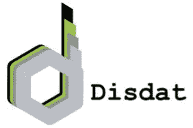
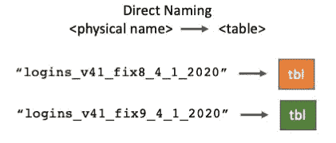
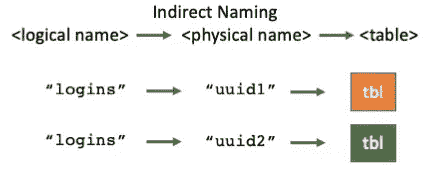
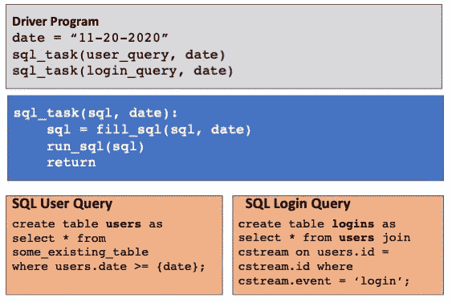
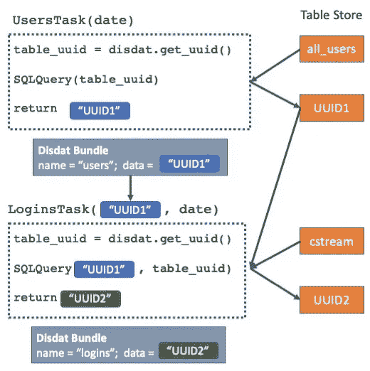

# 带有 Disdat 的 ML 的简单数据(基础)版本控制

> 原文：<https://medium.com/analytics-vidhya/simple-database-versioning-for-ml-with-disdat-aa5e42af1ab9?source=collection_archive---------6----------------------->



本文描述了如何构建对数据库工件进行版本控制的 ML 管道。数据科学家和 ML 工程师在模型开发期间创建数据工件，包括清理的数据、特征、训练数据和模型评估结果。随着数据科学家探索特征、模型类型和超参数，这一过程会不断重复。与此同时，上游数据不断变化，导致数据工件(文件和表格)激增，这些数据工件通常使用手动的特别方法进行管理。

例如，考虑一个数据科学团队与存储点击流、事实表和下游分析师表的数据库进行交互。通常每个团队都以定制的方式为每个项目管理这种复杂性。派生表在对象存储和数据库中有它们自己的特定于项目的命名法，比如`logins_v41_fix8_4_1_2020`。

这导致:

*   维护定制逻辑以编码系统如何产生数据，例如上游数据源、参数和表名中的修正。
*   数据共享困难。查找、共享和理解数据需要下游团队和系统坚持每个项目的命名选择。
*   悬空数据。很难在整个数据湖或数据库中确定可删除的数据，以降低成本或适应数据隐私法规。

本文向您展示了如何使用 [Disdat](https://disdat.gitbook.io) ML 管道来:

*   使用名称间接的版本数据库表，允许消费者通过搜索像`logins`这样的逻辑实体来找到最新的表。
*   自动使用和生成版本化的表，而不必担心破坏先前的结果或踩到已部署的数据工件。
*   启用简单的数据保留策略。

## **分离和间接命名**

Disdat 是一个[开源数据版本控制系统](https://github.com/kyocum/disdat)，有三个关键组件:一个用于管理和版本控制数据的 Python API、Spotify 的 Luigi 管道系统和一个 CLI。Disdat 以*包、*命名的用户数据集合的粒度发布数据。束元数据捕获代码如何创建每个束(代码+参数+输入数据)。Disdat 管理*数据上下文*中的包，这些包可能是本地的，也可能附加到 S3 的远程设备上。Disdat 为执行版本化数据科学提供了许多工具；更多关于 Disdat 的细节可以在[这里](https://disdat.gitbook.io)找到。

在 ML 管道中，每个任务可以消耗和产生数据表。通常，任务将确定每个表的名称，例如`logins`。但是，如果我们重新运行相同的任务，我们有三个选择:a .)更新现有的表，b .)用相同的名称重新创建一个表，或者 c .)创建一个新表。本文关注于*批处理，*非追加转换，(尽管我们将在下面对选项 A 进行评论)，所以我们只能选择选项 B 或 c。如果我们选择 B，那么先前的版本将会丢失。如果我们选择 C，那么我们必须有一个命名方案、一种交流名称的方式和一种清理旧表的方法。

Disdat 的*命名间接*使用户既能保留他们数据的先前版本，又能很容易地找到最新的表。我们先来看一个直接命名的例子。



通过直接命名，数据科学家/ ML 工程师在 ML 管道中为表指定自定义名称。

在这里，用户使用自定义名称创建和读取表格。每个新版本都需要一个新的物理表名，每个下游消费者都必须知道新版本何时存在以及名称如何演变。



使用间接方式，ML 管道为每个新版本注册一个逻辑名。

通过允许使用*逻辑*名称，间接命名简化了创建者(ML 管道)和消费者(其他管道或用户)的过程。版本化实体只有一个逻辑名称，并且目录服务(即 Disdat)维护逻辑名称和 uuid 之间的关联。
现在创造和消费变成了:

```
create table `register(“logins”)`
select * from `get("logins")`
```

表编写器向命名目录服务(即 Disdat)注册人类可读的名称“logins ”,后者返回一个惟一的 ID (uuid)。然后，表读取器查询目录以发现最新版本的“登录”注意，这种方法也适用于文件和流。

## **示例:一个简单的基于 SQL 的 ML 管道**

下面是双任务管道的伪代码，其中每个任务创建一个表。第一个任务在现有的表中查询`date`之后的用户。第二个将该表与点击流数据中的登录事件关联起来。



为了避免作为方法调用序列重新运行所有任务，我们可以使用许多可用的工作流/流水线系统中的一个(例如 Luigi、Airflow、Kubeflow 等)在 DAG 中编码依赖性。).但是仍然存在许多问题:

*   多个开发人员必须通过调整表名来隔离他们的工作，以避免冲突。
*   类似地，部署的管道必须使用新的表名，以避免与 dev 或 test 冲突。
*   没有办法知道是哪个版本的代码创建了这些表。
*   如果我们从这些表中训练 ML 模型，就不可能“回滚”到先前的训练数据(或特征)，也不可能判断当前的表是否用于训练被检查的模型。

为了解决这些问题，我们使用 Disdat-Luigi 编写了简单的管道。一般模式是:

*   每个 Disdat-Luigi 任务都生成一个带有物理名称表，并返回物理名称作为输出。
*   Disdat-Luigi 在每个任务运行后创建一个包，用这个物理名称作为它的数据。
*   后续任务使用上游任务的包来获取物理表名，以参数化 SQL 语句。



利用 Disdat 进行名称间接寻址的两个任务的伪代码。注意，Disdat-Luigi 在任务完成时自动创建灰色 Disdat 包，并自动读取上游包以找到下游任务的输入。

## 示例:转换为管道任务

我们将上面的伪代码翻译成下面的实际 Disdat-Luigi PipeTasks。

```
**class UsersTask(disdat.PipeTask):** sql_string = “create table {dst} as select * from users where users.date >= {date}”
  date = luigi.DateParameter()

  **def pipe_run(self):**
    dst = f”users_{self.get_hframe_uuid()}”
    run_sql(self.sql_string.format(dst=dst, date=self.date))
    return dst
```

```
**class LoginsTask(disdat.PipeTask):** sql_string = “create table {dst} as select * from {src} join cstream on {src}.id = cstream.id where cstream.event='login'”
  date = luigi.DateParameter() **def pipe_requires(self):**
    self.set_bundle_name("logins")
    self.add_dependency(‘phys_table’, UsersTask, params={‘date’: self.date})

  **def pipe_run(self, phys_table):**
    dst = f”logins_{self.get_hframe_uuid()}”
    run_sql(self.sql_string.format(src=phys_table, dst=dst))
    return dst
```

我们仅通过`date`参数来参数化第一个任务。它通过`self.get_hframe_uuid()`调用创建物理输出表名，在 SQL 调用中使用它，然后将其作为输出返回。第二个任务使用`pipe_requires()`方法中的`self.add_dependency`语句将第一个任务添加为上游依赖项。当 Disdat-Luigi 运行 **LoginsTask** 时，它从 Disdat 中找到前一个任务的输出包，并将其数据放入`phys_table`参数中。现在，任务可以使用物理表名参数化它们的 SQL 语句，瞧！您有一个通过数据库生成版本化数据的 ML 管道。

现在，每次管道运行时(注意`date`参数)，它将根据需要创建每个表的新版本。我们利用了每个 Disdat-Luigi 任务为每个任务执行创建一个单一的、惟一的、不可变的包的事实。我们只是重复使用该包的 UUID 来命名任务的物理表。如果一个任务希望增量添加到现有的表中，它可以使用 UUID 来标记每个新行，保持表名不变。下面是我们如何从 CLI 运行它(假设模块 sql_tasks.py 包含上述代码):

```
$dsdt apply sql_tasks.LoginsTask --date 2020-12-4
```

在幕后，Disdat-Luigi 添加元数据，包括 git 存储库、文件、提交、日期和执行时间。并且使用 Disdat 的 Python API 可以轻松获取最新的`logins`表:

```
import disdat.api as apiapi.pull("sql-data-context")
b = api.get("logins")
print(f"The most recent table is located here: {b.data}")
```

## **清理**

最后，虽然存储很便宜，但限制版本的蔓延也很重要。为此，我们使用 Disdat 的元数据来查找可删除的表。我们可以将此编码为另一个 Disdat-Luig 任务，如果有多于`last_m_copies`且早于`threshold_n_days`的表，则丢弃这些表。由于这也是一个 Disdat-Luigi 任务，因此可以将其添加到原始管道的末尾，或者单独运行。

如果你已经走到这一步，恭喜你！Disdat 还有许多其他功能来支持版本化数据科学。这篇文章介绍了 Disdat 稍微高级一点的用法(使用 UUID 包对非文件数据进行版本控制)。我很快会发布更多的“介绍”故事。代码可以在 [github](https://github.com/kyocum/disdat) 上获得，包括一些[的例子](https://github.com/seanr15/disdat-examples)。文档，包括那些例子和与其他数据版本系统的比较，可以作为 [gitbook](https://disdat.gitbook.io) 获得。