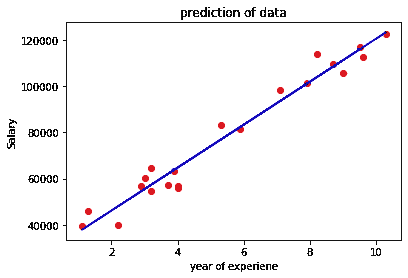
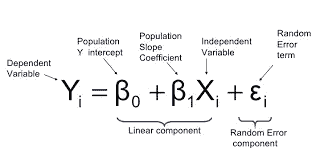
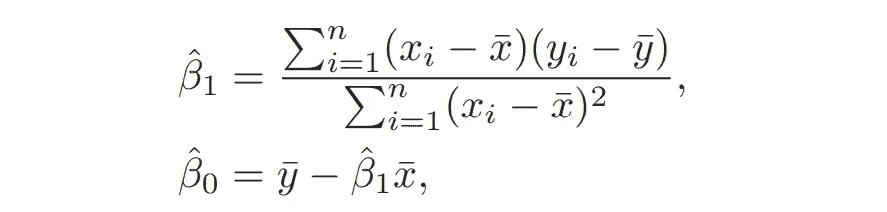
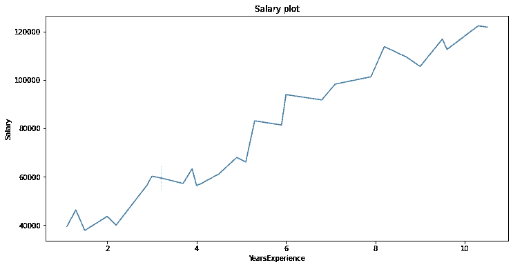
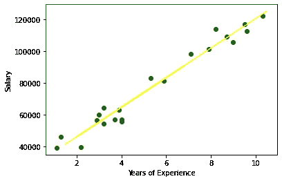

# 线性回归

> 原文：<https://medium.com/analytics-vidhya/simple-linear-regression-4f55f9bdb987?source=collection_archive---------14----------------------->

## 简单线性回归

## 线性回归背后的统计学

害怕数学和统计的人。不要再这样了，因为我太害怕它了，但是当我发现它背后的数学，每个计算都是由软件包和模块完成的，为什么要承受这种压力。线性回归模型背后有简单的数学原理
我们都知道上学时遇到的斜率截距公式。

## 我们今天学了什么？？

1.  线性回归简介
2.  线性回归方程
3.  数据的特征
4.  斜率和截距
5.  带有数据集的 ML 模型

## 线性回归方程:

```
**y = mx + c ** -->(1)
```

根据上面的等式。y 是因变量。x 值的任何变化都会导致 y 变量的变化。所以，艾尔莎证实了‘y’是从属的，而‘x’是独立的。

我们来看一个小情节来理解回归。



线性回归拟合。

其中 m 是斜率，c 是截距。

## 数据的特征:

特征可以是用于分析的属性、变量、数字或可测量的分类数据，例如年龄、姓名等。

我们获得了多个数据点和特征。我们所需要做的只是绘制 x 和 y 之间的数据。根据上面的公式，我们从提供的 x 值、斜率和截距来预测“y”。

艾尔莎正努力让你明白这一点。她用知识的结合让事情变得简单


到现在为止，您可能已经理解了线性回归是一种使用独立变量对目标进行建模的方法。这是一个直线拟合。
这里我们的主要目的是拟合斜率和截距的最佳值，以获得理想的最小误差直线拟合图。

现在让我们将公式改写如下



**线性回归方程**

## 斜率和截距:

**其中截距和斜率值可通过以下等式获得。**



**计算回归模型所需的值**

这里，X 的平均值是 X，y 的平均值是 y。我们计算 X[I]项和 X 的平均值的差，对于 y 也是如此，并将它们呈现在上面的公式中，以获得斜率和截距项。

**让我们从方程式中得到“不给糖就捣蛋”的游戏，并建立一个模型。**

## 带数据集的 ML 模型:

**将 Salary_data.csv 文件作为数据集示例**

```
Salary_data.csv
YearsExperience,Salary
1.1,39343.00
1.3,46205.00
1.5,37731.00
2.0,43525.00
2.2,39891.00
2.9,56642.00
3.0,60150.00
3.2,54445.00
3.2,64445.00
3.7,57189.00
3.9,63218.00
4.0,55794.00
4.0,56957.00
4.1,57081.00
4.5,61111.00
4.9,67938.00
5.1,66029.00
5.3,83088.00
5.9,81363.00
6.0,93940.00
6.8,91738.00
7.1,98273.00
7.9,101302.00
8.2,113812.00
8.7,109431.00
9.0,105582.00
9.5,116969.00
9.6,112635.00
10.3,122391.00
10.5,121872.00
```

**数据集描述:**

这个特定的数据集包含 30 行和 2 列，其中一列是从属的，另一列是独立的。我猜工资是因变量。猜猜这是什么？

我的猜测怎么是正确的？？我没猜错，众所周知，当我们工作了很长一段时间，或者有了足够的经验或技能而得到提升时，工资就会增加。这仅仅是常识。

我们已经准备好了数据集。让我们来了解一下适合我们模型的包

这些 python 包可以帮助我们做数学

## 1.使用的库:

**让我简单列举一下:**

1.  **numpy-** numpy 是一个用于计算数字数据的 python。
2.  **pandas-** pandas 用于数据操作、数据帧和创建虚拟值
3.  matplotlib- 用于数据可视化的最佳和最强大的库
4.  **seaborn-** 用于数据可视化的 Python 库
5.  **scikit learn-** 用于构建机器学习模型的库

让我们根据需求编写代码

**2。使用导入功能导入库:**

```
import numpy as np 
import pandas as pd 
import matplotlib.pyplot as plt 
from sklearn.model_selection import train_test_split
from sklearn.preprocessing import StandardScaler 
from sklearn.linear_model import LinearRegression
from sklearn import metrics
```

**3。从数据集 salary_data.csv 中读取数据**

```
df =pd.read_csv(“salary_data.csv”) 
#if data is in the same directory as notebook we are executing code
                         or
df = pd.read_csv('desktop/maa/ml_proj/salary_data.csv') 
```

**4。使用 pandas** 检查数据中的任何空值

```
df.isnull().sum()
---------------------
#we get this as solution if no missing values
YearsExperience    0
Salary             0
dtype: int64
```

**5。绘制数据，了解 X 和 y 的关系**

```
p = sns.color_palette("ch:s=.25,rot=-.25", as_cmap=True)
plt.figure(figsize=(12,6))
plt.title("Salary plot")
sns.lineplot(data=df,x=df.YearsExperience,y=df.Salary,palette=p)
```



**工作年限和工资的关系**

**5。指定 X 和 y 值**

```
X = df.iloc[:,:-1] # this means all the rows excluding last column 
y = df.iloc[:,1]   # this means all the rows and first column 
```

**train_test_split** 其实就是把数据分成 2 类。训练数据用于训练数据以建立模型，测试数据用于测试数据以检查我们的模型是否有效。

```
X_train,X_test, y_train, y_test = train_test_split(X,y,          test_size=0.3, random_state= 40 )
```

**标准缩放器**是一种缩小特征的特征缩放技术。这里我们的特色是多年的经验。为了避免模型中的错误。

标准定标器是如何工作的？

标准缩放器缩放数据。这里 x(i)std 是第 I 个样本数据的标准差，`μ,σ`是 x 列的均值和标准差。

```
x(i)std =  ( x(i)- μx)/(σx )
```

6。拟合和转换数据:

```
sc = StandardScaler()
X_train_sc = sc.fit_transform(X_train)
X_test_sc = sc.fit_transform(X_test)
y_train_sc = sc.fit_transform(y_train)
```

**7。拟合线性模型并预测 y_test:**

```
lr = LinearRegression()
lr.fit(X_train_sc,y_train_sc)
pred = lr.predict(X_test_sc)
```

**8。指标:**

```
print(metrics.mean_squared_error(y_test,pred))
print(metrics.mean_absolute_error(y_test,pred))
print(np.sqrt(metrics.mean_squared_error(y_test,pred)))
-----------------------------------------------
#we get the following result 
44024061.33808141 
5822.332723050979 
6635.063024424215
```



**图形**

我希望这给了你足够的信息…..

谢谢大家！！！

快乐学习