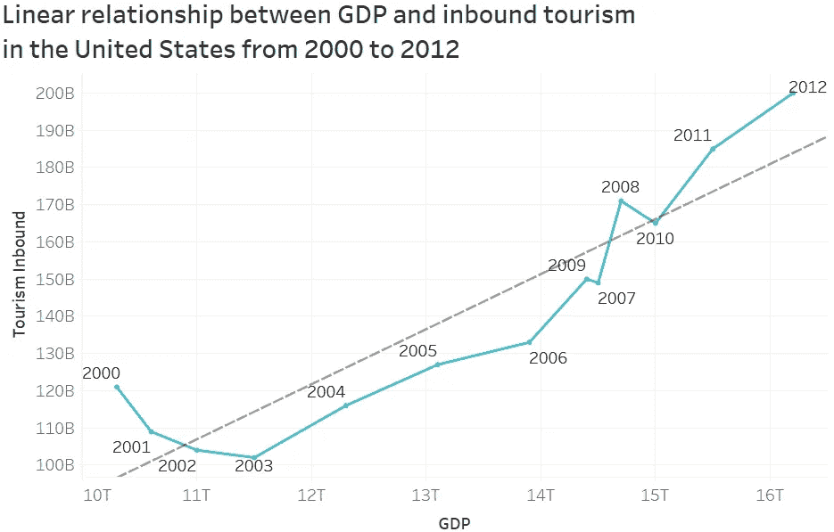
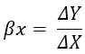
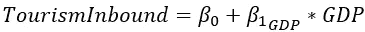
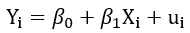
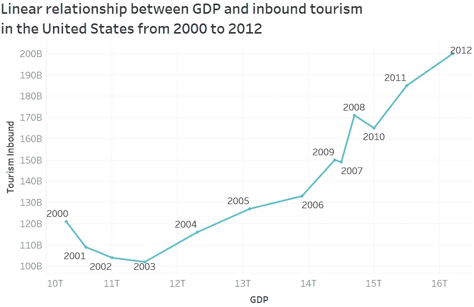
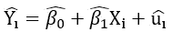
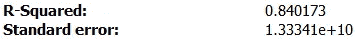

# 简单线性回归—已解释

> 原文：<https://medium.com/analytics-vidhya/simple-linear-regression-explained-d3381b033d0b?source=collection_archive---------29----------------------->

马库斯·温克勒在 [Unsplash](https://unsplash.com?utm_source=medium&utm_medium=referral) 上的照片

线性回归允许我们探索改变一个变量如何影响另一个变量。应用程序是无止境的，遍布各行各业。例如，线性回归可以帮助我们更好地理解以下问题:

*   一个国家的国内生产总值增加:对入境旅游有什么影响？
*   全球温室气体排放总量增加:对全球平均温度有什么影响？
*   一家公司减少利润最低的产品的生产:对总收入有什么影响？
*   一个人增加脂肪摄入量:对其体脂百分比有什么影响？

顾名思义，线性回归假设两个变量之间存在线性关系。所以这种线性关系可以用直线来解释。

下图概述了近年来伴随着国内生产总值增长的入境旅游的增长。实际数据点用蓝线连接，而灰线解释变量之间的线性关系。

这条线代表了这种关系的**斜率**，并告诉我们，GDP 每改变一个单位，美国的入境旅游会发生多大的变化。

由于我们试图解释给定 GDP 的入境旅游的变化，入境旅游是我们的**因变量**。即我们声称入境旅游取决于另一个变量——在这种情况下 GDP 的变化。在这个简单的例子中，由于 GDP 不依赖于任何其他变量，所以它是我们的独立变量**。**

一般来说，斜率表示为 **βx** ，变化表示为**δ**，因变量和自变量分别表示为 **Y** 和 **X** 。因此，斜率所代表的 X 单位变化的 Y 变化可表示为:

我们可能会想，如果美国没有 GDP，还会有入境旅游吗？考虑到我们的例子，这是一个抽象的场景，但有时这样的信息是有价值的。这个假设值被**截距**捕捉到。截距表示为 **β0** 并告诉我们自变量 X 的值为 0 时因变量 Y 的期望值。

综合我们目前所掌握的信息，我们的线性模型如下所示:

斜率可以是正值，也可以是负值。前者表明两个变量之间的正相关关系，而后者则表明相反的关系。

假设我们示例中的斜率值为 0.015。这将证实我们之前在图表上观察到的入境旅游和 GDP 之间的正相关关系。由于国内生产总值以万亿计，而入境旅游以十亿美元计，因此斜率表明，如果美国国内生产总值增加 1 万亿美元，该国的入境旅游将增加 15 亿美元(0.015 * 1*1⁰ = 15 * 1⁰⁹).

然而，有没有可能一个国家的 GDP 并不是影响其入境旅游的唯一因素？一个国家拥有的国家公园的数量、海滩、体育赛事和文化活动会是一个因素吗？他们肯定会的。

为了说明除了 GDP 以外的所有影响入境旅游的因素，我们在线性模型中添加了另一个变量。这种变量集合了除 GDP 以外的所有因素，被称为**误差项**。误差项一般表示为 **uᵢ** 。

最后，我们有一个单一回归变量的线性回归模型，如下所示:

其中:

*   y 是因变量或回归变量
*   x 是自变量或回归量
*   β0 是截距
*   β1 是斜率
*   uᵢ是错误的术语

现在我们有了线性回归模型，问题是我们如何估计直线来描述自变量和因变量之间的关系？

看看我们的图表，没有这条线，很明显，我们可以通过数据画出无限多条直线。但是哪一个最能解释 GDP 的变化对一个国家的入境旅游的影响呢？

为了回答这个问题，我们求助于**普通最小二乘(OLS)** 估计器。估计器以最小化数据点和回归线之间的差异的方式选择截距和系数。换句话说，这条线尽可能地接近数据。

如下图所示，一些数据点高于估计线，而其他数据点则高于估计线。简单地取每个观察数据点和估计数据点之间的差会使它们部分地相互抵消。这是因为有些差异是正的，而有些是负的。OLS 通过对这些差值求平方来测量直线与数据点的接近程度，从而使所有值为正值，从而解决了这个问题。然后将平方差加在一起，得出直线与数据接近程度的总体估计值。

简而言之，在进行线性回归时，我们是在给定自变量 x 的情况下估计因变量 Y 的值。我们通过估计截距和斜率来实现这一点，从而得出最佳拟合线，即使观察值和预测值之间的平方差最小化的线。OLS 使用帽子符号(^)来区分估计值和观测值。因此，线性模型变成:

其中最后一个变量代表残差，即观察值和预测值之间的差异。

在我们制定了模型并建立了最佳拟合线之后，我们如何衡量我们的模型是否好呢？OLS 使用回归 R 和标准误差来回答这样一个问题。

**R** 取 0 到 1 之间的值，告诉我们自变量的变化可以解释因变量的多少变化。通常，较高的 R 值是优选的。

**标准误差**告诉我们观察值在回归线周围的分布情况。观察值离最佳拟合线越远，x 的变化就越不能解释 Y 的变化。

示例 R 和标准误差

我们的例子中的拟合度告诉我们，美国入境旅游中约 84%的变化可以用该国 GDP 的变化来解释。标准误差用因变量来表示。因此，1.33341e+10 的标准误差意味着最佳拟合线周围存在相对较小的价差，以十亿美元计。

最后，有**三个 OLS 假设**必须成立，以提供适当的估计。这些假设是:

1.  **给定 Xᵢ的 uᵢ条件分布的均值为零** —还记得我们如何将除 GDP 之外可能影响该国入境旅游的所有其他因素分组吗？第一个假设仅仅意味着这些其他因素与独立变量无关，在这种情况下是 GDP。换句话说，无论 GDP 取什么值，这些其他因素的平均分布都是零。
2.  **(Xᵢ，Yᵢ)，i=1，…，n，是独立同分布的**——第二个假设涉及样本是如何抽取的。为了使 OLS 能够提供适当的估计量，数据样本必须从大量人口中随机抽取。假设我们想估计年龄对身高的影响。随机抽取不同年龄的人进行分析是有效的。另一方面，故意选择篮球运动员作为我们的样本会导致不准确的结果。
3.  **大的异常值不太可能** —异常值被定义为其值远离通常范围的观察值。因此，它们在数据中的存在会导致误导性的结果。例如，我们有一个小型数据集，由三名雇员和他们的工资组成。这些员工分别挣 5 万美元、6 万美元和 7 万美元。要计算平均工资，我们只需简单地将这三种工资相加，然后除以员工人数，得出 60k 美元。将首席执行官及其 30 万美元的薪水添加到我们的数据中，将会极大地影响平均薪水，使其膨胀到 12 万美元。

文章对简单线性回归进行了概述，并通过实例解释了基本概念。接下来的文章将处理一些场景，在这些场景中，我们试图包含大量的自变量，以解释因变量的变化，即，具有多个回归变量的线性回归。与此同时，如果你想重温一下概率或者想了解更多，可以看看之前的[文章](/analytics-vidhya/probability-basics-explained-a342cfa10390)。

如有任何问题和评论，请随时联系 [LinkedIn](https://www.linkedin.com/in/urostrifunovic/) 。

感谢您的阅读。

引用作品:

> *版 B. (2017)。计量经济学导论第三版定制巴鲁克。计量经济学导论，巴鲁克学院第三版(第三版。，第 109–129 页)。皮尔森教育。*