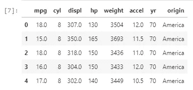

# 线性回归举例说明

> 原文：<https://medium.com/analytics-vidhya/simple-linear-regression-explained-with-an-example-2b088d6b874e?source=collection_archive---------10----------------------->

大家好！

在本文中，我将解释为特定数据集构建线性回归模型的过程。

## 导入库

首先，我导入了常用的库— NumPy、Pandas、Matplotlib 和 Seaborn。然后我导入 LinearRegression 构建线性回归模型，train_test_split 将数据集分别划分为训练和测试数据。

```
import numpy as np
import pandas as pd
import matplotlib.pyplot as plt
import seaborn as snsfrom sklearn.linear_model import LinearRegression
from sklearn.model_selection import train_test_split
```

## 资料组

在我继续这个过程之前，让我们先来看看数据集。数据集有以下几列，我们需要表达汽车的 mpg 和数据集中给出的其他属性之间的关系。

```
Data
```


变量及其简短形式如下

mpg -> MPG(每加仑英里数)

气缸->气缸

显示->发动机排量

马力->马力

重量->车辆重量

加速->从 0 加速到 60 英里/小时的时间

yr ->车型年

起源->汽车起源(1。美国人，2。欧洲人，3。日语)

汽车名称

# 探索性数据分析

## 情节

为了理解各种属性如何与目标变量相关联，我检查了目标变量和其他变量之间的关系。我用 seaborn 的线图在二维平面上画了线。

1.  mpg 和加速度之间的关系

在此图中，我们可以看到大多数点不在回归线附近，这意味着两个变量之间存在微弱的正相关。这可以通过使用 corr()函数检查相关值来进一步确认。

```
sns.lmplot(x=’mpg’,y=’accel’,data=Data)
```


```
Data[‘mpg’].corr(Data[‘accel’])
```


2.mpg 和 hp 之间的关系表明这两个变量之间有很强的正相关性。

```
sns.lmplot(x=’mpg’,y=’hp’,data=Data)
```


以类似的方式，我绘制了图表来检查 mpg 和其他变量之间的关系，这里是表格形式的相同内容的摘要。


## 删除不必要的列

接下来要检查的是所有的列在构建模型时是否有用。包含汽车名称的列不会在模型中使用，所以我删除了该列。数据集现在包含 8 列。

```
df=Data.drop(‘name’,axis=1)
df
```

## 处理分类值

“Origin”列以数字的形式包含汽车的产地，其中 1 代表美国，2 代表欧洲，3 代表日本。如果构建模型时没有考虑这些分类值，那么模型将获取这些数字，并按照它想要的方式对它们进行排序。例如，它可以这样排列- 1<2< 3，这意味着日本的汽车比欧洲的多，欧洲的汽车比美国的多。这根本说不通啊！因此，我用美国代替了 1，用欧洲代替了 2，用日本代替了 3。

```
df[‘origin’]=df[‘origin’].replace({1:’America’,2:’Europe’,3:’Asia’})
df.head()
```



嗯，还有一个问题！你能看出这是什么吗？

我们只需要包含数字数据的列。列原点违反了这一点。因此，需要采取措施来解决这个问题。这就是' *get_dummies* '函数发挥作用的地方。该函数将在感兴趣的列中选择不同的类别，并以“原始列名 _ 类别”的格式创建一个列名。然后，一旦遇到特定的列，它会将该列标记为 1，而其他两列将标记为 0。看看下面代码的输出，函数的作用将会更加清晰。

```
df=pd.get_dummies(df,columns=[‘origin’])
df
```


Tadaaa，问题解决了！

现在让我们看看这个数据集中是否有任何缺失值

**处理缺失值**

可能有几列缺少值。处理这些真的很重要，因为缺少值会带来各种问题。首先，某些价值观的缺失会导致我们的结果出现偏差。它也可能导致完全错误或不可接受的结论。处理缺失值的一些方法包括-用平均值或众数填充缺失值，删除包含缺失值的行。丢弃任何数据点应该是我们最后的选择，因为这样做我们可能会丢失很多重要信息。

我首先使用 *isna()* 函数检查是否有丢失的值。除此之外，我还使用了 *sum* 函数来计算 nan 的数量(如果有的话)。

```
df.isna().sum()
```


从输出来看，很明显没有丢失值。然后，我检查了数据类型，以确认我所看到的是否正确。 *dtypes* 函数可用于确定每一列的数据类型。

```
df.dtypes
```


我们可以看到每一列的值的种类，并用上面的输出进行确认。所有的数据类型似乎都没问题。

## 多元图

我使用了 *pairplot* 函数来解释数据集中变量之间的关系。仅使用前 7 列(因为绘制图形不需要后 3 列)，我得到以下 pairplots。

```
attr_select=df.iloc[:,0:7]
sns.pairplot(attr_select,diag_kind=’kde’)
```


注意:上面的截图没有显示完整的结果。

我们可以看到，只需一行代码，seaborn 就能够绘制多个图形来显示所有变量之间的关系。将' *diag_kind* '设置为获取我们想要的对角线类型。如果它被设置为 kde，我们会得到平滑的曲线，就像上面显示的那样。如果我们不指定 diag_kind，我们将得到直方图来代替平滑图。


另一个需要注意的要点是，在任何一个 pairplot 中，我们从曲线上半部分得到的任何推论都与从曲线下半部分得到的推论相同。因此，出于解释目的，您可以考虑对角线的任一侧。

为了理解清楚，我拿起一些图表，试图解释


如果我们看一下体重和 mpg 之间的图表，我们可以看到这是负相关的。重量和马力成正相关。以类似的方式，可以解释其他变量之间的关系。

我们已经为构建模型准备好了数据。

# 构建模型

## 将数据分为因变量和自变量

要做的第一件事是把数据分成因变量和自变量。在我们的数据集中，我们希望预测“mpg”的值，该 mpg 取决于所有其他属性，如气缸、马力等。因此 mpg 是我们的因变量，而其他变量是独立的。

```
X= df.drop([‘mpg’],axis=1)
y= df[[‘mpg’]]
```

“mpg”存储在 y 中，其他所有属性存储在自变量 x 中。

## 将数据集拆分为训练和测试数据

然后，我将数据分为训练和测试数据，其中 30%的数据在测试数据集中，其余的数据在测试数据集中。X 中要用于训练的数据点存储在 X_train 中，要用于测试的数据点存储在 X_test 中。同样，我把 Y 的数据点存储在 Y_train 和 Y_test 中。我还设置了一个随机种子，以确保每次运行代码时，存储在训练和测试变量中的随机数据保持不变。

```
X_train , X_test , y_train , y_test = train_test_split(X, y , test_size=0.30, random_state=1)
```

## 让模型学习

剩下要做的最后一件事是让我的模型从训练数据集中学习。在初始化模型时，我使用' *fit'* 函数使模型从 X_train 和 y_train 中学习。

```
regression_model=LinearRegression()
regression_model.fit(X_train,y_train)
```


数据集的方程是- Y=m1x1+m2x2+m3x3+的形式。….c(直到数据集的最后一列)。我使用了*‘coef _’*函数来获得各个列的系数的值。

```
regression_model.coef_
```


我使用了 *intercept_* 函数来计算 y 轴截距的值

```
intercept=regression_model.intercept_[0]
intercept
```


方程是 mpg =-0.23250(cyl)+0.0245(dis)-0.0014(HP)…-19.75 一旦我们输入了变量的值，就会预测出目标变量——mpg。因此，建立了一个数学模型来建立目标变量“mpg”和其他变量之间的关系。

## 模型的分数

检查模型的执行情况也很重要，所以我分别检查了训练和测试数据的得分。

```
Training_data_score=regression_model.score(X_train,y_train)
Testing_data_score=regression_model.score(X_test,y_test)
print(“Score of training data is :” + str(Training_data_score))
print(“Score of testing data is :” + str(Testing_data_score))
```


训练数据有 82%的分数，还算过得去。另一方面，测试数据的分数表明了数据从训练数据集中学习的程度。测试数据的得分为 82.4%，这已经足够好了，但还可以再好一点。

## 预测目标值

剩下要做的最后一件事是预测 X_test 中出现的数据点的“mpg”值。该模型已经从训练数据集中存在的几辆汽车中学习，现在是时候使用它所学习的任何东西来给出所需的预测结果。我使用 predict 函数做了同样的事情。

```
regression_model.predict(X_test)
```


## 例子

在下面的快照中，让我们取第一行中的值。该车有 4 个气缸，发动机排量为 8 立方英寸，马力为 97，车辆重量为 2506 磅，从 0 加速到 60 英里每小时需要 14.5 秒，72 年款，原产地为亚洲。考虑到所有这些参数，该模型预测其 mpg 为 23.83。同样，该模型预测了 X_test 中所有行的 mpg。

```
X_test
```

