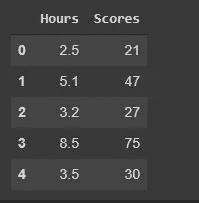
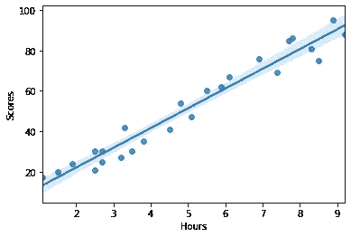
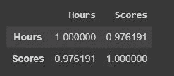
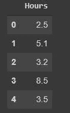
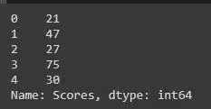
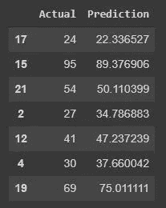
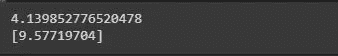
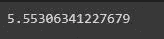
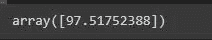
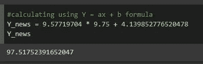

# 使用 Python 进行简单的线性回归

> 原文：<https://medium.com/analytics-vidhya/simple-linear-regression-using-python-98ddd7e6b391?source=collection_archive---------13----------------------->

在发布了我的第一个关于简单的网络报废的媒体故事后，今天我将写一个简单的监督学习算法，线性回归。我相信你们大多数人已经在学校上过线性回归课了。在这篇文章中，我将再次使用 python 编程和 google collab 来构建线性回归模型。

在我们开始编码环境之前，我将简单解释一下监督学习和线性回归。监督学习是一种机器学习方法，其中数据已经有标签作为目标，所以当我们使用新数据进行预测时，我们已经知道数据将被分配到的类/组/标签的名称。在监督学习中，将有一个训练或学习过程来建立模型。监督学习方法之一是线性回归。线性回归是一种统计模型，用于计算两个变量之间的关系，变量通常表示为 X 和 y。X 表示自变量，y 表示因变量。线性回归的公式解释如下:

```
y = ax + b, where :
a = slope/gradient/coefficient
x = independent variable
y = dependent variable
```

在这篇文章中，我假设你已经理解了线性回归的概念，因为我不会在这里解释更多的细节。

所以，让我们从代码开始…

# **阅读并理解数据**

在创建模型之前，我们需要做的第一个强制性步骤是理解数据并确定因变量和自变量。将使用的数据来自这个链接:"http://bit.ly/w-data"。

在读取数据之前，我将导入将在整个过程中使用的库。

```
import pandas as pd
import seaborn as sns
import matplotlib.pyplot as plt
import numpy as np
```

然后编写以下代码从 URL 读取数据:

```
#read data
url = "http://bit.ly/w-data"
data = pd.read_csv(url)
data.head()
```



现在我们可以从 url 中看到前 5 名的数据。我们可以看到数据框中有两个变量，小时和分数。小时将被用作 x 或自变量，而分数将被用作因变量。

我们还可以可视化或绘制数据，以了解可变小时数和分数之间的相关性。在这里，我将使用 seaborn 来可视化数据。我写了下面的代码。如前所述，小时将位于 X 轴上，分数将位于 y 轴上。

```
sns.regplot(x = "Hours", y = "Scores", data=data)
```



从图中可以看出，时间越长，学生得到的分数越高。根据该图，我们可以得出结论，这是一个正相关关系，这意味着如果 x 值增加，y 值也会随之增加。接下来，我们还需要评估这两个变量之间的相关性有多强。在 python 中，为了计算系数相关性，我们可以使用函数。corr()就像下面这样。

```
**#calculating coeeficient correlation**
data.corr()
```



从上表中我们可以看到，小时和分数之间的相关性是 0.976，这意味着这两个变量有很强的相关性，因为相关系数值接近 1。

# **创建线性回归模型**

下一步是创建线性回归模型。首先，我们需要将 x 和 y 变量分离到不同的数据框架中。要获得预测变量或 x，我们只需从数据帧中删除 y 列。

```
X = data.drop('Scores', axis=1)
X.head()
```



而要从数据帧中获得唯一的 y 变量，我们只需要获取列名。

```
y = data["Scores"]
y.head()
```



因为它是监督学习，所以在创建模型之前，我会将数据分成两个不同的部分，训练数据和测试数据。训练数据是将用于创建和训练模型的数据，而测试数据将用于验证模型。在 python 中，我们可以使用函数“train_test_split”来拆分数据。在这里，我将使用 25%的数据作为训练数据，75%作为测试数据，这些数据是随机选择的，所以如果每次重新运行代码时结果总是不同，这并不奇怪。要拆分数据，我们可以编写如下代码:

```
**#split data into data training and data testing**
from sklearn.model_selection import train_test_split
X_train, X_test, y_train, y_test = train_test_split(X, y, test_size=0.25)
```

接下来，我们将最终使用 python 库 linear regression 创建线性回归模型，只需编写以下代码。最后一段代码用于使用已创建的线性回归模型基于 X_test 数据预测 y 值。

```
**#create linear regression model**
from sklearn.linear_model import LinearRegression
lineg_model = LinearRegression()**#fit linear regression to the training data**
lineg_model.fit(X_train, y_train)**#predict y-value based on testing data**
y_pred = lineg_model.predict(X_test)
```

因此，我们成功地创建了线性回归模型，并使用预测模型来预测 y 值。然后，我们可以比较来自模型的 y 预测结果和来自数据的实际 y 值。我们最终也可以用这个模型来预测新的数据。

```
**#comparing y-value actual and prediction of testing data**df_compare = pd.DataFrame({'Actual' : y_test, 'Prediction': y_pred})
df_compare
```



我们还可以找到截距和线性回归模型的系数值。拦截 _ 和。python 中的系数 _ 函数。

```
**#intercept and coefficient**intercept = lineg_model.intercept_
koefisien = lineg_model.coef_print(intercept)
print(koefisien)
```



从上面的结果，我们得到截距 4.13…和系数 9.57…根据这些值，我们最终可以将线性回归方程写成 **Y = 9.57x + 4.13。**

# 评估模型

最后，我们需要评估我们的回归线性模型，这里我将简单地使用平均绝对误差(MAE)。实际上，有很多其他的评估方法可以使用，我将只使用 MAE 来进行这个练习。MAE 将计算数据中的实际值和模型产生的预测值之间的平均误差值。

```
from sklearn.metrics import mean_squared_error, r2_score#calculate MAE
MAE = mean_absolute_error(y_test,y_pred)
print(MAE)
```



通过计算，我们得到 MAE 值为 5.55。

# **使用新数据预测**

这里我将尝试使用线性回归模型来预测新的得分数据。我将输入学习小时数 9.75。

```
#predict using new data => Hours = 9.25X_new = np.array([9.75]).reshape(-1,1)
y_pred_new = lineg_model.predict(X_new)
y_pred_new
```



当学习小时数为 9.75 时，预计学生将获得 97.51 分。我们也可以用方程 Y = ax+b 来计算分数。



这与用线性回归模型预测的结果一致。

好了，以上就是关于如何使用 python 创建线性回归模型，并使用模型预测新数据的全部内容。希望这篇帖子对刚开始学习使用 python 编程的数据科学的你有所帮助。这个帖子实际上离完美还很远，我真的欢迎你的任何意见。