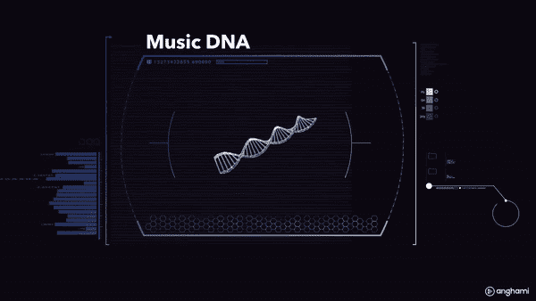
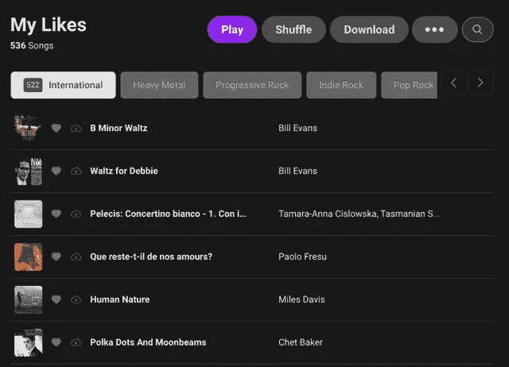

# Anghami 个性化音乐推荐的简单重新排序器

> 原文：<https://medium.com/analytics-vidhya/simple-re-ranker-for-personalized-music-recommendation-at-anghami-83b2f79824ce?source=collection_archive---------17----------------------->

## 个性化推荐

## 我们如何使用基于用户 DNA 的更简单的重排序器来改进我们的推荐

推荐更个性化的音乐有助于用户**快速**和**毫不费力**找到更符合他们口味和偏好的音乐。随着每天大量的内容被摄取，需要考虑每个用户的**独特性**是一个重要的信号。

有许多令人兴奋的研究论文讨论、实现和评估使用神经网络的复杂的重新排序算法。尽管这些模型可能非常高效，但你可能会惊讶地发现一个简单的*重排序器实际上可能也很高效。*

[**Anghami**](https://www.anghami.com/) 目前拥有超过 7000 万活跃用户、5700 万首歌曲和 10 亿条年度流媒体，是中东和北非地区领先的音乐流媒体平台。随着[**Anghami**](https://www.anghami.com/)**的增长，独特用户的数量也在增长，因此需要更多的个性化，以及快速简单的重新排名策略，以适应活跃用户的快速增长及其多样化的偏好。**

**在本文中，我将讨论我们基于用户 DNA 和歌曲嵌入的简单高效的重新排序器，以改进推荐并增加用户的收听时间。**

# **音乐推荐。它是你独有的吗？**

**简单地说，当听一首歌时，音乐推荐需要建议用户*可能*喜欢的其他类似歌曲以及推荐模型*认为用户*可能*喜欢的*。这是通过推荐与用户正在交互的歌曲最相似的歌曲来实现的。虽然使用*协同过滤、word2vec 或神经网络对数百万数据进行了训练……*所有这些模型都显示了许多研究的改进结果，但是*如果*有一些歌曲你可能更喜欢，或者更符合你的偏好，那该怎么办？*如果*在我们推荐的歌曲列表的底部有一些用户可能喜欢的歌曲，但是我们没有把它推到顶部，该怎么办？*如果*用户喜欢流行与不流行的歌曲，成熟与不成熟，现场版与录音室版，新与旧…我们不想错过给用户他们真正喜欢的东西。因此，需要一种个性化的策略，给每个用户一套独特的歌曲，并考虑到我们提出的许多假设。是什么让每个人都与众不同？这是他们的 DNA(0.1%的差异，其余 99.9%是相同的)**

# **用户子类型 DNA**

**一个音乐用户 DNA，基本上代表了一个用户的喜好和品味。这包括用户播放的歌曲、喜欢的歌曲、不喜欢的歌曲、分享的歌曲、插入到播放列表中的歌曲……这些隐性和显性的信号*改变了用户的音乐 DNA，因为它随着应用程序的使用而发展和优化。***

**对于**用户子流派 DNA，**子流派元数据是导致变异的因素。拥有多样化的品味，听各种流派的音乐，如当代爵士乐、进步摇滚、民谣摇滚或黎巴嫩独立音乐……会让用户的音乐 DNA 发生变异，产生许多子流派的复制品。**

****

**用户音乐 DNA 的复制**

**我们的音乐子流派元数据又名“V *ibes”，*来自我们的元数据库和我们开发的自动标记系统。这些元数据类型标签也用于轻松快速地过滤您的播放列表。以下截图来自昂哈密 app 中的“我的喜欢”标签。它们展示了用户如何按照流派和子流派过滤歌曲。**

********

**显示子流派过滤器的“我的喜欢”标签**

## **构建用户子类型 DNA**

**我们使用两种类型的嵌入来构建用户子流派 DNA。一个歌曲嵌入是我们的主推荐模型的输出，一个嵌入是由我们的*音乐信息检索*算法生成的，该算法输出一组歌曲的*情绪、节奏、能量*的描述符。这两个嵌入以一定的权重连接在一起，以导出最终的嵌入。从这些串联的嵌入中，我们继续构建用户子流派 DNA。我们将过去 X 天的**用户流***(>0.8%完成)*和**用户喜欢**，我们将歌曲与其对应的子流派元数据*、【Vibes】、*结合起来，并通过按子流派和按用户对这些嵌入进行平均来进行聚合。所以现在，每个用户都有多个*专用*向量，对应于他所交互的每个*【vibe】*。DNA 的结构如下图所示。**

****

**用户子类型 DNA 构建**

**这种策略的优点是用户嵌入将在与歌曲相同的特征空间中，并且推导它的数学是简单的。此外，我们可以通过计算用户嵌入和附近歌曲之间的余弦距离来获得其 *k* 首首歌曲的最近邻居，从而快速验证用户嵌入。下面是我们如何推导给定某个标签的用户嵌入的公式**

****

**歌曲嵌入的用户嵌入构建**

# **重新排序策略**

**重排序策略执行如下:**

*   **给定一首标签为 *m，*的种子歌曲，我们生成一个 *k* 歌曲候选列表**
*   **我们用相同的标签获取用户的子流派 DNA**
*   **我们使用距离函数对歌曲重新排序**

**在我们的策略中，我们使用候选歌曲和用户 DNA 之间的余弦距离作为距离函数的一部分，将距离最小的歌曲推到列表的顶部，而距离较大的歌曲在列表中向下。下图总结了该策略**

****

**宋重新排名策略**

**下面的公式显示了在给定阈值 **λ的情况下，我们如何通过用 **α** 和 **β** 对距离进行加权来得出歌曲的最终得分。****

****

**使用距离主模型的距离函数对歌曲候选重新排序**

**注意，如果我们怀疑重排序无效(距离大于 **λ** )，我们只考虑初始距离。我们选择了 **α=0.3** 和 **β=0.7** ，以便在为用户保持一定数量的**多样性**和**可发现性**的同时，为用户重新分级提供更多权重。我们将 **λ=0.3** 设置为阈值，以确保有效的重新分级。**

# **结果**

## **用户收听时间**

**我们将个性化重新排名模型部署到 10%的用户群中，通过 A/B 测试，我们注意到在部署的第一周，用户平均秒流量增加了 **3.5%** 平均。目前部署到所有用户，当比较有和没有重新排序的歌曲时，百分比仍然很高。**

****

**非个性化和个性化模型之间的平均秒流百分比差异**

## **主观评估**

**给定一首种子歌曲，我们现在显示对个性化音乐推荐的重新排序的主观评估。如果我要以一个用户的身份来描述我的音乐品味，我会说它是醇厚/寒意的结合，更喜欢不受欢迎的歌曲，不太喜欢最近的歌曲。这也适用于我听的其他流派，比如[进步摇滚](https://play.anghami.com/playlist/7957650)、[独立](https://play.anghami.com/playlist/102602788)、[爵士](https://play.anghami.com/playlist/48403078)、[黎巴嫩爵士](https://play.anghami.com/playlist/171466572)。奇怪的 DNA！**

**以歌曲 [*酷玩乐队的*](https://play.anghami.com/artist/4757) 歌曲 [*科学家*](https://play.anghami.com/song/862744) *，*为种子，我们在下面展示了模型生成的推荐与使用我的 DNA 的个性化推荐之间的比较。**

****

**非个性化推荐和重新排序推荐的比较**

**个性化推荐更符合我的偏好，比如更冷，不那么流行的歌曲。还有更多的用原声吉他演奏的民谣歌曲。还有一个有趣的是我平时经常听的现场表演推荐。因此，结合声学特征和歌曲特征来构建我的子流派 DNA，能够很好地模拟我的声学和情绪品味以及我的流行和新近偏好。**

# **结论**

**这个*简单的*重排序器被证明在匹配用户偏好方面非常有帮助，并且与更高级的模型或策略相比，只需要很少的努力。这个排名器的工作主要集中在特征处理和在我们的推荐微服务中实现逻辑。此外，它还增加了用户的收听时间，这意味着用户更加满意。**

**更先进的模型*可能会*产生更令人满意的结果，这一直是一项进展中的工作。然而，从小处着手是有好处的，首先是有一个基线来与未来更复杂的模型进行比较，其次，快速启动并运行*是很重要的。***

***从小处着手，大处着眼！***

**重新排序的建议:**

** [## 准备好了(伦敦 Lynx Black Space 现场直播)

### 播放和下载“柯达线”的“准备好了(在伦敦 Lynx Black Space 现场)”和其他歌曲，包括“诚实(孩子…

play.anghami.com](https://play.anghami.com/song/74573655)  [## 来来去去

### 播放和下载“格雷格·拉斯维尔”的“来来去去”(在波浪中)，以及其他歌曲，包括“这是一年”，“那…

play.anghami.com](https://play.anghami.com/song/1062591)  [## 帮助就在眼前

### 播放并下载“酷玩”乐队的“帮助就在拐角处”——被困在一个令人头疼的地方...

play.anghami.com](https://play.anghami.com/song/11066396)  [## 她是——脱衣版

### 播放并下载“The Fray”的“她是-脱衣版”-和其他歌曲，包括“如何拯救生命-新…

play.anghami.com](https://play.anghami.com/song/148153)  [## 更近的

### 播放和下载“特拉维斯”的“关闭”-和其他歌曲，包括“每天”，“唱”，“闲置野生(壮举。约瑟芬…

play.anghami.com](https://play.anghami.com/song/36306003)  [## 袖手旁观我

### 播放并下载“佛罗伦萨+机器”的“袖手旁观我”——当夜晚来临，大地漆黑，月亮…

play.anghami.com](https://play.anghami.com/song/16298699) 

**致谢**

*赫尔米·里法伊、阿卜杜拉·穆萨维、穆罕默德·马卡维***