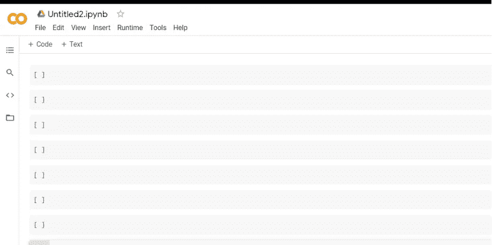

# 简单报废数据 Twitter(系列 Twitter 数据)

> 原文：<https://medium.com/analytics-vidhya/simple-scrapping-data-twitter-part-1-series-twitter-data-7a096c906103?source=collection_archive---------3----------------------->


Twitter 是一种免费的社交网络微博服务，允许注册会员发布简短的帖子，称为 tweets。Twitter 成员可以通过用户多个平台和设备广播推文并关注其他用户的推文。你可以通过网络或移动设备访问 Twitter。为了尽可能广泛地分享 Twitter 上的信息，我们还通过 API 为公司、开发者和用户提供对 Twitter 数据的编程访问。

要访问 Twitter，首先我们必须具备:

1.API 密钥

2.Api 密钥

3.访问令牌

4.访问令牌秘密

你可以在这里看到。

[https://developer . Twitter . com/en/docs/Twitter-API/getting-started/getting-access-to-the-Twitter-API](http://For get the access token you can look in here. https://developer.twitter.com/en/docs/twitter-api/getting-started/getting-access-to-the-twitter-api)

让我们开始编码

**1。设置环境**

打开代码脚本或笔记本代码。我们可以用笔记本。让我们在谷歌合作实验室访问笔记本。

【https://colab.research.google.com/ 

和新笔记本，直到您准备好



2.安装和导入库

将在这次报废中使用的库是广告库。所以在此之前，请在您的计算机上安装该库。

在笔记本代码中:

```
!pip install advertools
```

在 cmd/终端代码中:

```
pip install advertools
```

因此，导入您的库:

```
Import pandas as pdImport numpy as npimport advertools as adv
```

3.设置令牌访问 Twitter

```
auth_params = {'app_key': "xxxxxxxxxxxxxxxxxxxxxxx",'app_secret': "xxxxxxxxxxxxxxxxxxxxxxxxxxxxxxxxxxxxxxxx" ,'oauth_token': "xxxxxxxxxxxxxxxxx-xxxxxxxxxxxxxxxxxxxxxx",'oauth_token_secret':"xxxxxxxxxxxxxxxxxxxxxxxxxxxxxxxxxxxx",}adv.twitter.set_auth_params(**auth_params)
```

如果你想这么容易得到 API，你可以使用我的 API。

[](https://drive.google.com/file/d/19RPjWjbW-3ztVEelKAtc5RZzgWmXmNej/view?usp=sharing) [## 认识 Google Drive -一个存放所有文件的地方

### Google Drive 是一种免费的文件备份方式，可以从任何手机、平板电脑或电脑上轻松访问。开始…

drive.google.com](https://drive.google.com/file/d/19RPjWjbW-3ztVEelKAtc5RZzgWmXmNej/view?usp=sharing) 

本文中要得到的数据是:

1.从搜索关键字获取数据

这个方法可以得到关于关键字的所有数据。例如，如果你搜索“复仇者”，结果是包含“复仇者主题”的推文，所以你可以得到推文数据


所以放手一搏:

```
input_keyword = "avengers"
count_data = 200df = adv.twitter.search(q = input_keyword, geocode=None, lang=None, locale=None, result_type=None, count=count_data, until=None, since_id=None, max_id=None, include_entities=None, tweet_mode=None)
```

您可以自定义刮刀的参数。所以我们可以详细解释每一个参数，因为这对你来说非常重要。

**q =是报废的主要参数关键字**

(str 必选)最多 500 个字符的 UTF-8、URL 编码的搜索查询，包括运算符。查询还可能受到复杂性的限制。

关键字的多种值。


*   **geocode** — (lat long dist —可选)返回位于给定纬度/经度的给定半径内的用户的推文。位置优先从地理标记 API 获取，但会退回到他们的 Twitter 个人资料。参数值由“纬度、经度、半径”指定，其中半径单位必须指定为“英里”(miles)或“公里”(km)。请注意，不能通过 API 使用 near 运算符对任意位置进行地理编码；但是，您可以使用此地理编码参数直接搜索附近的地理编码。使用“半径”修改器时，最多会考虑 1000 个不同的“子区域”。
*   **lang**——(str-可选)将推文限制在给定的语言，由 ISO 639-1 代码给出。语言检测是最大努力。
*   **地区** — (str —可选)指定您发送的查询的语言(目前只有 ja 有效)。这是为特定于语言的用户设计的，默认设置在大多数情况下都适用。
*   **result_type** — (str —可选)可选。指定您希望接收哪种类型的搜索结果。当前默认为“混合”有效值包括:*混合:在响应中包括流行和实时结果。* recent:仅返回响应中最近的结果* popular:仅返回响应中最受欢迎的结果。
*   **count** — (int —可选)指定要检索的结果数。
*   **直到** —(日期—可选)返回在给定日期之前创建的推文。日期格式应为 YYYY-MM-DD。请记住，搜索索引有 7 天的限制。换句话说，超过一周的日期将找不到推文。
*   **since_id** — (int —可选)返回 id 大于(即比)指定 ID 更新的结果。通过 API 访问的 Tweets 数量是有限制的。如果 Tweets 的限制发生在 since_id 之后，则 since_id 将被强制为最早的可用 id。
*   **max_id** — (int —可选)返回 id 小于(即早于)或等于指定 ID 的结果。
*   **include _ entities**—(bool—可选)当设置为 False 时，将不包括实体节点。
*   **tweet_mode** — (str —可选)有效的请求值是 compat 和 extended，分别为包含超过 140 个字符的 tweet 提供兼容模式和扩展模式

因此，毕竟，尝试显示报废的数据

```
print(df.shape)print(df.head)
```


数据列是 1 条 tweet 数据的 79 列表示信息，以及我们得到的 200 条 tweet 数据的 200 行表示。

非常感谢

来源:

[https://whatis.techtarget.com/definition/Twitter](https://whatis.techtarget.com/definition/Twitter)

[https://广告工具. readthedocs . io/en/master/广告工具. twitter.html](https://advertools.readthedocs.io/en/master/advertools.twitter.html)

【https://developer.twitter.com/ 