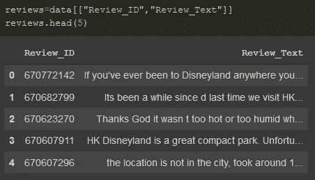

# 简单的情感分析— Python

> 原文：<https://medium.com/analytics-vidhya/simple-sentiment-analysis-python-bf9de2d75d0?source=collection_archive---------7----------------------->

史蒂文·洛萨诺在 [Unsplash](https://unsplash.com?utm_source=medium&utm_medium=referral) 上的照片

在当今时代，每个人都会产生大量的数据。这些数据的大部分是非结构化的。这些公司从非结构化数据中获取洞察力的能力使他们与其他竞争对手区分开来。

我举个例子来解释一下。在世界各地，每年有数十万人参观迪斯尼乐园。该团队拥有大量访问者评论和评级形式的数据。应用现代技术(如 ML、NLP 等)。)可以帮助他们确定哪些方法对他们有效，哪些地方需要改进。情感分析就是这样一种工具，它有助于理解访问者评论的整体基调。

# 情感分析

情感分析使用自然语言处理(NLP)和文本分析来测量人对某事的倾向。简而言之，使用这种技术，我们将能够将访问者的评论分为正面或负面评论。

# VADER

Python 中的 NLTK 库为我们提供了一个预训练的模型 VADER，旨在对社交媒体进行情感分析。本教程结束时，你将能够使用 VADER 在 Python 中进行简单的情感分析。

## **先决条件**

*   熟悉 Google Colab 笔记本、Jupyter 笔记本(或任何其他等效工具)
*   对熊猫数据框架和 NLTK 库的基本了解

## 资料组

我将使用的数据集包含游客在 Trip Advisor 上发布的对 3 个迪士尼乐园分支——巴黎、加州和香港——的约 42，000 条评论。你可以从 [Kaggle](https://www.kaggle.com/arushchillar/disneyland-reviews) 下载数据集。

专栏描述(来源:Kaggle)

## 预期产出

情绪 _ 标签:积极/消极

## 下载数据集

您可以直接从 Kaggle 下载数据集，或者使用 Kaggle API 令牌来完成同样的工作。参考我的 [Colab 笔记本](https://github.com/athisha-rk/mediumArticlesRelatedFiles/blob/master/Simple_Sentiment_Analysis_Python.ipynb)了解要遵循的步骤。

## 下载所需的库

下载 NLTK 和 vader_lexicon

首先，我们必须下载 NLTK 库和 VADER 模型，如上所示。

## 必需的库

导入所需的库

**读取数据集**

使用 Pandas.read_csv()读取数据集

## 数据集概述

data.shape 和 data.info()

我们的数据集中有 42，656 条评论和 6 个特征。我们混合了 int64 和 object 数据类型条目。

## 准备数据集

我们的分析只需要审查 id 和审查文本。

提取评论 ID 和评论文本

**一个使用 VADER 的简单例子**

让我们继续申请 VADER 进行第一次审查，如下所示。

摘录第一篇评论

> 如果你曾经去过任何地方的迪士尼乐园，当你走进大街时，你会发现香港迪士尼乐园的布局非常相似！它有一种非常熟悉的感觉。其中一个游乐项目《世界很小》绝对精彩，值得一玩。我们参观的那天相当热，也相当繁忙，但是队伍移动得相当好。

首次审查的情感分析—修订版

在结果词典中，
*** Pos:**
*** Neg:**Neg:
*** Neu:**Neutral Review Degree
*** Compound:**范围为-1(非常负)到+1(非常正)。

从结果来看，我们可以得出结论，该评论是相当中立的。

## **对于所有评论…**

使用 for 循环并将结果存储在四个数组中:neg、pos、neu 和 compound，这可以很容易地应用于所有的评论。

对于所有评论…

## 将结果附加到数据框架

将 neg、pos、neu、compound 附加到数据帧

## 分配情感标签

我们可以通过设定化合物的阈值或使用消极和积极的特征来分配情感标签。出于演示的目的，我使用了正数和负数的最大值来设置标记。

分配情感 _ 标签

## 决赛成绩

决赛成绩

根据我们的分析，我们得到了 4K+的负面评价。我确信有比 VADER 更好的模型可以更准确地分析它。您也可以使用 ML 和其他熟悉的技术提出自己的模型！

为了进一步处理，我们可以将结果保存为 CSV 文件，如图所示。

将数据帧写入 CSV 文件

## 有用的链接

*   [简单情感分析 Colab 笔记本— GitHub](https://github.com/athisha-rk/mediumArticlesRelatedFiles/blob/master/Simple_Sentiment_Analysis_Python.ipynb)
*   [迪士尼乐园评论数据集— Kaggle](https://www.kaggle.com/arushchillar/disneyland-reviews)