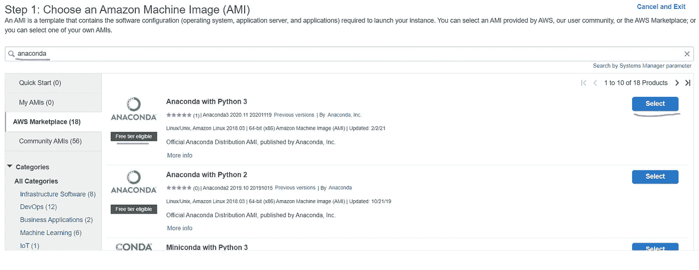

# 在 AWS 中运行本地 Python 程序的简单步骤

> 原文：<https://medium.com/analytics-vidhya/simple-steps-to-run-your-local-python-programs-in-aws-815b5b2d993?source=collection_archive---------4----------------------->

**我为什么要写这个？**

当运行我的机器学习模型特别是图像分割时，我对自己的计算能力感到沮丧。在本地不可能运行。我也没有在谷歌 colab 和 Kaggle 笔记本上找到任何运气。:(都提供了很好的 IDE，所以你可以立刻运行你的代码，但是没有人保证有很好的计算能力。GPU 就在那里，但是想象一下，你必须改变你的代码，只在 GPU 中运行，这也是不能保证的！总之，长话短说，我想在具有原始计算能力的远程机器上运行我的 python 代码。我很难得到一个清晰的文章，特别是我在 windows 对不起伙计们，Mac 还没有在我的国家流行:)

如果你在某个地方看到超过 10 个步骤来做这个简单的事情，那你就在正确的地方！

**步骤 1:在 AWS 控制台中创建密钥对并下载**

转到 AWS 控制台中的密钥对服务，然后单击创建密钥:

创建完成后，您可以下载到本地，然后关注我将在下面分享的重要信息。

请务必从 Windows 中的 PowerShell 连接 EC2 实例。所有的截图都来自 powershell。现在，要从 powershell 执行 ssh，请记住您需要成为密钥文件(即。pem 文件。如果你右击。pem 文件和查看权限应该显示为完全控制:

如果创建一个更好的方法，请不要“禁用继承”。pem 文件，然后正确修复安全权限。

**步骤 2 :** **创建一个 EC2 实例**请按照我之前的故事[这个](/@jaganbisoyi/connect-aws-ec2-instance-through-windows-remote-desktop-70fc90cbf7ee?sk=c1e1edb18fcdb2f1caa9596bf1cdb175)创建一个 EC2 实例。我不会在这里重复同样的话。但是不要忘记第 1 步，我们需要为 pem 文件提供适当的权限。

选择带有 Anaconda 的 AMI，这样在启动 EC2 之后就不需要安装任何软件了！

选择 AMI:在搜索框中键入 anaconda 并选择一个 AMI。我选择第一选择。

只需点击默认选择，如下一步，并继续每当你找到。

更新安全组以便允许来自端口 8888 的任何 IP 地址的请求(有点冒险！不建议用于生产质量)

上面将打开 Jupyter 笔记本端口，以便从您的本地机器或世界上的任何机器访问 Jupyter 笔记本服务器！。请按如下方式更新安全组:

选择密钥对(如果您忘记下载 pem 文件，也可以在此步骤中下载)

就在完成 EC2 实例创建之前，将弹出一个 UI 来选择密钥对。请选择密钥对。pem 文件。它会下载到您的本地。保证它的安全。这是连接 EC2 实例的密钥。

**步骤 3:在 EC2 中启动 Jupyter 笔记本:**

通过公钥对实例执行 ssh:

> ssh-I .<pemfile-name>。PEM ec2-用户@<public-ip-address-of-ec2></public-ip-address-of-ec2></pemfile-name>

键入 Yes 并继续:

通过 **jupyter 笔记本—无浏览器**运行 jupyter 笔记本

**步骤 4:配置本地文件，这样你就可以连接到运行在 EC2 中的 Jupyter 笔记本。**

在用户目录/.ssh .中创建一个名为' config '的文件，并结束下面的。从 EC2 下载后，我已经将 pemfile.pem 保存在我的用户目录中。

> 主机 ec2
> 主机名 ec2–XX–YYY–ZZZ–MMM.compute-1.amazonaws.com
> 用户 ec2-用户
> 身份文件~/pemfile.pem

**步骤 5:连接到 EC2 内部运行的 Jupyter 笔记本**

打开您的本地 power shell，传递下面的命令，并在出现提示时键入 yes。

> ssh -NfL 9999:本地主机:8888 ec2

上面是一个简单的步骤，将您的本地 9999 端口请求转发到端口 8888 上 EC2 实例内部托管的 Jupyter 笔记本。

你都设置好了，不要关闭 powershell，让它挂在那里。

从 EC2 内部运行的笔记本中复制令牌。toke=[xxxx-yyyy]

进入浏览器，访问您刚刚在 AWS EC2 中创建的 Jupyter 笔记本。 [localhost:9999/](http://localhost:9999/) 你会看到类似下面的内容。你可以粘贴之前复制的令牌并访问 notebook，也可以生成一个密码(我更喜欢这样，因为这样可以提供个人密码)

为您的 jupyter 笔记本服务器设置密码，这是我们的 Hello EC2！！

我花了几个小时得到这个简单直接的方法，所以你不需要做同样的事情:)。如果您有任何问题，请务必让我知道，并在错误日志中留言，我很乐意帮助您！

快乐计算和快乐编码！！