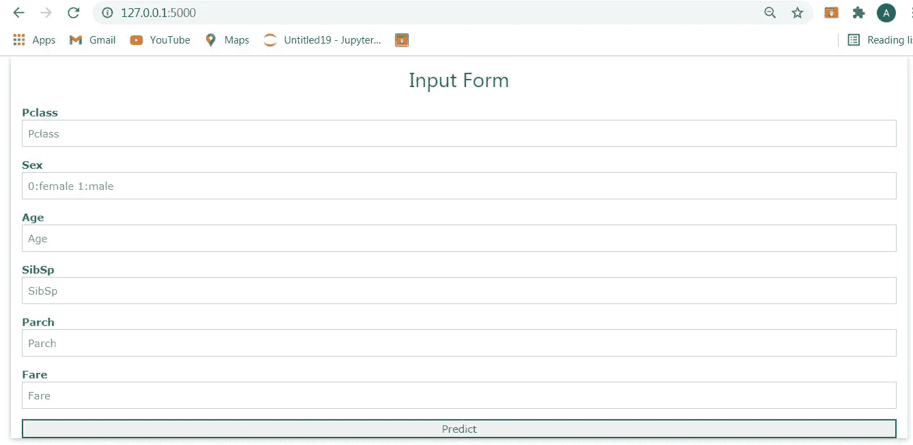

# 用 Flask 创建机器学习 Web 应用程序的简单方法

> 原文：<https://medium.com/analytics-vidhya/simple-way-to-create-a-machine-learning-app-with-flask-69a532663fd5?source=collection_archive---------14----------------------->

使用 flask 和 w3css 框架创建机器学习 web 应用程序的最简单方法


magtech dihub

web-apps 提供了人工智能和数据科学的实用概念，为学习者、数据科学家和研究人员提供了部署和测试他们的算法/模型的机会，并将他们的解决方案引入现实世界的场景和实践。

## 教程的部分内容:

1-创建并训练一个模型
2-使用 Flask 框架创建 web 应用程序。
3-运行并测试应用程序

这是 https://titanic-model1.herokuapp.com[的网络应用链接](https://titanic-model1.herokuapp.com/)，我使用 w3css 来设计我的应用，但是你可以使用 bootstrap、css 或其他 CSS 框架来使它看起来更像样。你可以从我的 github repo【https://github.com/alaminmagaga/titanic-web-app 下载文件

## 步骤 1:创建一个模型

```
//model name:titanic.pyimport pandas as pd
import numpy as np
import pickledf=pd.read_csv('titanic_train.csv')
df.drop('Cabin',axis=1,inplace=True)
df['Age']=df['Age'].fillna(df['Age'].mode()[0])
df['Embarked']=df['Embarked'].fillna(df['Embarked'].mode()[0])
sex_mapping={'male':1,'female':2}
df['Sex']=df['Sex'].map(sex_mapping)embark_mapping={'S':1,'C':2,'Q':3}
df['Embarked']=df['Embarked'].map(embark_mapping)survival_mapping={1:'survived',0:'Did not survived'}
df['Survival']=df['S'].map(embark_mapping)
df.drop(['PassengerId','Name','Ticket','Survived'],axis=1,inplace=True)
x=df.drop('Survival',axis=1)
y=df.Survival
from sklearn.preprocessing import MinMaxScaler
scaler=MinMaxScaler()
x=scaler.fit_transform(x)
```

训练模型

```
from sklearn.model_selection import train_test_split
x_train,x_test,y_train,y_test=train_test_split(x,y,test_size=0.3,random_state=42)from sklearn.ensemble import RandomForestClassifier
rfc_classifier = RandomForestClassifier()
rfc_classifier.fit(x_train, y_train)
```

我们现在使用 pickle 将模型保存为 titanic_classifier.pkl

```
pickle.dump(rfc_classifier,open('titanic_classifier.pkl','wb'))
model=pickle.load(open('titanic_classifier.pkl','rb'))
```

稍后将使用的 titanic_classifier.pkl 文件。

## 步骤 2:使用 Flask 框架创建一个 web 应用程序

有其他 python 框架可以用来创建 web 应用程序，但我们使用 flask，因为它非常灵活，更易于使用。在此阶段，我们将创建三个文件:

*   index.html
*   result.html
*   app.py

**index.html**和**result.html**文件是我们的主页和结果(预测)页面，包含 HTML 模板和 web 应用的样式，而 **app.py** 包含 flask API 和模型的预测值。

现在，让我们编写我们的 index.html 和 result.html**文件**

**index.html**

```
<!DOCTYPE html>
<html >

<head>
  <meta charset="UTF-8">
  <title>ML API</title>

  <link rel="stylesheet"  href="{{ url_for('static', filename='w3.css') }}">
 <style type="text/css">

.mySlides {display:none;}</style>
</head><body><div class='w3-padding w3-teal w3-center'><h1>Titanic prediction model</h1></div>
  <div class="w3-container">
  <div class="w3-padding-18 w3-content w3-section w3-threequarter">
  
  
  
  
</div><div class="w3-container w3-padding-24 w3-quarter"><div class="w3-card-4 w3-padding-32" style="width:100%;height: 100%;" >
    <header class="w3-container  w3-center">
      <h5 class="w3-center">Alamin Magaga</h5>
    </header>
    <div class="w3-container">

      <hr>
      
      <p>Founder of Magtech Dihub,Data scientist,and Web developer</p><br>
    </div>
    <button class="w3-button w3-block w3-dark-grey"><a href="twitter.com" target="_blank" style="text-decoration:none">+ Connect</a></button>
  </div>
</div>
</div><div class="w3-container">
  <form class="w3-container w3-card-2" action="{{ url_for('predict')}}"method="POST" style="width: 100%">
  <h2 class="w3-text-blue w3-center w3-text-teal" >Input Form</h2>
  <p>      
  <label class="w3-text-teal"><b>Pclass</b></label>
  <input id="id1" class="w3-input w3-border" name="Pclass" placeholder="Pclass" required="required" type="number" ></p>
  <p>      
  <label class="w3-text-teal"><b>Sex</b></label>
  <input id="id1" class="w3-input w3-border" name="Sex" type="number" placeholder="1:female 0:male" required="required" max="1" min="0"></p>
  <label class="w3-text-teal"><b>Age</b></label>
  <input id="id1" class="w3-input w3-border" name="Age" type="number" placeholder="Age" required="required"></p>
  <p>      
  <label class="w3-text-teal"><b>SibSp</b></label>
  <input id="id1" class="w3-input w3-border" name="SibSp" placeholder="SibSp" type="number" required="required"></p>
  <label class="w3-text-teal"><b>Parch</b></label>
  <input id="id1" class="w3-input w3-border" name="Parch" placeholder="Parch" type="number" required="required"></p>
  <p>      
  <label class="w3-text-teal"><b>Fare</b></label>
  <input id="id1" class="w3-input w3-border" name="Fare" placeholder="Fare" type="number" required="required"></p><p>      
  <label class="w3-text-teal"><b>Embarked</b></label>
  <input id="id1" class="w3-input w3-border" name="Embarked" placeholder="Embarked" type="number" required="required"></p>  

  <button onclick="myFunction()" type="submit" class="btn btn-primary btn-block btn-large w3-text-teal w3-border-teal" style="width:100%;">Predict</button>
</form>
</div></div><script>
var myIndex = 0;
carousel();function carousel() {
    var i;
    var x = document.getElementsByClassName("mySlides");
    for (i = 0; i < x.length; i++) {
       x[i].style.display = "none";  
    }
    myIndex++;
    if (myIndex > x.length) {myIndex = 1}    
    x[myIndex-1].style.display = "block";  
    setTimeout(carousel, 2000); // Change image every 2 seconds

}
</script>
</body>
</html>
```

**result.html**

```
<!DOCTYPE html>
<html>
<head>
 <title></title>
    <link rel="stylesheet" type="text/css" href="{{ url_for('static', filename='w3.css') }}">
</head>
<body><div class="w3-card-4 w3-teal w3-center w3-padding-32 w3-xxlarge w3-animate-bottom">Titanic Survival Result</div>

 </div><br>
 <div class="w3-card-4 w3-opacity w3-hover-opacity-off w3-animate-top">
   
</div>
<br>
<div class="w3-center w3-card-4 w3-teal w3-xxlarge w3-padding-24 w3-text-black" > 
<h2>{{ prediction_text }}</h2></div>

 </div></body>
</html>
```

让我们也创建 **app.py** 文件

```
import numpy as np
from flask import Flask, request, jsonify, render_template
import pickleapp = Flask(__name__)
model = pickle.load(open('titanic_classifier.pkl', 'rb'))[@app](http://twitter.com/app).route('/')
def home():
    return render_template('index.html')[@app](http://twitter.com/app).route('/predict',methods=['POST'])
def predict():
    '''
    For rendering results on HTML GUI
    '''
    int_features = [int(x) for x in request.form.values()]
    final_features = [np.array(int_features)]
    prediction = model.predict(final_features)return render_template('result.html', prediction_text='The Passenger {}'.format(prediction[0]))if __name__ == "__main__":
    app.run(debug=True)
```

**结果:**

titanic-web 是我的主文件夹，包含**静态**和**模板**子文件夹，以及 **app.py** 、 **titanic.py、titanic_classifier 和数据集。**titanic _ classifier . pkl 文件是根据模型(titanic.py)创建的


**静态**文件夹包含图像和 w3css 文件，用于设计 web 应用程序的样式


magtech dihub

**模板**文件夹包含**index.html**和**result.html**文件


使用 anaconda 命令提示符运行 web 应用程序。

```
python app.py
```

将此 URL:[http://127 . 0 . 0 . 1:5000/](http://127.0.0.1:5000/)复制并粘贴到浏览器中


magtech dihub

**这里是网络应用:**


magtech dihub



magtech dihub

[https://medium . com/analytics-vid hya/identifying-cleaning-and-replacing-outliers-titanic-dataset-20182 a 062893](/analytics-vidhya/identifying-cleaning-and-replacing-outliers-titanic-dataset-20182a062893)

[https://medium . com/analytics-vid hya/natural-language-processing-NLP-and-process-modeling-in-precision-medicine-a 55 fa 9 EC 9818](/analytics-vidhya/natural-language-processing-nlp-and-process-modeling-in-precision-medicine-a55fa9ec9818)

[https://medium . com/analytics-vid hya/3-main-challenges-for-training-algorithm-in-medical-field-F2 cf 29d 4 eecc](/analytics-vidhya/3-main-challenges-for-training-algorithm-in-medical-field-f2cf29d4eecc)