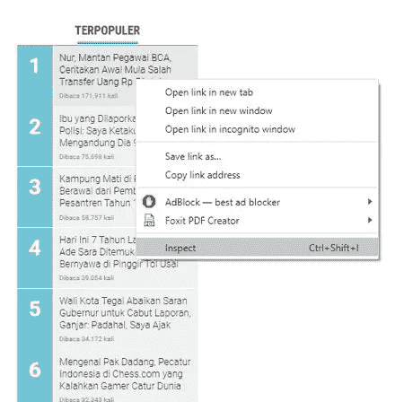
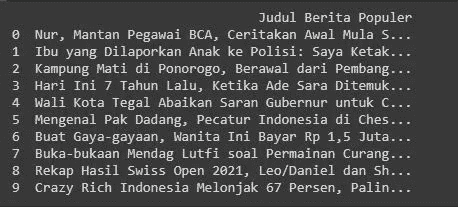

# 使用 beautifulsoup 进行简单的 web 报废

> 原文：<https://medium.com/analytics-vidhya/simple-web-scrapping-using-beautifulsoup-d7cfd59b53f3?source=collection_archive---------9----------------------->

这是我在 medium 上的第一篇文章，我刚刚受到一个朋友的启发，他正在为想学习网络抓取的你写一个非常有用的资源。如果你对网络抓取和 python 感兴趣，你可以跟随她的媒介【https://arrlany.medium.com/】T2。

在这第一篇文章中，我将讲述如何使用 python 中的 beautifulsoup 库来废弃一个网站。这是一个非常简单的步骤，我刚刚从以前的训练营课上学到的。供你参考，我写了我的代码并在 google collab 上运行它们，是的，google collab 对那些想学习和练习 python 编程但对计算机要求不高的人来说非常有用，就像我一样，它非常容易使用，非常轻便。

我将删除 kompas.com 的信息，特别是它的“berita terpopuler”专栏。

首先，像往常一样，我们需要导入项目所需的所有 python 库。在这里我将导入熊猫、urlopen 和 beautifulsoup。Urllib 将打开网站 url，而 bs4 将用于抓取网站，我们还将使用 pandas 将结果转换为 pandas 数据帧。

```
from urllib.request import urlopen
from bs4 import BeautifulSoup
import pandas as pd
```

然后我们需要创建一个函数，我将其命名为 def kompas()，然后创建 3 个变量，如下所示。在变量“Alamat”中，您可以输入您想要的网站 url。

```
def kompas():
  alamat = "https://www.kompas.com/"
  html = urlopen(alamat)
  data = BeautifulSoup(html, 'html.parser')
```

在继续编写整个代码之前，我们必须决定我们要抓取网站的哪一部分。就像我之前说过的，我会从网站上删除“berita populer”专栏。因此，我需要检查“berita populer”部分中的元素，只需将光标悬停在“berita terpopuler”列周围，右键单击，然后选择“检查元素”。



我们将得到如下的检查元素结果。


该部分有 html h4 标签和类“most__title ”,因此我们可以编写如下代码:

```
title = []
items = data.findAll("h4", {"class":"most__title"})
for item in items:
    title.append(item.get_text())
```

我们创建了一个名为 title 的列表，在将废弃结果转换为数据框之前，将它作为一个只包含文本标题的列表。items 变量将存储所有的报废结果，在本例中，它们都在 HTML 标签 h4 中，并且具有 most__title 类。循环条目将只从每个“条目”结果中获取文本格式，即新闻的标题，并将它们添加到“标题”列表中。

该函数的最后一部分是将列表转换成数据帧，以便于阅读。

```
df = pd.DataFrame(title, columns = ['Judul Berita Populer'])
print(title)
```

现在让我们调用函数 kompas()

```
kompas()
```

一段完整的代码最后会是这样的:

```
from urllib.request import urlopen
from bs4 import BeautifulSoup
import pandas as pddef kompas():
    alamat = "https://www.kompas.com/"
    html = urlopen(alamat)
    data = BeautifulSoup(html, 'html.parser')
    title = []
    items = data.findAll("h4", {"class":"most__title"})
    for item in items:
        title.append(item.get_text())
        df = pd.DataFrame(title, columns = ['Judul Berita Populer'])
        print(df)kompas()
```

运行代码后，我们将得到如下结果:



最后，这就是关于如何使用 python 中的 beautifulsoup 库从一个网站进行简单的 web 报废。感谢你阅读我的第一篇文章。也感谢 sanbercode.com[的训练营。](http://sanbercode.com)