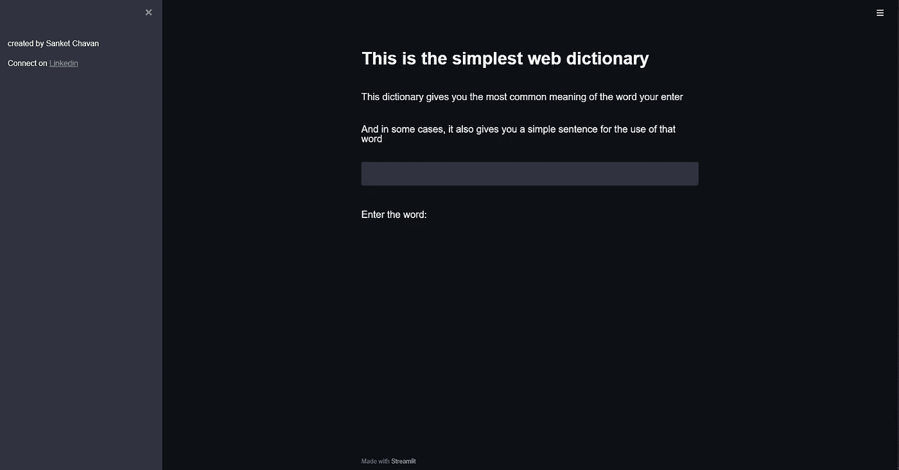

# 使用 streamlit 和 beautifultsoup 的最简单的字典 web 应用程序

> 原文：<https://medium.com/analytics-vidhya/simplest-dictionary-web-app-using-streamlit-and-beautifultsoup-66025e66d8ef?source=collection_archive---------14----------------------->

## 只需输入单词，就可以通过这个简单的网络应用程序获得最常见的意思。



使用的重要库:

*   细流
*   美味的汤
*   要求

前几天在参加一个关于 python 的研讨会时，认识了两个库，Beautiful Soup 和 Streamlit。

我的想法是，也可以使用这些库来创建字典。所以我开始写代码。

我有三项任务要完成:

*   *使用美汤创建工作代码*
*   *使用 streamlit 创建一个可以在本地机器上运行的 web 应用*
*   *在 Heroku 上部署 app。*

## ***任务一:***

Beautiful Soup 是一个 Python 库，用于从 HTML 和 XML 文件中提取数据。它与您喜欢的解析器一起工作，提供导航、搜索和修改解析树的惯用方式。它通常为程序员节省数小时或数天的工作。

初始代码:

```
import requests
from bs4 import BeautifulSoup as bs
import lxml.etree as xml
import lxmlword = input('enter the word: ')
url = f'[https://www.dictionary.com/browse/{word}?s=t'](https://www.dictionary.com/browse/{word}?s=t')
web_page = bs(requests.get(url, {}).text, "lxml")
meanings = web_page.find_all('div', attrs={'class': 'css-1ghs5zt e1q3nk1v2'})
print('\nThe meaning(s) of the word is: ')
# for all the meanings
# for meaning in meanings:
#   print('* '+ meaning.text)
#   print('\n')# for most common meaning 
print(meanings[0].text)
```

它需要用户的一句话。之后，它访问[**dictionary.com**](https://www.dictionary.com/)网站。寻找这个词的意思。它抓取所有单词并返回第一个意思，即最常见的意思。

## **任务二**

下一个任务是将这个小代码转换成 web 应用程序。Streamlit 是一个面向机器学习和数据科学团队的开源应用框架。在数小时内而不是数周内创建漂亮的数据应用。全是纯 Python。创建 web 应用程序时，您也可以在语法中添加 HTML 代码。

要安装 streamlit，请使用以下命令

`pip install streamlit`

streamlit 中有很多有趣的函数。对原始代码做了一些修改。但是，对于这个简单的项目，只使用了以下几种:

`st.title()`:为网络应用添加标题

`st.subheader()`:添加副标题

`st.text_input()`:获取用户的输入

`st.write()`:显示输出

`st.sidebar.markdown()`:添加带降价文字的侧边栏。

要在本地机器上运行应用程序，您必须键入以下命令。

`streamlit run app_name.py`

它将打开默认浏览器并运行应用程序。你也可以改变应用程序的外观。点击页面右上角的三个栏，然后点击设置。按照您的意愿应用修改。

## **任务三**

现在，这两项测量任务已经完成。是时候在 Heroku 上部署应用程序了。Heroku 是一个平台即服务(PaaS ),使开发人员能够完全在云中构建、运行和操作应用程序。Heroku 支持多种编程语言，如 Java、Node.js、Scala、Clojure、Python、PHP 和 Go。

部署应用程序很容易，但却是一个谨慎的过程。需要创建三个重要的文件。

*   首先是 **requirement.txt** 文件。该文件将包含应用程序中使用的库。

```
streamlit==0.79.0
requests==2.25.1
lxml==4.6.3
beautifulsoup4==4.9.3
```

*   第二个文件是 **setup.sh** 文件。该文件包含以下代码

```
mkdir -p ~/.streamlit/echo "\
[server]\n\
headless = true\n\
port = $PORT\n\
enableCORS = false\n\
\n\
" > ~/.streamlit/config.toml
```

*   最后是 **Procfile** 。它包含部署应用程序时要运行的命令。需要记住的重要一点是，Procfile **不会有任何扩展名。**

`web: sh setup.sh && streamlit run app.py`

当这一步完成后，剩下的过程就简单了。以下是步骤:

1.  创建 GitHub repo。
2.  将包括上述文件在内的文件推送到 repo。
3.  打开 Heroku 网站。(如果您还没有，请创建一个帐户)
4.  点击**新建**并选择**创建新应用**选项。
5.  给应用命名，点击**创建应用**按钮。
6.  连接您的 GitHub 帐户。它将首次请求授权。
7.  然后搜索推送 web app 代码的回购。
8.  部署有两种选择。自动部署和手动部署。自动部署将根据您在代码中所做的更改自动更新应用程序。选择你喜欢的选项。
9.  单击部署选项后。它将开始部署应用程序。

在这个过程的最后，你会得到一个**查看 app** 按钮。点击它访问网络应用程序。

*   要使用最简单的字典，点击 [**这里。**](https://simplest-dictionary.herokuapp.com/)
*   **Github** [**链接**](https://github.com/sanketchavan5595/stwebapp):
*   要连接: [Sanket Chavan | LinkedIn](https://www.linkedin.com/in/sanket-chavan5595/)

> 谢谢你，祝你愉快