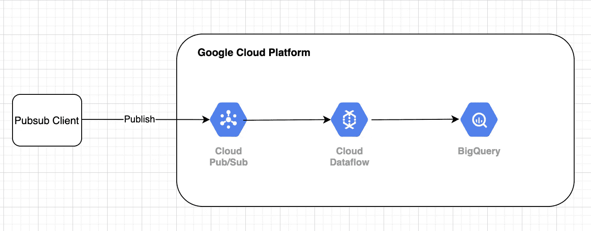

# Google 云平台上最简单的实时流数据管道

> 原文：<https://medium.com/analytics-vidhya/simplest-realtime-streaming-data-pipeline-on-gcp-a57cd07adfc1?source=collection_archive---------0----------------------->

## “利用谷歌的技术，在 GCP 建立流媒体管道非常简单”

> *最初发表于*【https://asyncq.com】

**

## *目录*

*   *步骤 1:构建客户端*
*   *步骤 2:数据摄取*