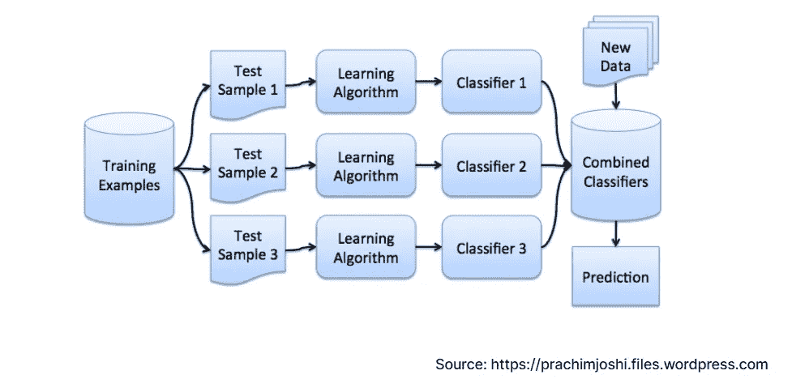
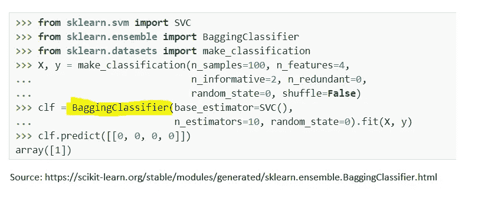
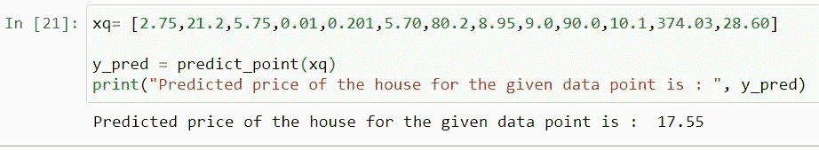

# 理解 Bagging(引导聚合)和实施的简化方法，无需 scikit-learn

> 原文：<https://medium.com/analytics-vidhya/simplified-approach-to-understand-bagging-bootstrap-aggregation-and-implementation-without-89b7271f02bc?source=collection_archive---------12----------------------->

第一种集成方法/功能称为 Bagging，主要用于机器学习中的回归问题。名称' **Bagg** ing '是两个词的连词，即**自举**和**聚集**。在统计学中，Bootstrap 类似于随机抽样。

在给你关于装袋的清晰图片之前，让我们先了解为什么我们需要装袋，我们什么时候应该选择它来解决这个问题？

# 为什么以及什么时候我们应该使用装袋？

每个模型的性能取决于数据。结果的准确性总是直接取决于我们考虑用于训练的数据量。因此，在训练数据集非常小的情况下，在拟合到模型之前考虑 bagging 方法应该始终是最佳实践。除此之外，它还有助于减少方差(即对输入数据的微小变化敏感)

假设，训练数据集非常小，我们被赋予一个回归任务。使用 Bagging，从给定数据中创建几组随机样本，其中样本长度(m) < length of the data(n). Now we can consider these samples as our training data.

Now, let me show you a code from sklearn on Bagging.

Sci-kit learn provides a beautiful library called **BaggingClassifier** 在内部进行所有采样和聚合。*但我们的目标是让这个博客可以理解，展示内部作品。毕竟，观察采样和聚合背后的工作方式真的很有趣。*

# **在没有 Scikit 的情况下实施装袋-学习**

让我们考虑一下，我有一个非常小的数据集(长度< 1000) and I am given a task to find the prediction for a given data point. This is a regression problem.

1.  First step is to create a sample: In this step, I have computed a single sample data with the help of column-sampling mechanism

2\. In this step, I am creating 30 samples from the given dataset ‘x’.

3\. Now as I have mentioned above, we have reached to the final step of **自举**)。在这一步中，我们将为每个样本创建模型。在这种情况下，它将是 30 个模型。

4.正如我在 Bagging 的介绍部分提到的，它是引导和聚集的结合，现在我们可以跳到聚集机制。在这一步，我将预测每个模型的数据点并取平均值(即平均值/中值)。

现在当我们调用这个方法来预测一个数据点时，结果如下。

# 结论

Bagging 非常有助于提高模型性能的稳定性，因为它试图防止方差的影响。由于多重采样，方差的影响呈指数下降。对我们来说，最重要的是不要拘泥于它的预测值，而要找出均方误差和袋外得分，以密切观察所准备的模型的性能。

***感谢您抽出宝贵的时间阅读本文。***

***如果你喜欢这篇文章-请喜欢，分享并关注我的*** [***频道***](http://sibanisankar.medium.com) ***因为它会鼓励我张贴各种概念，关于 ML 和 DL 的问题…***