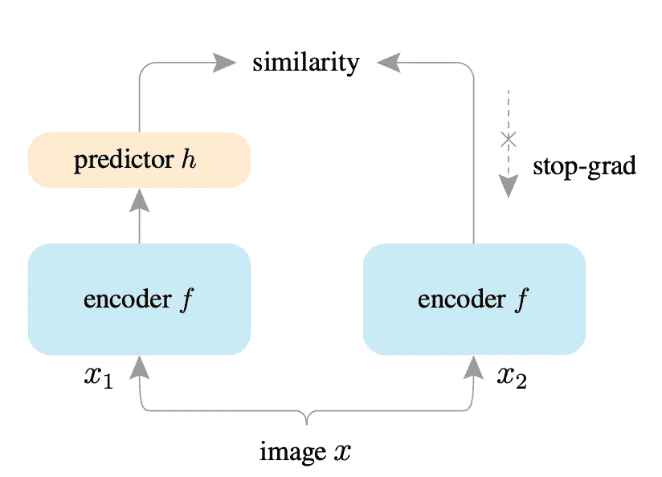
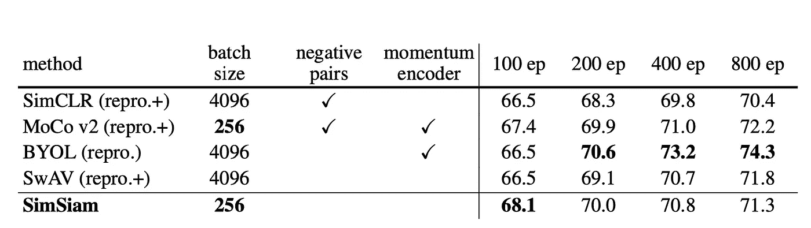

# “暹罗”报解释说

> 原文：<https://medium.com/analytics-vidhya/simsiam-paper-explained-df3577cab49e?source=collection_archive---------6----------------------->

> [更新:陈和何的《探索简单的连体表示学习》获得了第 21 届最优秀论文荣誉奖。](http://cvpr2021.thecvf.com/node/329)

近年来，自我监督表征学习领域非常受欢迎，并已显示出在提高许多任务的性能方面非常有效。

在这篇博文中，我们来了解一下人工智能研究院的陈和何的最新研究论文**探索简单暹罗表征学习。**

如果你是一个熟悉自我监督学习和表征学习的高级读者，你可以直接跳到**提出解决方案一节。**

# 自我监督学习

顾名思义，它是一个学习算法家族，可以以自我监督的方式学习任务，即不需要手动标记数据。

# 表征学习

在表征学习中，我们为图像(或文本或音频)开发表征向量。假设有一张 256x256 大小的狗的图片，有三种颜色。该图像具有 256x256x3 张量形式的像素数据。在表示学习中，我们试图开发一个大小为 1x1024(或任何合适的维度)的向量，它可以捕获关于图像的更高级别的抽象信息，而不仅仅是原始像素。

# 自我监督表示学习

这是通过拍摄相似的图像(或文本或声音)并强制具有相似的表示向量来实现的。

# 问题

简单的自我监督表示学习的问题是，在几个时期之后，该模型学习身份映射——对于所有图像，它输出相同的向量。这是因为我们希望表示向量相似。身份映射给出了相同的表示，因此模型的余弦相似性损失变成了**零**。

尽管在训练过程中损失为零，但是所学习的表示是无用的，因为所有图像都得到相同的表示。

# 提出解决方案

自我监督表示学习中的折叠到身份映射的问题通过以下方式解决:

*   论文中的阴性样本 **SimCLR，和 MoCo** 。这个想法是使用负样本，我们的损失函数不仅衡量相似图像的相似性，还衡量不同图像之间的差异。

注 1: **有监督的对比学习**也使用负样本，但不是自监督的，所以不提。

注 2: **MoCo** 也使用移动平均法，但不仅限于此。

*   论文在线聚类 **SwAV。**想法是对图像进行聚类，并将聚类用作正样本和负样本。
*   文中均线 **BYOL。**想法是用一个带移动平均值的网络来代表相似的样本。这种方法不需要任何负样本。

# 这篇论文

整篇论文的一句话概括就是

> 没有动量编码器的 BYOL。无负样本的 SimCLR。无在线聚类的 SWaV

这篇论文的作者发现，即使在删除了所有添加的额外结构(如负样本、聚类和移动平均)以防止模型崩溃到身份映射之后。模型可以学习好的表示。

# 怎么会？

**SimSiam** 的模型架构

只有**停止-分级**操作足以获得下游任务的比较结果。在 stop-grad 方法中，我们使流过该分支**、**的所有梯度为零，因此只有编码器-预测器分支在训练步骤得到更新。

这种方法出奇的简单，并且显示出**连体网络**在开发表示方面具有强大的能力。

注 arXiv update v3 中的 **BYOL** 论文在预训练阶段以 10 倍的学习速率做了 300 个时期的相同程序。这项工作是同时进行的，应该得到承认。

# 结果

ImageNet 分类任务的结果

很明显， **SimSiam** 的简单性在前 100 个纪元中比其他所有方法都更成功。同样显而易见的是，像 **BYOL** 这样更先进的方法在训练更多的时期时更有优势。

SimSiam 方法的一个巨大优势是批量较小，因此这种方法需要的计算资源非常少。

## 参考

1.  **暹罗—** `Exploring Simple Siamese Representation Learning`
2.  **SimCLR —** `A Simple Framework for Contrastive Learning of Visual Representations`
3.  **simclrv 2—**
4.  **BYOL—**

更多有趣的论文解释博文，请关注并分享。