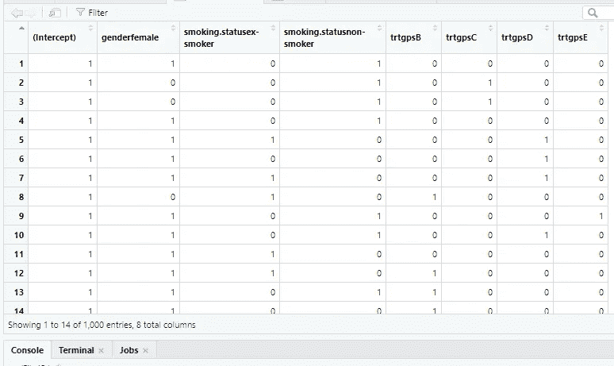

# 模拟常见的，非删失的，结果变量作为因变量在 R

> 原文：<https://medium.com/analytics-vidhya/simulating-common-non-censored-outcome-variables-as-dependent-variables-4bdea1efd211?source=collection_archive---------9----------------------->

*【正在审核】*

为了理解统计建模技术和更好地处理真实世界的数据，模拟数据或其他种类的合成数据在这方面有目的地帮助很大。例如，在医疗保健领域，模拟试验通常会引导研究者了解预期的参与者数量，从而获得更高的临床成功率。

我们关注临床试验数据。这种数据的数据生成过程通常被认为产生:正常情况下，二项式或泊松分布数据；和多变量正态分布数据，用于多个结果的联合分析，同时考虑竞争结果之间的相关性/关系。

假设我们对 5 组共 1000 名患者进行 5 种治疗。在此之前，我们收集他们的*年龄*(以岁为单位)*身体质量指数*(以公斤/米为单位的 BMI)*性别*、*吸烟状况*等信息。除了*治疗变量*之外，最后两个变量分别是等级 2、3 和 5 的分类变量。患者为*男性*或*女性*、*吸烟者*、*戒烟者*或*不吸烟者*，接受 A、B、C、D 或 e 治疗。我们承认对治疗的结果反应(Y)将取决于所有这些变量(X)。为简单起见，我们假设 Y 的期望值 E(Y)通过可逆函数 g(通常称为*链接函数*)与这些变量线性*相关，从而*

***【E(Y))****= B0+B . age *(Xage-mean(Xage))+B . BMI *(Xbmi-mean(Xbmi))+B . female * Xfemale+B . ex smoker * xex smoker+B . non smoker * xnosmoker+B . B * XB+B . C * XC+B . D * XD+B . E * XE*

三个分类变量的参考分别是*男性*、*吸烟者*和 A。b 是真实的回归系数:b0 是在平均年龄、平均 bmi 以及二元变量 x 女性、x 吸烟者、x 非吸烟者、XB、XC、XD、XE 都为零时对结果反应的真实影响。换句话说，b0 是平均年龄和 bmi 的男性吸烟患者在治疗组 A 中的真实效果。这是将连续(潜在)非零变量*年龄*和 *bmi* 居中的主要作用，以便对截距 b0 有一个合理的解释。为了在 R 中进行模拟和拟合，我们将调用以下包: *MASS、tidyverse、truncnorm 和 fitdistplus*。

# 模拟线性预测器

首先，我们通过以下方式模拟 5 个变量(协变量):

> **set.seed(10082021) #** 随时生成相同的值(如果我们没有相同的模拟值，也不用担心！)
> **性别**<-样本(c("男"，"女")，大小=1000，replace = T，prob=c(.4，. 6))
> **年龄**<-样本(17:103，大小=1000，replace = T，prob = NULL)
> **BMI**<-rtruncnorm(1000，a=0，b=50，mean=20.7，sd=6

可以使用任何其他分布来生成这些值:性别为*性别为*的二项分布；均匀、[截尾威布尔( *tweibull* )](https://rdrr.io/rforge/TruncatedDistributions/man/tweibull.html) [截尾正态(*截尾正态* )](https://www.rdocumentation.org/packages/truncnorm/versions/1.0-8/topics/truncnorm) 、指数或[截尾泊松](https://stat.ethz.ch/pipermail/r-help/2005-May/070678.html)分布，以及你能想到的用于连续变量*年龄*以及 *bmi* 的任何其他合适的连续分布；*吸烟状况*以及治疗组( *trtgps* )变量的多项分布。将模拟变量捆绑在一个数据帧中作为***data1****<-data . frame(性别=因子(性别)，年龄=年龄，bmi=bmi，smoking.status =因子(smoking.status)，trtgps =因子(trtgps)，*看起来是这样的:

视图(数据 1)在 R 中

分类变量必须包装在数据帧 data1 中的 R 函数 *factor()* 中，否则它们将保留为*字符变量*，不适用于 R 中的统计分析。

接下来，我们用下面一行代码指定分类变量的引用:***relevel . data1****<-data1 %>%
mutate(gender = relevel(gender，ref = "male ")，
smoking . status = relevel(smoking . status，ref = "smoker ")，
trtgps = relevel(trtgps，ref = "A "))。*具有 *k* 级的分类变量在分析中以这样一种方式处理，即不是引用的*、*k-1 级被编码为二进制变量。例如*，* ***XB=1 如果 trtgps=B & XB=0 如果 trtgps 不是 B****为了方便地将这些级别从它们各自的*父变量中分离出来，*我们在 r 中使用函数 *model.matrix()* ，这样就创建了一个( *contrast* )矩阵: ***contrast.matrix 矩阵如下所示。第一列*(拦截)*不是我们感兴趣的。****

**

*用视图(*对比矩阵*)在 R*

*我们将最后 7 列添加到 data1，并形成新的数据集 data2:*

****data 2****<-data . frame(gender = factor(性别)，Xage=age，Xbmi=bmi，smoking . status = factor(smoking . status)，trtgps=factor(trtgps)，Xfemale=contrast.matrix[，2]，Xexsmoker=contrast.matrix[，3]，xnosmoker = contrast . matrix[，4]，XB=contrast.matrix[，5]，XC=contrast.matrix[，6]，XD=contrast.matrix[，7]**

**

*视图(数据 2)在 R 中*

*我们分别为真系数 *c(b0，b.age，b.bmi，b.female，b.exsmoker，b.nonsmoker，b.C，b.D，b.E)* 生成任意值***<-runif(10，-.05，.. 05)* 。这些系数在区间[-.05，. 05]内是相对非常小的值。当链接函数 g 是*对数*或*对数比值*时，它们是*对数值*或*对数比值*(见下文)，因此，如果它们很大，它们可能会产生不切实际的响应值(您可以尝试通过改变均匀分布的边界来验证)。我们定义线性表达式/预测值:***

******linear . expr****<-b[1]+b[2]*(Xage-mean(Xage))+b[3]*(Xbmi-mean(Xbmi))+b[4]* x female+b[5]* xex smoker+b[6]* xn smoker+b[7]* XB+b[8]* XC+b[9]* XD+b[10]* XE【XE****

# ***相对于线性预测值模拟响应变量 Y***

## ***情景 1:我们对结果反应变量 Y 施加未知的分布***

***在这种情况下，Y 就是上面定义的线性表达式。***

****Y<-与(data2，linear.expr)****

***对 Y 的快速汇总统计表明，它是一个具有一些负值的连续变量。它的均值和中位数是相似的，所以它可以描述一个正态分布。***

******

***无论如何，我们可以拟合 Y 的一些常见分布是均匀分布和正态分布。我们用函数*来实现****

> ****fit.u fit.n < - fitdist(Y，" norm ")****

****并具体比较 R 函数 *denscomp(list(fit.u，fit.n)，legendtext=c("uniform "，" normal "))生成的图中的两种分布。*****

********

****用 denscomp(list(fit.u，fit.n)，legendtext=c("uniform "，" normal "))绘图****

****并比较由 R 函数 *gofstat()* 提供的拟合优度特征****

********

****AIC 或者 BICs 的区别，没那么大(< 3), and the graph shows that a uniform as well as a normal model, would provide reliable estimates of the parameters that describe Y. A thorough investigation can be done to find out what other distributions Y could fit best within the [*fitdistplus*](https://www.jstatsoft.org/article/view/v064i04)R 包)。****

## ****情景 2:我们对结果反应变量 Y 进行正态分布****

****模拟 R 中的正态分布变量需要两个参数:*均值*和*标准差 sd* 。为了说明可能的链接功能，需要区分两种情况。我们为 sd 选择任意值。然而，*均值*是协变量的预定义线性组合的函数。****

******情况 1:** g 是恒等环 g(E(Y))=E(Y)****

*****Y < -with(data2，rnorm(1000，mean = linear.expr，sd = 3.7))*****

******情况二:** g 是对数链接 g(E(Y))=log(E(Y))****

*****Y < -with(data2，rtruncnorm(1000，a=0，b=Inf，mean = exp(linear.expr)，sd = 0.3))*****

## ****情景 3:我们对结果反应变量 Y 采用二项式分布****

****这里只需要一个参数，即 *prob* ，即感兴趣事件的概率，通常表示为成功的概率。****

******情况 1:** g 是 logit 链接 g(E(Y))=log(E(Y)/1-E(Y))(也称为 log odds)****

*****Y < -with(data2，rbinom(1000，size=1，prob = exp(linear . expr)/(1+exp(linear . expr)))*****

******案例二:** g 是概率单位链 g(E(Y))=Phi^(-1)(E(Y)，标准正态分布 N(0，1)的*逆* cdf。pnorm() R 函数为 N(0，1)生成 cdf 值。****

*****Y < -with(data2，rbinom(1000，size=1，prob=pnorm(linear.expr)))*****

******情况 3:** g 是互补的对数-对数链接函数 g(E(Y))=log(-log(1-E(Y)))****

*****Y < -with(data2，rbinom(1000，size=1，prob = 1-exp(-exp(linear . expr)))*****

## ****场景 4:我们对结果反应变量 Y 进行泊松分布****

****这里也一样，只需要一个参数来模拟泊松数据，*λ*，感兴趣事件的速率。****

******情况 1:** g 是对数链接 g(E(Y))=log(E(Y))****

****Y with(data2， rpois(1000，lambda = exp(*linear . expr*))****

# ****拟合响应变量 Y****

****因此，不同情景下的每个响应变量都可以在 [*广义线性模型*](https://www.statmethods.net/advstats/glm.html)*【glm】*框架下进行拟合。****

*******合身。Y****<-glm(Y ~ Xage+Xbmi+Xfemale+xex smoker+xnosmoker+
XB+XC+XD+XE，family=distribution(link= " . ")，数据=数据 2)*****

****将*分布组件*替换为高斯(正态)、二项式或泊松，相应地*链接组件*可以是 identity、log、logit、cloglog。glm 是为*指数族*中的分布设计的。然而，均匀分布不是指数分布族的一部分，应寻求其他模型(简单的线性模型可以用 *lm()* R 函数)。例如，在拟合二项式数据或泊松数据时，会出现*过度分散或分散不足*的问题。当拟合模型的偏差大于*最大似然估计(MLE)* 下剩余偏差的渐近卡方分布的自由度时，出现过度分散。否则，当偏差小于自由度时，它就是分散不足。处理离差问题的替代方法包括使用拟似然法(如拟二项式、拟泊松似然法)以及将带有 R 函数 *glm.nb()* 的*负二项式模型*拟合到过度或不足离差的单变量数据。例如，只有一个参数描述泊松数据，这使得很难找到此类数据的最佳拟合，这也是出现与离差相关的问题的原因之一。****

# ****参考****

****1. [*临床试验数据分析采用 R*](https://www.academia.edu/20618730/Clinical_Trial_Data_Analysis_Using_R_by_Ding-Geng_Din_Chen_Karl_E._Peace) 由丁庚(Din)陈、卡尔和平。《2013 年国际统计评论》****