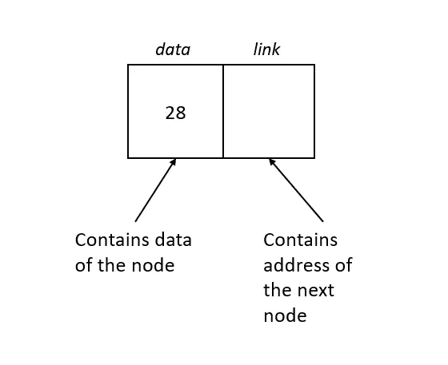
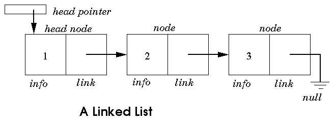
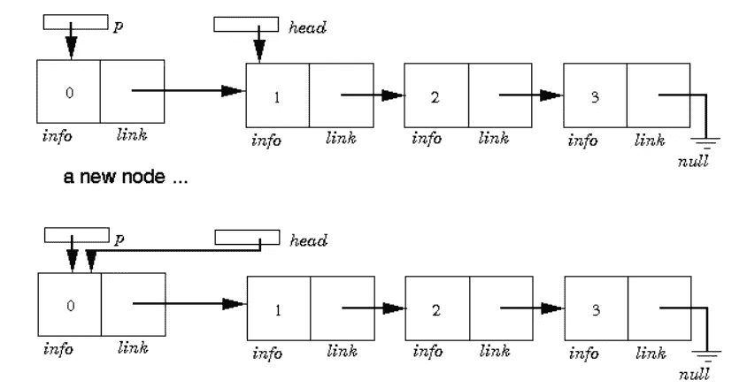
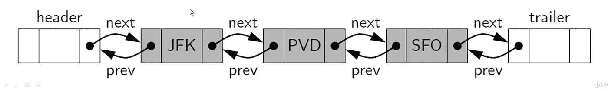
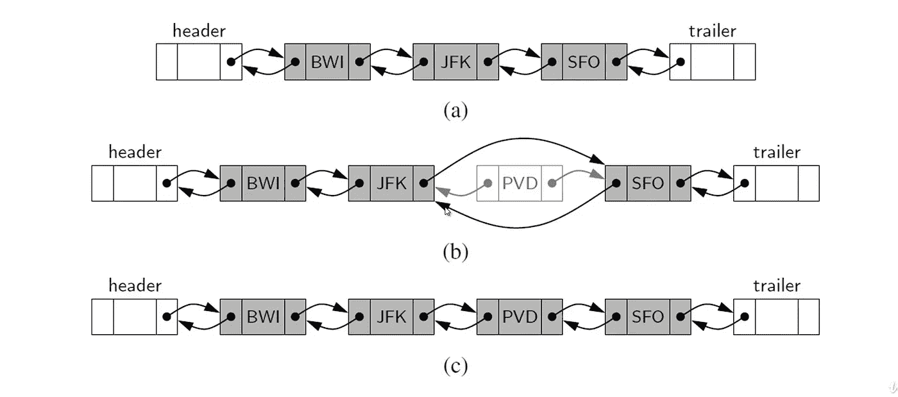

# 单链表和双链表概述及其在 Python 中的实现

> 原文：<https://medium.com/analytics-vidhya/single-linked-lists-and-double-linked-lists-overview-and-its-implementation-in-python-ffc41ffa7cfe?source=collection_archive---------20----------------------->

# 单一链接列表概述:

单个链表，最简单的形式，是节点的集合，共同形成一个线性序列。每个节点存储一个对作为序列元素的对象的引用，以及对列表中下一个节点的引用。

在单链表中，每个节点都有两部分数据和下一个节点的地址，如下图所示。



[来源](https://dev.to/ivywalobwa/singly-linked-list-f2m)

单链表包含一个头指针，它包含第一个节点(头节点)的地址。向前连续移动。
注意，最后一个节点的链接部分设置为空



链表的第一个和最后一个节点被称为链表的**头**和**尾**。我们可以将尾部标识为没有作为其下一个引用的节点。遍历节点并通过遍历节点来检查链表的过程通常被称为**遍历**链表，遍历链表的过程有时也被称为**链接跳转**或**指针跳转。**

每个节点都表示为一个唯一的对象，该实例存储对其元素的引用和对下一个节点的引用(或者不存储)

**注意:**链表的一个重要属性是它没有预先确定的固定大小。它使用的空间与其当前的元素数量成比例。

我们创建一个新节点

将其元素设置为新元素

设置其下一个链接到新元素

设置其下一个链接指向当前头

然后设置列表头指向新节点。



类似地，我们也可以很容易地在列表的尾部插入一个元素，只要我们保留一个对尾部节点的引用。

1.  创建一个新节点。
2.  将其下一个引用赋值为 none。
3.  将尾部的下一个引用设置为指向这个新节点。
4.  然后将尾部引用更新到我们已经创建的新尾部节点。

从单链表的头部删除一个元素实质上是在头部插入一个新元素的反向操作。

我们不能轻易地删除单链表的最后一个节点。即使我们维护一个直接指向列表最后一个节点的尾引用，我们也必须能够访问最后一个节点之前的节点，以便移除最后一个节点。但是我们不能通过跟随尾部的下一个链接到达尾部之前的节点。

如果我们想要有效地支持这样的操作，我们将需要把我们的列表做成双向链表。

# 单链表实现

我们将实现一个基本的单链表。

记住，在一个单链表中，我们有一个有序的条目列表，作为指向其他节点的单独节点。

```
class Node(object):

    def __init__(self,value):

        self.value = value
        self.nextnode = None
```

现在我们可以用节点集合构建链表:

```
a = Node(1)
b = Node(2)
c = Node(3)a.nextnode = bb.nextnode = c
```

在一个链表中，第一个节点被称为**头**，最后一个节点被称为**尾**。让我们讨论一下链表的优缺点:

# 赞成的意见

*   链表在任何位置都有固定时间的插入和删除，相比之下，数组做同样的事情需要 O(n)时间。
*   链表可以继续扩展，而不必事先指定它们的大小。

# 骗局

*   要访问链表中的一个元素，从链表头到第 k 个元素需要 O(k)时间。相比之下，数组有常量时间操作来访问数组中的元素。

# 双向链表概述:

在一个双向链表中，我们定义了一个链表，其中每个节点都保持一个对它之前的节点的显式引用和对它之后的节点的引用。

这些列表允许更多种 O(1)时间的更新操作，包括插入和删除。

我们继续使用术语**“下一个”**来指代跟随另一个节点的节点，并且使用术语**“上一个”**来指代在它之前的节点。

在双向链表中，我们在链表的两端添加特殊的节点。

列表开头的**头**节点和列表结尾的**尾**。这些“虚拟”节点被称为**哨兵或守卫**节点。



对双向链表表示的每次插入都将发生在一对现有节点之间。当一个新元素被插入到序列的前面时，我们将简单地在头部和头部后面的节点之间添加新的节点。



向双向链表中插入新元素与从双向链表中移除元素是一样的。

# 双向链表实现

现在我们将实现一个双向链表

```
class DoublyLinkedListNode(object):

    def __init__(self,value):

        self.value = value
        self.next_node = None
        self.prev_node = None
```

现在我们有了可以引用下一个*和前一个*值的节点，让我们开始构建我们的链表吧！

```
a = DoublyLinkedListNode(1)
b = DoublyLinkedListNode(2)
c = DoublyLinkedListNode(3)# Setting b after a
b.prev_node = a
a.next_node = b# Setting c after a
b.next_node = c
c.prev_node = b
```

拥有一个双向链表允许我们向前**和向后**遍历链表。

在下一篇博客中，我们将看到递归及其在 python 中的实现。

如果你有任何反馈或批评，请随时与我分享。如果本演练对您有所帮助，请喜欢👏文章。干杯！🍻