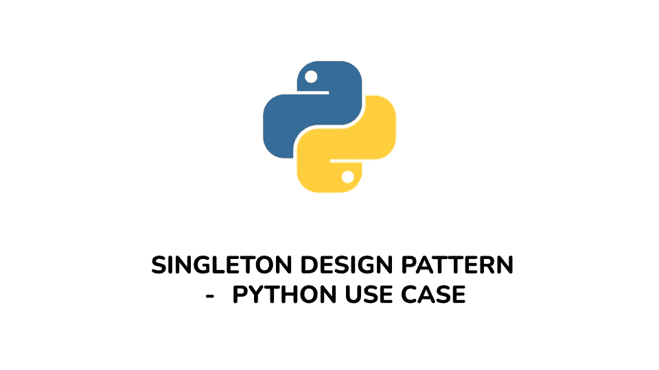

# 单例设计模式——PYTHON 用例

> 原文：<https://medium.com/analytics-vidhya/singleton-design-pattern-python-use-case-c85fc870eda2?source=collection_archive---------12----------------------->

听说过 singleton 设计模式，但是不知道如何、何时以及为什么使用它？嗯，那是几天前的我。

总之， [**单例设计模式**](https://en.wikipedia.org/wiki/Singleton_pattern) 是一个简单的模式，它允许你共享一个资源，或者最好是管理一个共享的资源。它允许你实例化你的类的一个实例，并限制所述类的多个实例化。

当你想检索和存储外部配置文件的信息，管理到数据库或外部文件或驱动程序的连接时，你可以使用单例。

# 真实世界的例子

想象一下，一个服务器上的应用程序有几个部分创建它自己的到数据库的连接，并且还在数据库上执行不同的操作，混乱吧？

singleton 允许您只创建一个数据库连接的实例，并且在应用程序的所有部分中，使用同一个对象对数据库执行其他操作。

> 总之，Singleton 确保一个类只有一个实例，并提供一个全局的访问点。

# Python 中 Singleton 的实现

单例模式可以很容易地在 python 中实现，因为 Python 给了用户更多的自由来修改类的构造函数。

下面是 singleton 的一个简单实现的例子。

我们会看到 obj1 和 obj2 是相同的实例，并打印出相同的对象。这是因为`**__new__()**`方法是一个默认的构造函数，用于创建和返回该类的一个新实例。在大多数情况下，不需要修改这个默认方法，因为当调用一个类时，它会自动返回一个新的实例。但是在这种情况下，我们必须实现 singleton 模式，我们将修改它以确保只创建该类的一个实例。

# 结论

在介绍、讨论和实现了 Singleton 设计模式之后，需要注意的是，就像任何其他设计模式一样，Singleton 模式有其优点和缺点，我们可以根据我们的特定场景选择最佳的设计模式。

还要注意，设计模式只是编程中要遵循的良好惯例，因为它使应用程序工作得更好，并增加了它的可扩展性。设计模式可以在不同的编程语言中用于不同的情况。