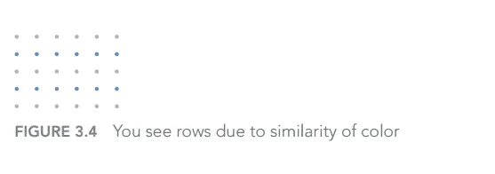
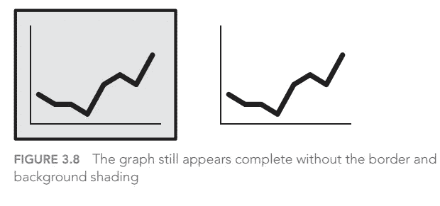
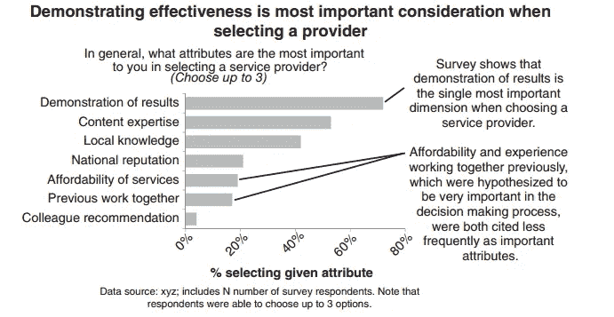
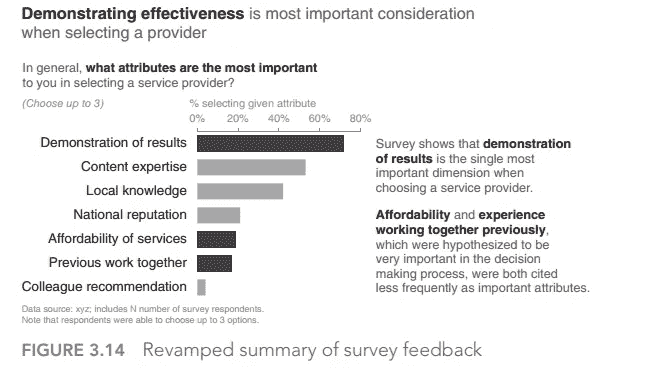
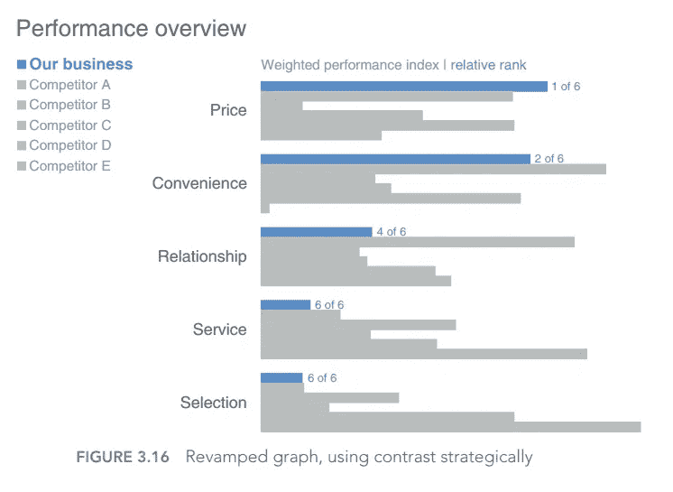
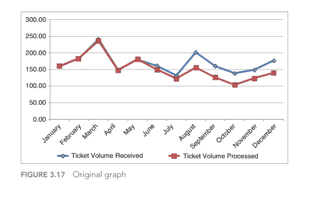
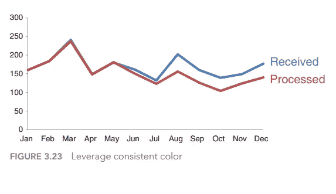

# 用数据讲故事的六个重要经验

> 原文：<https://medium.com/analytics-vidhya/six-important-lessons-from-storytelling-with-data-by-nussbaumer-knaflic-part-2-737d8478bc0b?source=collection_archive---------16----------------------->

在这一系列文章中，我将分享 Nussbaumer Knaflic 的《用数据讲故事》一书的摘要。所有内容都摘自她的书，但我试图通过解释书中教授的与主题相关的六个重要课程来总结内容。我希望这六课能大大提高你的可视化专业知识，从而提高用数据讲故事的艺术。这将是一系列文章，在每篇文章中，我将总结一到两个教训。在这一部分，我将总结第三个关键教训。

图片-0-由 Nussbaumer Knaflic 提供的数据

# 什么是杂乱？

在第三章中，Knaflic 详细阐述了混乱以及如何在你自己的视觉化中避免混乱。根据 Knaflic clutter 的说法，“这些是视觉元素，**占据了空间**，但**并没有增加理解**”[1]。她认为杂乱是你可视化的敌人的原因是，它没有向你的观众传达任何信息，同时增加了“认知负荷”，这基本上是“占用精神资源但无助于观众理解信息的处理”。

# 视觉感知的格式塔原理

之后，她描述了构成普通视觉感知的 5 个关键要素。然后，她以此为基础，进一步解释与杂乱相关的主要问题，然后制定如何避免杂乱的详细步骤。第一个元素是“**接近度**”[1]，这是人类将物理上接近物体认为属于同一组的倾向。第二个要素是"**相似性** "[1]，这意味着，"颜色、形状、大小或方向相似的物体被认为是相关的或属于一个群体的一部分"[1]

图 1-由 Nussbaumer Knaflic 用数据讲故事提供

第三个元素是“**Enclosure**”[1]也就是，“我们认为物理上封闭在一起的对象属于一个组的一部分”[1]。此外，第四个元素是"**闭包** "[1]，这意味着人类喜欢简单而不是复杂:

图 2-由努斯鲍默·克纳弗里克提供的数据故事

最后一个关键要素是“**连续性**”[1]，这是人类寻求最平滑路径的倾向，甚至创造一条路径，即使明显不存在这样的连续性。

# 杂乱的主要原因

然后，作者用这五个关键要素来阐述什么对人类来说是真正的杂乱以及如何避免。她提到的第一个原因是缺乏视觉秩序。这基本上没有具体的顺序和对观想的强调，一切都是白色和灰色的:

图 3-由 Nussbaumer Knaflic 用数据讲故事提供

很明显，可视化没有清晰的结构和顺序，这使得向用户传达信息很困难，因为这增加了观众的复杂性，也没有强调观众的任何连续性。作者随后改进了该图，以改善其视觉顺序，从而减少混乱:

图 4-由 Nussbaumer Knaflic 用数据讲故事提供

此外，上面的例子还表明，在任何可视化中缺乏对齐也增加了混乱。请注意，在图 4 中，图表是如何居中对齐的，这使得视觉解释更加平滑和容易。作者还谈到有多少新手只是为了添加数据而添加数据，却没有为“**空白区域**”[1]留下任何余地。她提到“视觉交流中的空白与公开演讲中的停顿一样重要”[1] &“可以战略性地使用来吸引对页面中非空白部分的注意”[1]。

她进一步阐述了人们在策略上随机使用**对比** **对比**而非**。对比**可以作为给观众的信号:

图 5-由 Nussbaumer Knaflic 用数据讲故事提供

## 去杂乱示例

最后，她提到了在完成这一章之前避免混乱的六个步骤。最初杂乱图形如下:

图 6-由 Nussbaumer Knaflic 提供的数据故事

**应用这六个步骤后，使用了视觉感知的五个要素，避免了杂乱的主要原因:**

1-删除图表边框

2-删除图表边框

3-移除数据标记

4-清理轴标签

5-直接标记数据

6-利用一致的颜色

最终图形如下:

图 7-由 Nussbaumer Knaflic 用数据讲故事提供

# 结论

最后，本文总结了本书的第三章，这一章是关于混乱的原因以及如何避免混乱的。我试图总结出抓住这一章主旨的关键观点，这样你就可以很容易地应用这一章的知识，避免任何可视化的最大敌人。

在本系列文章的第三部分，我将讨论本书的第四个关键教训。

# 参考

> [1]纳弗利克，努斯鲍默。*用数据讲故事*。