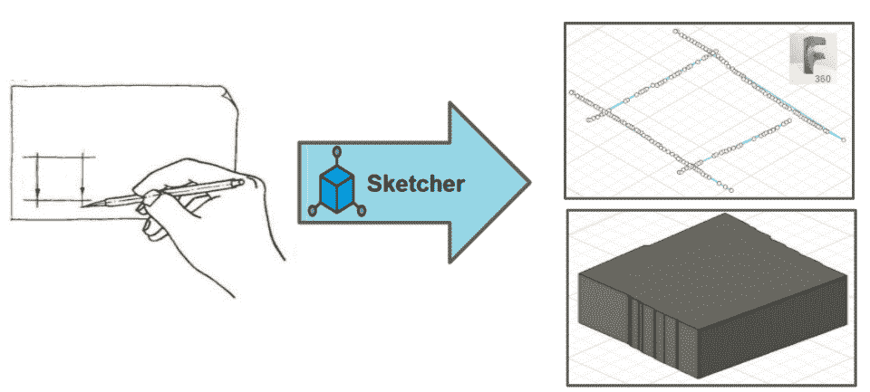
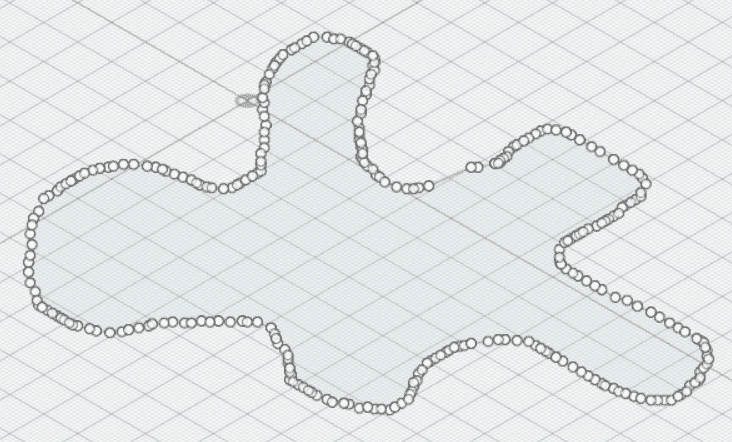
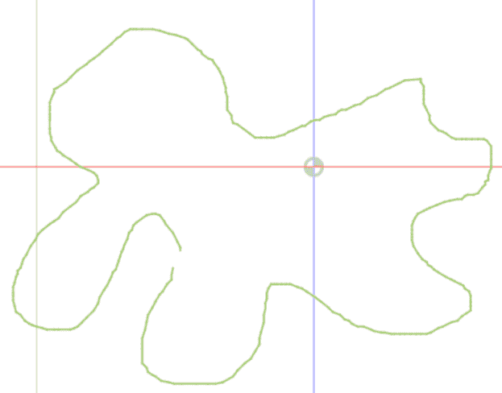
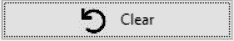
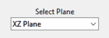
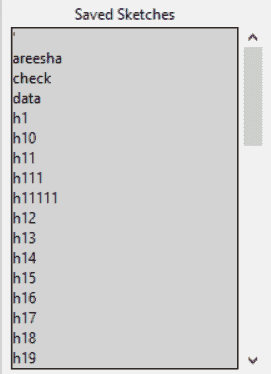
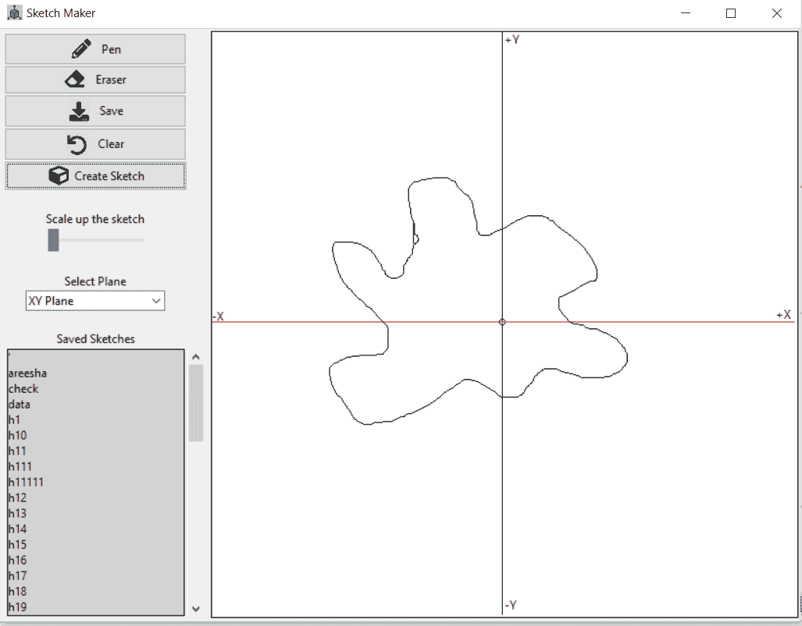

# Sketch Maker —一款用于手绘草图的 fusion360 插件

> 原文：<https://medium.com/analytics-vidhya/sketch-maker-a-fusion360-plugin-for-free-hand-sketching-a1da1aa0ec42?source=collection_archive---------12----------------------->

这是我的研究实验室项目任务，是我在亚琛工业大学软件系统工程硕士学位的一部分。

在头脑风暴这个想法的时候，我和我的实验室伙伴 *Sana Kanj* 在 AutoDesk Fusion360 论坛[1]上对 Fusion 用户的反馈进行了一些研究，并为 Fusion360 用户创建了一个他们真正需要的愿望列表。在其他酷而有趣的想法中，我们选择了“手绘草图”的想法，因为这是 Fusion360 用户在用户定义的平面中绘制不规则表面的草图，然后在 Fusion 中挤出为 3D 模型，并将挤出的模型用于 3D 打印的最基本要求。

# 需要一个插件:

Fusion360 提供的草图绘制功能用于绘制固定草图。Fusion360 工具中没有可用的手绘草图功能。为了手绘草图，通常会在绘制草图的地方使用第三方工具，如 [Inkscape](https://inkscape.org/) 。草图保存在 SVG 中，然后导入 Fusion360。

草图生成器插件概述

# 什么是 Sketch Maker？

*草图生成器插件图标*

*Sketch Maker* 方便用户在我们插件提供的绘图编辑器上绘制手绘草图，然后进行一些平面之类的选择；草图必须放置在 fusion 360°网格上，将草图转换到 fusion 360°时，根据草图的大小进行缩放。然后，草图被添加到 Fusion360 grid 上，如果绘制的草图是一个封闭的表面，则可以立即挤出草图，无需任何第三方软件即可使用。

# 方法:

对于插件“草图生成器”的开发，我们使用了两种方法。第一种方法也是为 Alpha 版本提出的，也是一种工作方法，但是有一些优化和性能问题。为了解决这些问题，我们采用了第二种方法，这种方法将在测试版中推出，速度非常快，相对来说响应时间也很短。关于所用方法的细节如下:

1。 **基于点坐标的方法**
这是草图生成器 alpha 版本的基本方法。由于我们使用单独的窗口/编辑器进行绘制，为了将编辑器上绘制的草图传输到 Fusion360，我们必须从编辑器中捕捉像素形式的点坐标，然后执行计算以将其放置在正确的网格中，因为 Fusion360 的网格坐标默认为 mm(毫米)。最初，我们将每个点逐个转移到 Fusion360 的线函数，因为没有函数可以直接将点列表发送到函数，并在 Fusion360 网格上获得草图。这种方法很慢，因为它需要大量的循环迭代和对 Fusion360 函数的调用，并且在复杂草图的情况下还会导致 Fusion360 崩溃。

*使用基于点坐标的方法在融合 360°平面中输出草图*

2。 **基于 SVG 的方法**
为了迎合上述问题，我们觉得有必要改变我们正在使用的方法。所以更新的方法是定制 SVG 对象，然后将生成的 SVG 图像保存在一个文件中。为了将图像传输到 Fusion360，我们只需导入定制的 SVG 文件。这种方法克服了迭代循环然后在每次迭代中调用融合函数的开销。

*使用基于 SVG 的方法在融合 360°平面中输出草图*

# Sketch Maker 的功能:

以下是插件的可用功能，足以满足 Fusion360 用户的需求:

允许用户在编辑器上绘制草图。

允许用户擦除在编辑器上绘制的线条或草图。

允许用户将绘制的草图保存在系统中。

创建草图特征用于将草图转移到 fusion360。

清除按钮用于清除或清空草图编辑器。

该选项允许用户放大草图的尺寸，并将其传输到 Fusion360。

编辑器使用户能够在 XY、XZ 和 YZ 平面上绘制草图。

用户保存的所有草图都显示在保存的草图标签下，可以上下滚动。

# 草图生成器的用户界面:

Fusion360 中的 Sketch Maker 具有简单的交互式用户界面，

*草图生成器编辑器 UI*

# 草图制作预告片:

# 现场演示和 Mickey Wakefield:

2021 年 2 月 10 日，我和我的实验室伙伴在实验室同事、主席、主管和媒体计算组的其他 fusion 用户面前演示了 Sketch Maker 插件。此外，AutoDesk Fusion360 中的应用工程师 Mickey Wakefield【2】受邀参加了插件演示。与其他 fusion360 用户的反馈类似，Wakefield 也很兴奋，并感谢我们在实施 Sketch Maker 期间日夜付出的努力。

# 源代码和安装指南:

您可以从下面的链接下载插件的源代码和安装指南/详细文档。

> 下载:[素描师](https://hci.rwth-aachen.de/public/Lectures/MCP/2020_WS/Plugins/sketchmaker.zip)

你可以在 manual.pdf 文件中找到插件的安装指南和工作步骤。

# 特别感谢！！！

媒体计算小组[3]—亚琛工业大学和导师们，他们在新冠肺炎封锁期间监督并随时提供指导和安排数字会议。

你也可以在亚琛工业大学媒体计算小组网站的[媒体计算项目](https://hci.rwth-aachen.de/mcp2021)下找到我实验室同事的一些很酷的 Fusion360 插件。

## 参考资料:

[1]:[https://forums . Autodesk . com/t5/fusion-360-design-validate/freehand-sketching/TD-p/6047798](https://forums.autodesk.com/t5/fusion-360-design-validate/freehand-sketching/td-p/6047798)

[2]:[https://www . Autodesk . com/products/fusion-360/blog/author/Mickey wakefield/](https://www.autodesk.com/products/fusion-360/blog/author/mickeywakefield/)

[3]:[https://hci.rwth-aachen.de/](https://hci.rwth-aachen.de/)