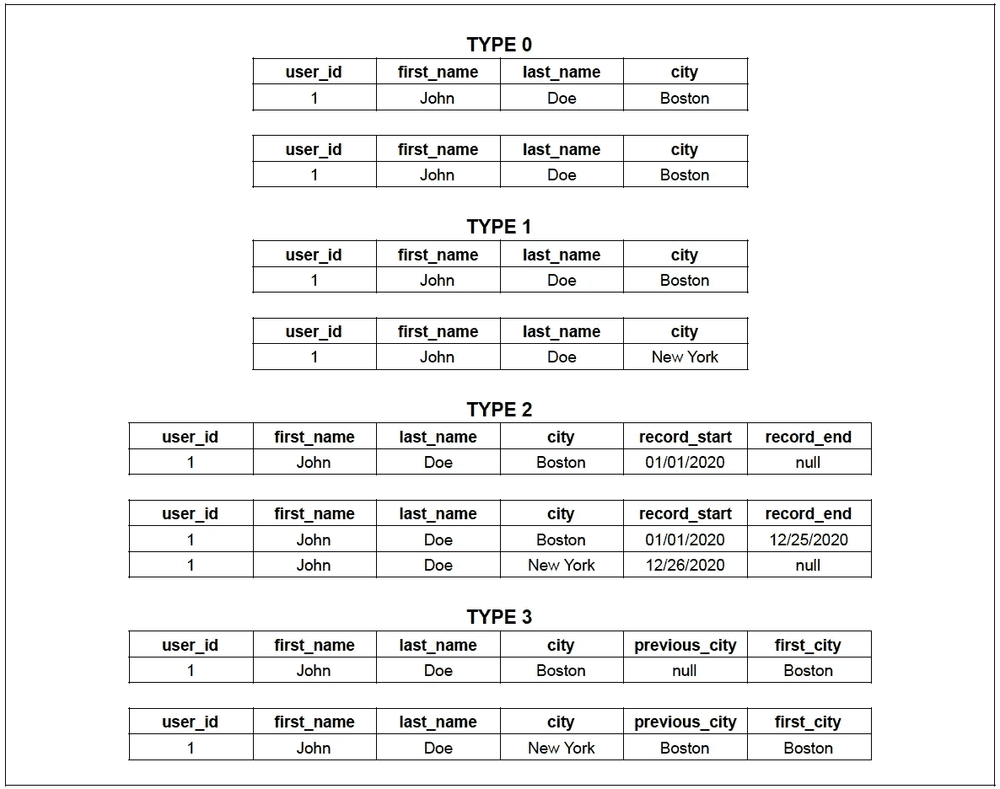

# 尺度缓慢变化

> 原文：<https://medium.com/analytics-vidhya/slowly-changing-dimensions-at-scale-bf9ce9157951?source=collection_archive---------0----------------------->

## 对大数据中缓慢变化的维度进行建模的策略

照片由[法比奥](https://unsplash.com/@fabioha?utm_source=unsplash&utm_medium=referral&utm_content=creditCopyText)在 [Unsplash](https://unsplash.com/s/photos/data?utm_source=unsplash&utm_medium=referral&utm_content=creditCopyText) 上拍摄

在维度模型中，数据被分类为事实或维度。事实通常(但不总是)是描述业务活动的数值，而维度是提供更多事实背景的描述符。如果考虑银行的维度模型，交易是事实，而客户、分行、日期、设备等是事实。是维度。维度的属性相对于事实来说变化很慢。比如考虑用户维度，用户的地址、邮箱、电话等。可能会随着时间而改变。

在 Ralph Kimball 的 [**数据仓库工具包**](https://www.amazon.com/Data-Warehouse-Toolkit-Definitive-Dimensional/dp/1118530802/) 中，他提出了各种设计模式来适应缓慢变化的维度，类型 0、类型 1、类型 2、类型 3 等等。这里有一个这些类型的快速总结。在类型 0 中，我们不更新维度的已更改属性，这似乎非常违背直觉，并且在实际应用中非常有限。类型 1 是范围的另一端，在这种情况下，更改的属性总是在维度表中被覆盖。在这种方法中，跟踪历史的能力丧失了。类型 2 是最全面的方法，每当维度属性发生变化时，都会添加一个新行。类型 3 是一种折衷，在这种情况下，按列而不是按行跟踪更改。当定期发生固定数量的更改时，类型 3 方法非常适用，例如，用户维度中的 tax_filing_status 属性可以建模为类型 3、tax_filing_status_2020、tax_filing_status_2021、tax_filing_status_2022 等。当维度属性变化不对称时，类型 3 方法不适用。图 1 提供了从 0 到 3 缓慢变化的维度类型的可视化表示。还有各种其他缓慢变化的维度类型，它们是上述 4 种类型的组合，但这些是为非常特殊的使用情况设计的，并没有广泛使用。

图 1:缓慢变化的尺寸

随着渐变维度的引入，让我们来探索在大数据生态系统中建模渐变维度的一些好策略。类型 2 方法非常全面，它提供了进行时间点分析的能力，并提供了维度当前状态的快速视图。然而，它增加了代码库的复杂性。类型 2 维度表的数据管道维护起来复杂而麻烦，而且对于下游用例来说，使用类型 2 维度表并不总是一帆风顺的。与事实表的常见日期/小时分区方案相比，类型 2 维度表的分区方案比较复杂。维度表与事实表的不同分区方案，加上使用类型 2 维度表的复杂下游查询，会导致查询效率低下。因此，如果您正在处理大数据规模，最好避免类型 2 维度表。

一个显而易见的问题出现了，如果不是 2 型缓慢变化的维度，那会是什么呢？这个问题的惊人答案遵循了 KISS(保持简单，笨蛋)原则。存储维度表的每日快照，并使视图指向最新的快照，这是对缓慢变化的维度进行建模的好设计。例如，用户维度和视图将被建模为图 2，其中 dt(快照的日期)是分区列，视图指向维度的最新快照。

图 2:尺寸用户和尺寸用户视图示例

起初，这种方法似乎是多余和重复的，每天存储几乎相同的数据似乎是低效的，但我们稍后将讨论这种方法的存储方面。让我们将这种方法与类型 2 缓变维度方法进行比较。类型 2 方法使我们能够进行快速的时间点分析，并提供维度当前状态的视图，这种方法给我们带来了这两种好处。此外，在构建、维护和消费类型 2 维度表的复杂性方面，类型 2 方法的缺点在该方法中得以减轻。这种方法中创建和维护表的管道非常简单。使用这个表也很容易，如果用例需要维度的当前状态，用户可以查询视图，如果用例需要维度的时间点视图，用户可以查询相关的 dt 分区或将事实表连接到 dt 列上的维度表。对 dt 列上的维度表进行分区可以避免昂贵的全表扫描，从而提高查询效率。这种方法还打开了维度数据的时序用例，这在类型 2 方法中是非常困难的。

看了这种方法的各种好处之后，让我们再来看看存储方面。鉴于维度表通常比事实表小得多，拥有维度表的每日快照不会对整体存储需求产生巨大影响。由于与计算和开发时间相比，存储要便宜得多，因此用存储换取减少的计算和开发时间是一个不错的决定。最后，有一些策略可以通过保留策略和冷数据存储来管理这种方法的存储影响。根据法律和业务要求制定适当的保留策略来删除维度数据的旧分区，并将很少访问的分区移动到冷数据存储中，可以降低这种方法的存储成本。