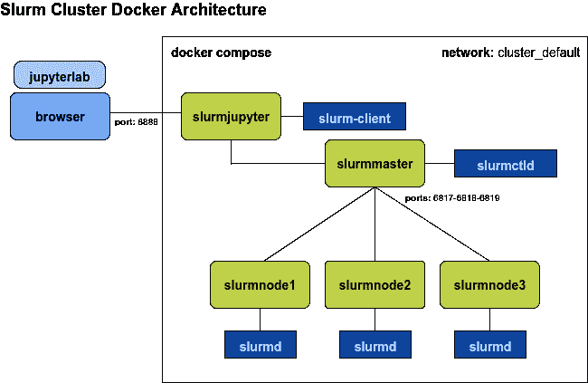
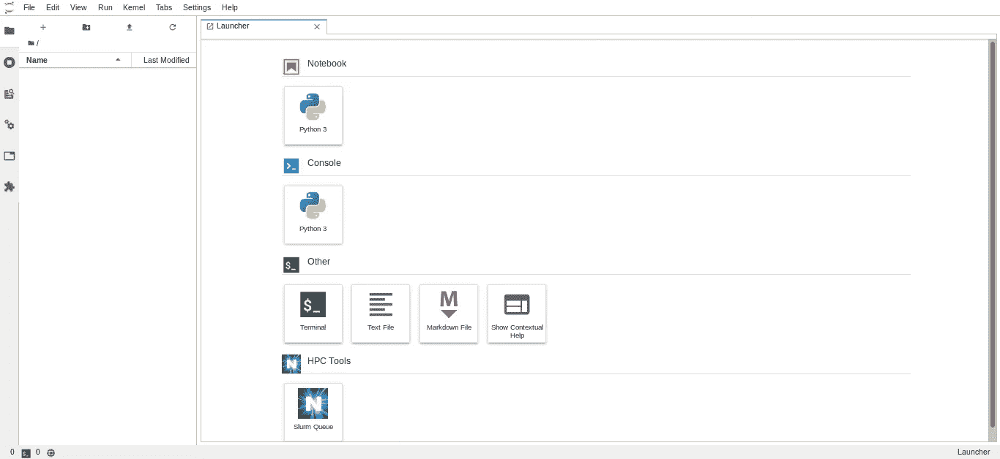
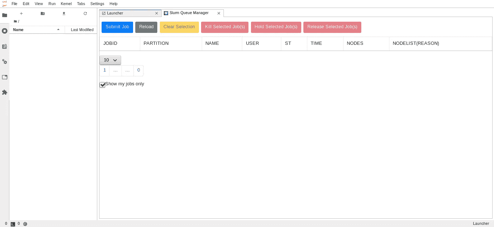
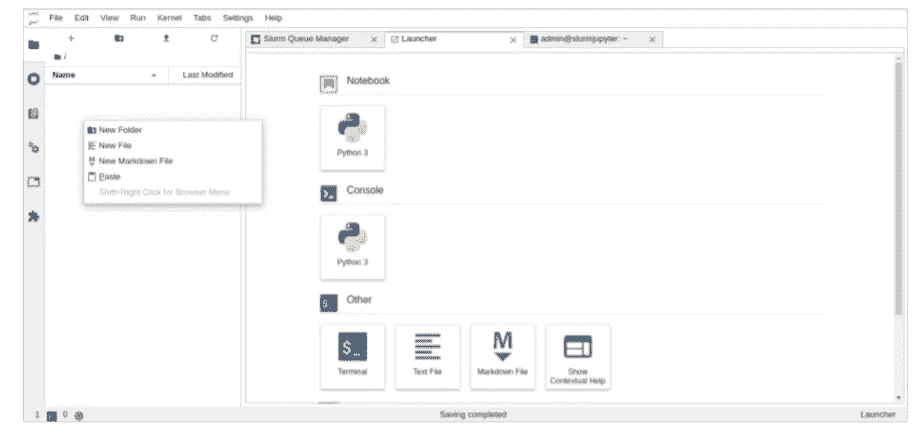
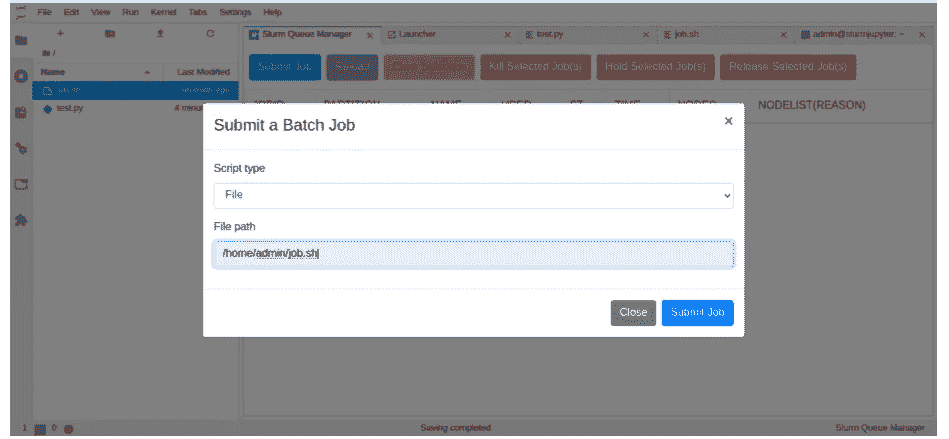
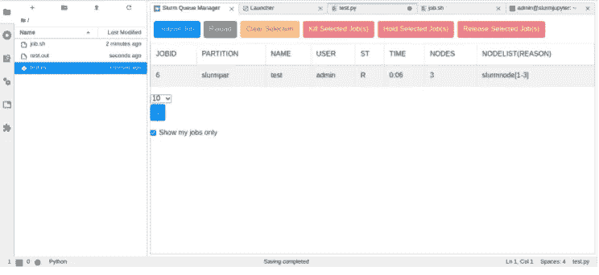

# 带有 Docker 的 Slurm 集群

> 原文：<https://medium.com/analytics-vidhya/slurm-cluster-with-docker-9f242deee601?source=collection_archive---------2----------------------->


这是一个关于如何使用 [**Docker**](https://docs.docker.com/engine/install/) 得到一个 Slurm 集群的简单指南。

目的是提供一个环境来测试、介绍和实践在一个 Slurm 集群上的使用和开发(这不是一个生产环境)。

[Github 资源库](https://github.com/rancavil/slurm-cluster)

## Slurm

根据定义， [**Slurm**](https://slurm.schedmd.com/overview.html) 是一个开源、容错、高度可扩展的集群管理和作业调度系统，适用于各种规模的 Linux 集群。

Slurm 代表**S**simple**L**inux**U**utility，代表 **R** esource **M** 管理(SLURM)，它通常被世界上许多超级计算机和 Linux 集群使用。

简单地说，Slurm 允许我们使用集群中的节点资源来执行任务。

## Slurm 建筑

我们将使用[**docker-compose**](https://docs.docker.com/compose/)创建一个 Slurm 集群，Docker compose 允许我们从 Docker 图像(之前构建的)创建一个环境。Docker-compose 将创建容器和网络，以便在隔离的环境中进行通信。每个容器都将是集群的一个组件。

**slurmmaster** 将是带有**Slurm ctld**(Slurm 的中央管理守护进程)的容器。

**slurmnode[1–3]**是带有**slurmd**(Slurm 的计算节点守护进程)的容器。

**slurmjupyter** 将成为装有 **jupyterlab** 的容器。这允许使用 [JupyterLab](https://jupyterlab.readthedocs.io/en/stable/getting_started/overview.html) 作为集群客户端与集群进行交互。作为最终用户，我们将通过浏览器使用 JupyterLab 与 Slurm 交互。

**cluster_default network** ，docker-compose 将创建一个网络来加入并保存容器。网络中的容器可以互相看见。

下面的方案显示了组件如何交互。



Slurm 集群 docker 架构

## 创建集群

正如我之前提到的，我们将使用 [**docker-compose**](https://docs.docker.com/compose/) 来创建我们的 Slurm 集群。所以我们将编写一个 **docker-compose.yml** 文件来声明和配置所有集群组件。

要安装 [**docker-compose**](https://pypi.org/project/docker-compose/) ，您必须执行:

```
$ pip3 install docker-compose
```

我创建了一个名为 **cluster** 的目录来编写我的 **docker-compose.yml**

```
$ mkdir cluster
$ cd cluster
$ vim docker-compose.yml
```

**注意:**你可以用你喜欢的编辑器代替 vim。

现在，在 docker-compose.yml 文件中编写或复制并粘贴以下行。

```
services:
  slurmjupyter:
        image: **rancavil/slurm-jupyter:19.05.5-1**
        hostname: slurmjupyter
        user: admin
        volumes:
                - shared-vol:/home/admin
        ports:
                - 8888:8888
  slurmmaster:
        image: **rancavil/slurm-master:19.05.5-1**
        hostname: slurmmaster
        user: admin
        volumes:
                - shared-vol:/home/admin
        ports:
                - 6817:6817
                - 6818:6818
                - 6819:6819
  slurmnode1:
        image: **rancavil/slurm-node:19.05.5-1**
        hostname: slurmnode1
        user: admin
        volumes:
                - shared-vol:/home/admin
        environment:
                - SLURM_NODENAME=slurmnode1
        links:
                - slurmmaster
  slurmnode2:
        image: **rancavil/slurm-node:19.05.5-1**
        hostname: slurmnode2
        user: admin
        volumes:
                - shared-vol:/home/admin
        environment:
                - SLURM_NODENAME=slurmnode2
        links:
                - slurmmaster
  slurmnode3:
        image: **rancavil/slurm-node:19.05.5-1**
        hostname: slurmnode3
        user: admin
        volumes:
                - shared-vol:/home/admin
        environment:
                - SLURM_NODENAME=slurmnode3
        links:
                - slurmmaster
volumes:
        shared-vol:
```

**注意:**我用的是一台有两个 CPU 的电脑

现在，您可以创建集群执行。

```
$ docker-compose up -d
```

**注意:**-d 选项意味着我们将运行一个贫民窟集群作为守护进程。

你可以检查一下是否一切正常。

```
$ docker-compose ps
```

现在，在您的浏览器中进入以下 URL 以访问 JupyterLab。

```
http://localhost:8888
```

你会看到木星实验室的环境。



带有 Slurm 队列和客户端的 JupyterLab

它安装了 HPC 工具/ Slurm 队列扩展。


按下按钮，你将得到 Slurm 队列管理器。



要查看集群，请转到启动器选项卡中的终端。


在终端中，执行命令控制 show node。

```
admin@slurmjupyter:~$ **scontrol show node**
NodeName=**slurmnode1** Arch=x86_64 CoresPerSocket=1 
   CPUAlloc=0 CPUTot=2 CPULoad=0.88
   AvailableFeatures=(null)
   ActiveFeatures=(null)
   Gres=(null)
   NodeAddr=slurmnode1 NodeHostName=slurmnode1 Version=19.05.5
   OS=Linux 4.15.0-135-generic #139-Ubuntu SMP Mon Jan 18 17:38:24 UTC 2021 
   RealMemory=1 AllocMem=0 FreeMem=203 Sockets=2 Boards=1
   State=IDLE ThreadsPerCore=1 TmpDisk=0 Weight=1 Owner=N/A MCS_label=N/A
   Partitions=slurmpar 
   BootTime=2021-02-05T00:25:01 SlurmdStartTime=2021-02-28T21:25:18
   CfgTRES=cpu=2,mem=1M,billing=2
   AllocTRES=
   CapWatts=n/a
   CurrentWatts=0 AveWatts=0
   ExtSensorsJoules=n/s ExtSensorsWatts=0 ExtSensorsTemp=n/sNodeName=**slurmnode2** Arch=x86_64 CoresPerSocket=1 
   CPUAlloc=0 CPUTot=2 CPULoad=0.88
   AvailableFeatures=(null)
   ActiveFeatures=(null)
   Gres=(null)
   NodeAddr=slurmnode2 NodeHostName=slurmnode2 Version=19.05.5
   OS=Linux 4.15.0-135-generic #139-Ubuntu SMP Mon Jan 18 17:38:24 UTC 2021 
   RealMemory=1 AllocMem=0 FreeMem=203 Sockets=2 Boards=1
   State=IDLE ThreadsPerCore=1 TmpDisk=0 Weight=1 Owner=N/A MCS_label=N/A
   Partitions=slurmpar 
   BootTime=2021-02-05T00:25:01 SlurmdStartTime=2021-02-28T21:25:19
   CfgTRES=cpu=2,mem=1M,billing=2
   AllocTRES=
   CapWatts=n/a
   CurrentWatts=0 AveWatts=0
   ExtSensorsJoules=n/s ExtSensorsWatts=0 ExtSensorsTemp=n/sNodeName=**slurmnode3** Arch=x86_64 CoresPerSocket=1 
   CPUAlloc=0 CPUTot=2 CPULoad=0.88
   AvailableFeatures=(null)
   ActiveFeatures=(null)
   Gres=(null)
   NodeAddr=slurmnode3 NodeHostName=slurmnode3 Version=19.05.5
   OS=Linux 4.15.0-135-generic #139-Ubuntu SMP Mon Jan 18 17:38:24 UTC 2021 
   RealMemory=1 AllocMem=0 FreeMem=203 Sockets=2 Boards=1
   State=IDLE ThreadsPerCore=1 TmpDisk=0 Weight=1 Owner=N/A MCS_label=N/A
   Partitions=slurmpar 
   BootTime=2021-02-05T00:25:01 SlurmdStartTime=2021-02-28T21:25:18
   CfgTRES=cpu=2,mem=1M,billing=2
   AllocTRES=
   CapWatts=n/a
   CurrentWatts=0 AveWatts=0
   ExtSensorsJoules=n/s ExtSensorsWatts=0 ExtSensorsTemp=n/s
```

集群创建了一个名为 **slurmpar** 的分区。Slurm 中的分区是具有相关资源的节点集。

## 第一个例子

我们将使用 python 开发一个例子来测试如何运行我们的集群。

转到 JupyterLab，创建一个新文件，并将该文件重命名为 **test.py**



并编写以下代码:

```
#!/usr/bin/env python3

import time
import os
import socket
from datetime import datetime as dtif __name__ == '__main__':
    print('Process started {}'.format(dt.now()))
    print('NODE : {}'.format(socket.gethostname()))
    print('PID  : {}'.format(os.getpid()))
    print('Executing for 15 secs')
    time.sleep(15)
    print('Process finished {}\n'.format(dt.now()))
```

现在，我们将编写一个 job.sh 脚本。再次转到新文件，将文件重命名为 **job.sh** ，编写以下内容:

```
#!/bin/bash
#
#SBATCH --job-name=test
#SBATCH --output=result.out
#
#SBATCH --ntasks=6
#sbcast -f test.py /tmp/test.py
srun python3 /tmp/test.py
```

在脚本中，我定义了输出文件 **result.out** 和 **ntask=6** ，因为我们有 **3 个节点**，每个节点有 **2 个 CPU**。

[**sbcast**](https://slurm.schedmd.com/sbcast.html) 将文件传输到分配给 Slurm 作业的节点。

[**srun**](https://slurm.schedmd.com/srun.html) 将运行并行作业。

我们的 test.py 将作为 6 个任务并行执行。

在 Slurm 队列管理器中进入**提交作业**，选择 **job.sh** (路径/home/admin)。



执行 job.sh 脚本后，按下 Reload 按钮，您将看到以下内容。



15 秒后，结果将被写入文件 **result.out** 。

```
Process started **2021-02-28 11:23:55.094187**
NODE : **slurmnode1**
PID  : 249
Executing for 15 secs
Process finished **2021-02-28 11:24:10.109268**Process started **2021-02-28 11:23:55.133633**
NODE : **slurmnode3**
PID  : 145
Executing for 15 secs
Process finished **2021-02-28 11:24:10.141112**Process started **2021-02-28 11:23:55.149958**
NODE : **slurmnode3**
PID  : 144
Executing for 15 secs
Process finished **2021-02-28 11:24:10.164342**Process started **2021-02-28 11:23:55.153752**
NODE : **slurmnode1**
PID  : 248
Executing for 15 secs
Process finished **2021-02-28 11:24:10.168402**Process started **2021-02-28 11:23:55.192345**
NODE : **slurmnode2**
PID  : 145
Executing for 15 secs
Process finished **2021-02-28 11:24:10.207377**Process started **2021-02-28 11:23:55.197817**
NODE : **slurmnode2**
PID  : 146
Executing for 15 secs
Process finished **2021-02-28 11:24:10.212361**
```

分析结果，我们可以看到 **test.py** 被并行执行了 6 次，同时开始和结束(所有任务都在 15 秒内执行)，每个节点两次。

要停止集群，请执行以下操作:

```
$ docker-compose stop
```

## 摘要

这是一个关于如何获得一个 Slurm 集群来学习和练习并行编程的小教程。好好享受吧。

