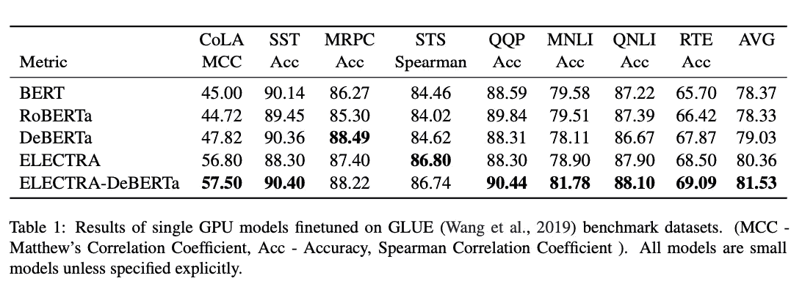
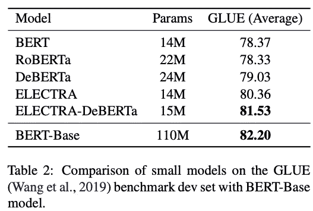

# 小型工作台 NLP:自然语言处理中单个小 GPU 训练模型的基准

> 原文：<https://medium.com/analytics-vidhya/small-bench-nlp-benchmark-for-small-single-gpu-trained-models-in-natural-language-processing-92433cf70f73?source=collection_archive---------7----------------------->

自然语言处理领域的最新进展，如基于转换器的模型，为我们提供了几个最新的(SOTA)预训练模型。然后，可以针对特定任务在定制数据集上对这些大型预训练模型进行微调。值得注意的是，这些大型模型在数周/数月内在众多 GPU/TPU 上训练了数十亿个参数，在基准排行榜上处于领先地位。

像伯特、T5、GPT-3 等最先进的模型有数百万/数十亿个参数。自然，训练这些时间和计算密集型模型需要大量资金。这种机构在排行榜上与不断增加的计算密集型大型十亿参数模型竞争的趋势大大增加了财务成本和碳足迹。对于资源有限的研究人员来说，在标记化、预训练任务、架构、微调方法等方面尝试新颖和创新的想法确实非常困难。为了使自然语言处理(NLP)研究更具包容性，更容易被更大的社区所接受，我们发布了小型 NLP 基准，用于在单个 GPU 上训练的具有成本和时间效益的小型模型。研究人员和从业者有机会验证他们使用相对较小的计算资源构建的模型。

我们在单个 GPU (V100- 16GB 内存)上预训练了四个小型模型。我们在 38GB 的 [OpenTextWebCorpus](https://skylion007.github.io/OpenWebTextCorpus/) 数据上对 BERT、RoBERTa、DeBERTa 和 ELECTRADeBERTa 模型架构进行了预训练。为了验证我们的模型，我们在[通用语言理解评估(GLUE)](https://gluebenchmark.com/) 基准中的八个数据集上对我们的模型进行了微调。GLUE 由基于六个不同 NLP 任务的九个数据集组成——问题回答、语言可接受性、情感分析、文本相似性、释义检测和自然语言推理(NLI)。由于开发和测试发行版的问题，我们没有在 WNLI 数据集上进行评估。



我们观察到，我们的实验性 ELECTRA-DeBERTa 架构比 BERT 模型(BERT、RoBERTa 和 DeBERTa)具有显著的增益，这是由于 ELECTRA 的替代令牌检测任务和 DeBERTa 的解纠缠注意机制。表 1 显示了我们的模型在 GLUE 数据集上的结果。

我们将这些单 GPU 训练模型的性能与具有(110M 参数)的 BERTBase 模型的性能进行了比较。我们观察到，在几天内用几百万个参数训练的这些模型的平均得分比 BERT-Base 的平均得分 82.20 低大约 1.8 到 3.8 分。我们的 ELECTRA-DeBERTa 架构平均得分为 81.53，与 BERT-Base 模型的得分 82.20 相当。表 2 显示了性能比较。



我们设立了一个排行榜来展示模特们的表现。小板凳 NLP 的代码和排行榜可在[https://github.com/smallbenchnlp](https://github.com/smallbenchnlp)获得。可以在 https://huggingface.co/smallbenchnlp 的[的 huggingface 下载模型。](https://huggingface.co/smallbenchnlp)

要了解更多的技术细节，请查看 https://arxiv.org/pdf/2109.10847.pdf[。](https://arxiv.org/pdf/2109.10847.pdf)

引用我们的论文，

```
[@misc](http://twitter.com/misc){kanakarajan2021smallbench,      title={Small-Bench NLP: Benchmark for small single GPU trained    
     models in Natural Language Processing},
     author={Kamal Raj Kanakarajan and Bhuvana Kundumani and    
     Malaikannan Sankarasubbu},
     year={2021},
     eprint={2109.10847},
     archivePrefix={arXiv},
     primaryClass={cs.LG}
}
```

**参考文献**

[](https://gluebenchmark.com/) [## 粘合基准

### 通用语言理解评估(GLUE)基准是一个培训、评估…

gluebenchmark.com](https://gluebenchmark.com/)  [## [计] 下载

### 今天，我们宣布发布 Open WebText 的测试版——一个复制 OpenAI 的开源努力…

skylion007.github.io](https://skylion007.github.io/OpenWebTextCorpus/)