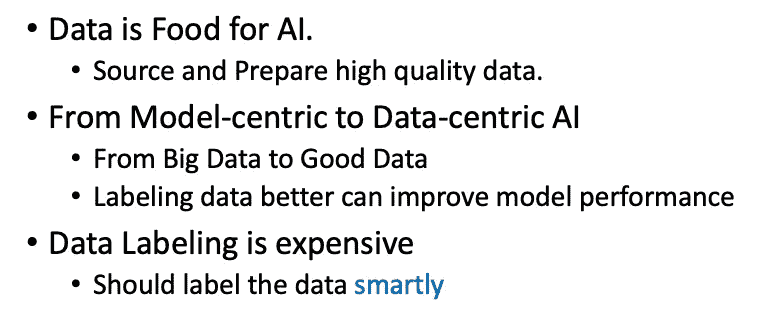
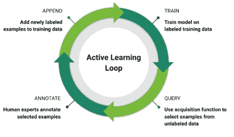
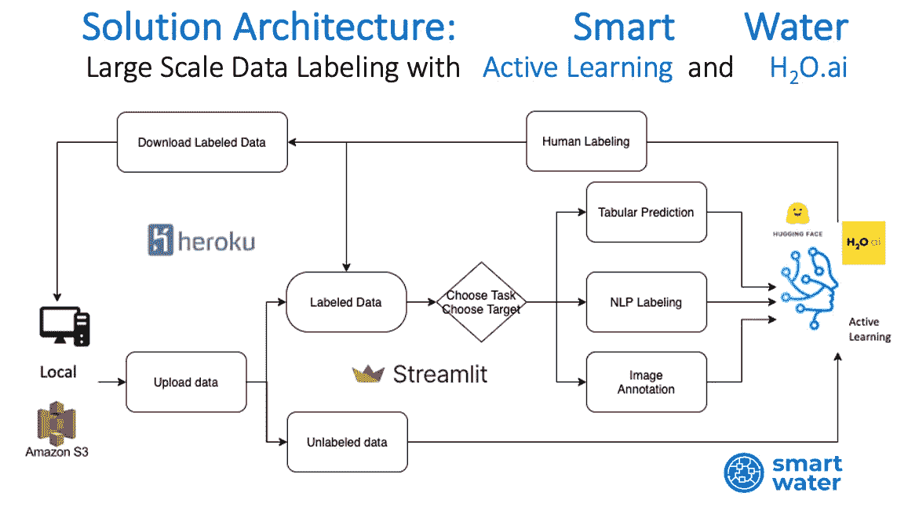
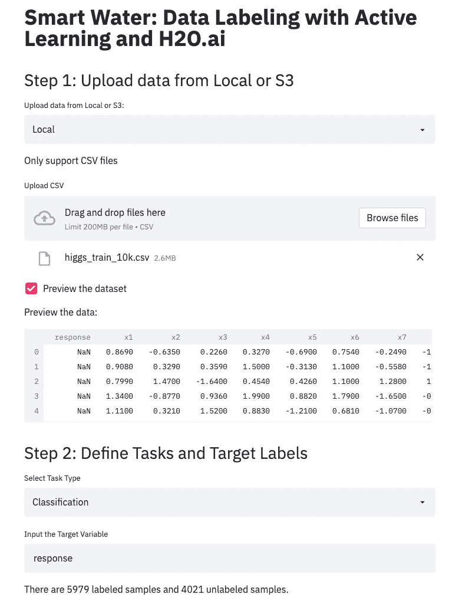
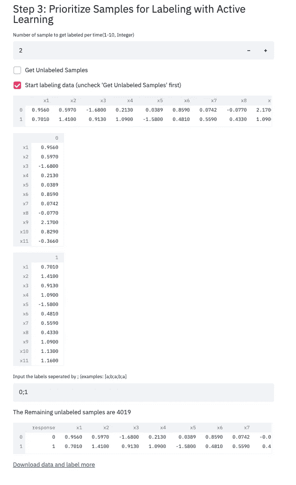

# 智能水:主动学习和 H2O.ai 的数据标签

> 原文：<https://medium.com/analytics-vidhya/smart-water-data-labeling-with-active-learning-and-h2o-ai-c97349c0ba09?source=collection_archive---------15----------------------->

# 直觉

数据是人工智能的食物。对于机器学习或监督学习，黄金标签是模型识别数据中模式的关键。然而，在现实世界的数据中，通常很难获得大量的标注数据，例如搜索相关性、新闻话题、自动驾驶等。最近，Angrew Ng 做了一个关于 [*MLOps:从以模型为中心到以数据为中心的 AI*](https://www.youtube.com/watch?v=06-AZXmwHjo) 的演讲，他在演讲中提到了从大数据到好数据的想法。良好的数据被一致地定义，并涵盖重要的案例。它有来自生产数据的及时反馈，并且大小合适。

所以现在的问题是如何获得高质量的数据。众所周知，获取未标记的数据相对容易，但是标记大量的数据是昂贵的:它需要人类开始基于特征给出正确的判断，并且需要一些领域知识。有一些方法比随机选择未标记的数据更好，主动学习只是其中一种，帮助你标记样本，可以为模型提供更多的信息。



在这个项目中，我们创建了一个平台，用户可以从本地设备上传未标记的数据，或 AWS S3 桶，我们使用主动学习和 H2O.ai 来智能地选择哪些样本应该首先被标记。这可以显著降低数据标记成本，并帮助用户为他们的机器学习模型获得高质量的数据。

# 主动学习

在深入我们的解决方案之前，让我解释一下主动学习是如何工作的，以及为什么它可以更好地对要标记的未标记数据进行优先排序。

有三种情况可以使用主动学习。

*   成员查询合成:生成的样本被发送到 oracle 进行标记。
*   基于流的选择性采样:每个样本被单独考虑。
*   基于池的采样:样本从未标记的数据池中选择，用于标记。

对于这个项目，我们使用基于池的抽样。从有限的标记数据开始，我们训练模型，然后对所有未标记的数据进行预测。基于这些预测，我们可以使用一些查询策略框架来选择具有某些属性的样本，这告诉我们这些样本可以对模型的学习过程做出更多贡献。然后在对待标记的样本进行标记后，再对模型进行重新训练，对其他未标记的数据进行预测，反复重复同样的过程，直到得到足够多的已标记数据，或者模型性能变得足够好。



主动学习循环

为了选择样本，我们选择具有高度不确定性的样本，因为模型对它们感到困惑，如果我们首先标记它们，我们可以更好地监督模型。以下是一些计算不确定性的流行方法:

*   边际抽样

我们选择在两个最高类别概率之间具有最低差异的 k 个样本，即，对于其模型对于单个类别非常确定的样本，将给出较高的数字，而对于其类别概率非常相似的样本，将给出较低的数字。例如，三类分类的两个预测是[0.9，0.06，0.04]和[0.6，0.3，0.1]。显然，该模型比第二个样本更了解第一个样本，因为它可以将样本从一个类别分离到其他类别。

```
def marginSample():
    d = {} 
    for i in range(len(X_pool)):
        probs = clf.predict_proba(X_pool[i].reshape(1, -1))
        sorted_probs = sorted(probs[0],reverse=True)

        margin = sorted_probs[0]-sorted_probs[1]
        d[i] = margin
    idx = sorted(d, key=d.get,reverse=True)[0]      
    return idx
```

*   熵选择

我们选择具有最高熵的“k”个样本，即具有高不确定性。

```
# pick sample based on maximum entropy
def entropy(x):
    return -x*np.log(x+ 1e-10)
def max_entropy():
    d = collections.defaultdict(list) 
    for i in range(len(X_pool)):
        for _ in range(5):
                  d[i].append(entropy(clf.predict_proba(X_pool[i].reshape(1, -1))))
        d[i] = np.mean(d[i])
    idx = sorted(d, key=d.get,reverse = True)[0]
    return idx, X_pool[idx]
```

*   最不自信

我们选择置信度最低的“k”个样本。在二元或多类分类问题中，我们对属于每一类的概率进行预测。我们可以用概率的最大值作为确定度，用 k 个最小的最大值作为待标注的样本。

```
def least_confidence():
    d = {}
    for i in range(len(X_pool)):
        probs = clf.predict_proba(X_pool[i].reshape(1, -1))
        d[i] = max(probs)
    idx = sorted(d, key=d.get)[0]
    return idx
```

# 解决方案架构

我们允许用户从本地设备和 S3 自动气象站上传数据集。在明确了任务的类型和目标列之后，平台将根据上述不确定性对未标记的样本进行优先排序。然后，用户可以在平台内标记数据，并通过重新训练模型获得更多未标记的数据。在获得足够的数据或性能达到某个阈值后，用户可以下载标记的数据，并回去训练自己的模型。

在我们的平台中，我们为不同的任务使用不同的算法。

*   对于表格预测，我们在分类和回归问题中都使用了 H2O.ai 中的随机森林。
*   对于 NLP 标注，我们使用 Hugging Face 开发的 transformers 包作为特征提取器，将文本转换为嵌入，嵌入是文本中所有单词嵌入的平均值。然后，我们应用分类模型来选择高不确定性样本
*   对于图像标注，我们正在积极开发..



智能水务工作流程

我们用 streamlit 构建平台，用 Heroku 部署平台。

# 演示



# 后续步骤

在目前的平台中，我们有许多可以改进的地方。我们可以允许用户上传定制的模型进行主动学习。我们可以支持更多类型的任务，并且可以优化计算资源以实现更快的标记。