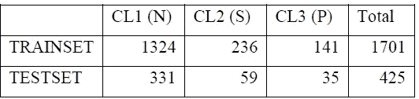
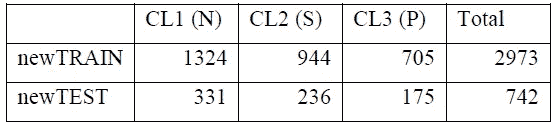

# R 程序设计中三类不平衡数据的 SMOTE 技术——心育图数据集

> 原文：<https://medium.com/analytics-vidhya/smote-technique-for-unbalanced-data-of-3-classes-in-r-programming-cardiotocography-data-set-474bb5dbf8dd?source=collection_archive---------2----------------------->

在本文中，我们将使用 SMOTE 来平衡心电分娩数据集中的 3 个类别。请阅读下面的文章以了解更多关于数据集的信息。

 [## UCI:“胎心监护数据集”——胎儿状态的分类——第 1 部分:数据汇总和 EDA

### 1.分类任务的数据总结和描述

phuongdelrosario.medium.com](https://phuongdelrosario.medium.com/uci-cardiotocography-data-set-fetal-states-classification-part-1-data-summary-and-eda-e0cec8a61eff) 

## 1.创建训练集/测试集数据

测试集和训练集是基于 SDATA 创建的。为名称分别为 SCL1、SCL2 和 SCL3 的每个类别 N、S、P 生成标准化数据集。

对于每个类标准化数据(SCL1、SCL2 和 SCL3)，随机选择 20%的数据，然后组合为完整的测试集，每个类的剩余 80%的数据组合为完整的训练集。完整的测试集有 425 行和 21 个特征，而完整的训练集有 1701 行和 21 个特征。

下表显示了训练集和测试集中每个类大小的细节。看看表 7 中的每个班级人数，我们看到班级之间存在不平衡。因此，需要对训练集和测试集进行平衡。

## 2.平衡训练数据集中的类别

训练集和测试集中的所有类都不平衡，不平衡的类可能会在预测模型中产生偏差并影响模型的准确性，因此下一步是平衡所有类。这里，我们只是平衡训练数据集中的类，只是为了防止对我们的性能过度拟合。

SMOTE 代表合成少数过采样技术，它基于少数类的现有事例创建新的合成事例。在 SMOTE 方法中，新案例不仅仅是少数类现有案例的副本，而是 SMOTE 通过对每个目标类及其最近邻居 k 的特征空间进行采样来生成新案例。然后，它将目标案例的特征与其邻居 k 的特征相结合。该方法用于过采样训练集和测试集中的两个少数类，即可疑(S)类和病理(P)类。

在 R 中，使用“smotefamily”包中的函数 SMOTE()生成 S 类和 P 类的新观测值。函数中的两个主要参数是 K 和 dup-size。k 值是为少数类中的每个目标案例选择的最近邻的数量，dup-size 值是少数类的大小被复制的次数。对于 S 类，K 值和 dup-size 值是 3 和 3，而对于 P 类，K 值和 dup-size 值是 4 和 4。每个类的最终大小和平衡后的完整 newTRAIN、fullnewTESTl 数据集的大小如表 8 所示:平衡的 newTRAIN 和 newTEST。完整的 newTRAIN 和完整的 newTEST 数据是通过在平衡后连接所有 3 个类而创建的。

