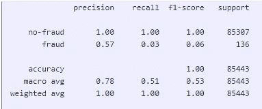
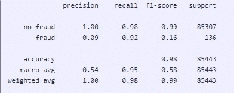
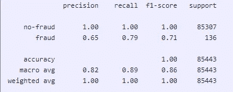

# SMOTE 与 Deep Augmenter —测试不平衡数据的预测能力

> 原文：<https://medium.com/analytics-vidhya/smote-vs-deep-augmenter-testing-the-predictive-power-on-imbalanced-data-c85b34bd706b?source=collection_archive---------0----------------------->

由 [kazuend](https://unsplash.com/@kazuend?utm_source=medium&utm_medium=referral) 在 [Unsplash](https://unsplash.com?utm_source=medium&utm_medium=referral) 拍摄的照片

在这篇博客中，我想测试深度学习增强方法与流行的 [SMOTE](https://arxiv.org/pdf/1106.1813.pdf) 方法。为此，我再次使用了[信用卡欺诈数据集](https://www.kaggle.com/mlg-ulb/creditcardfraud)。这个数据集是高度不平衡的，这意味着我们的欺诈案件比非欺诈案件少得多。目标是训练一个 RandomForest 模型来预测非欺诈与欺诈案例。为此，我将使用三种方法:

*   为欺诈案例分配更高的权重(随机森林的 sklearn 模型内置)
*   使用实施的 SMOTE 方法[此处](https://imbalanced-learn.org/stable/references/generated/imblearn.over_sampling.SMOTE.html)
*   使用[深度增强器](https://github.com/lschmiddey/deep_tabular_augmentation)

如何使用深度增强器包我已经在这里写了[这里写了](https://lasse-schmidt90.medium.com/comparison-randomforest-with-oversampling-vs-augmented-data-bd7fcb96ef0f)和[这里写了](/analytics-vidhya/data-augmentation-for-tabular-data-f75c94398c3e)。在信用卡欺诈数据集中，我们有 199.032 个非欺诈案例和 332 个欺诈案例。因此，让我们首先准备深度增强器，加载数据，只选择我们想要为其构建假数据的数据(在这种情况下是欺诈案例)，将其分为训练集和测试集，并将它们放入数据加载器。然后我们建立了我们的模型:

在我们的模型被训练之后，我们现在可以使用它来创建欺诈案例的数据:

这里的一个好处是，我们可以为每一列添加 sigma 参数。适马定义了标准差，我们把它作为一个列表传递，如果我们想让一些列有一个特定的标准差，你可以把它放在列表里。我确实使用了欺诈案例的标准差，但只有 25%，因为这似乎给了数据足够的“回旋”空间，同时仍然保持了变量之间经过训练的关系(查看我关于潜在因素的博客[这里](https://lasse-schmidt90.medium.com/understand-latent-factors-in-deep-tabular-augmentation-fd6d9e2c1307))。

现在我们使用 SMOTE 包来创建数据。SMOTE 只需要(完整的)列车组和该列车组的目标值:

所以基本上 SMOTE 会创建尽可能多的少数类条目，直到我们在两个类中得到相同数量的案例。我们也可以用深度学习增强器来做到这一点:

在这两种情况下，我们现在模拟了 199.032 个欺诈案例。虽然 SMOTE 几乎可以立即创建这些合成数据，但深度学习增强需要大约一分钟。

# 训练随机森林

我们想要比较内置的 class_weight 功能与新方法和 SMOTE 的性能。因此，我们将建立三个训练集:原始的一个，具有来自 SMOTE 的附加数据的一个，以及具有来自深度学习增强的附加数据的一个。

首先，让我们在原始数据上训练模型，同时使用类出现的差异作为权重。

我们还可以为 SMOTE 和 Deep Augmenter 方法定义随机森林:

让我们运行所有这些模型:

然后最后让我们比较结果。首先，class_weight 方法:

二、SMOTE 结果:

最后，深度增强器的结果是:

我们看到了这三种方法之间的巨大差异。简单地增加欺诈级别的权重没有任何帮助，我们只能正确识别 4 个欺诈案例。SMOTE 方法可以发现更多的欺诈案例，在 136 个案例中发现了 125 个。这导致召回率为 0.92。然而，这是有代价的:我们有惊人的 1283 个错误分类的欺诈案例，导致欺诈案例的精确度为 0.09。深度学习增强正确预测了 136 个案例中的 107 个，但仅错误分类了 58 个案例——这导致欺诈案例的精确度为 0.65。

总之，我认为这个博客能够展示深度学习增强的优点。在增加正确识别的欺诈案例的同时，我们还能够在这种情况下保持高精确度，这意味着我们只有少数错误分类的案例。虽然 SMOTE 能够正确识别更多的欺诈案例，但它也造成了大量错误分类的欺诈案例，这在资源分配方面可能代价高昂。

如果你有任何问题或者想在包裹里添加什么，就问我。

拉塞

*原载于 2022 年 2 月 19 日*[*https://lschmiddey . github . io*](https://lschmiddey.github.io/fastpages_/2022/02/19/DataAugmentation_vs_SMOTE.html)*。*