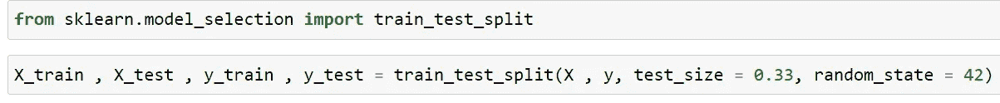
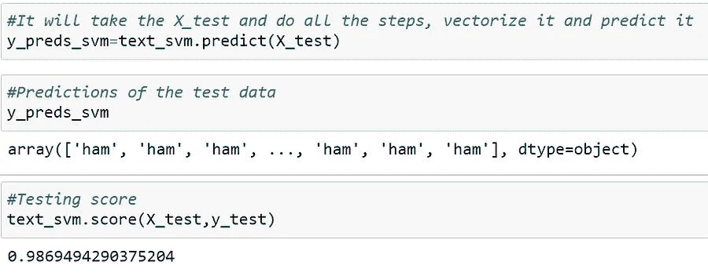

# 垃圾短信分类器(自然语言处理)

> 原文：<https://medium.com/analytics-vidhya/sms-spam-classifier-natural-language-processing-1751e2b324ed?source=collection_archive---------3----------------------->

**自然语言处理** ( **NLP** )是人工智能的一个分支，帮助计算机理解、解释和操纵人类语言

今天，我将向您解释如何使用 Python 中的机器学习来构建一个垃圾短信分类器

我们将使用**算法**，例如:-

*   多项式朴素贝叶斯分类器
*   支持向量机

对于这个项目，我们将使用 **python 库**，比如:-

*   自然语言工具包
*   sci kit-学习
*   熊猫

**Jupyter 笔记本可在此 [github](https://github.com/pulkitkhandelwal29/SMS-Spam-Classification) 帐户中找到**

# 接近:-

# 1.读取数据

要读取数据，导入 Pandas 库并使用 *pd.read_csv()* 读取数据。

这里文件中的数据是用制表符(\t)分隔的，所以我们必须提供“*sep*”(separate)参数。此外，该文件不包含任何列名，因此我们应该使用“ *names* ”参数提供列名。

数据存储在名为“*消息*”的数据帧中。

要查看前 5 行数据，我们应该使用 *messages.head()*

我们可以看到，第一列包含**标签(因变量)**，即一条消息是垃圾邮件还是垃圾邮件，第二列包含实际的**消息(自变量)**

# 2.探索性数据分析

我们可以看到这里有 5572 行和 2 列。这意味着有 5572 条消息和 2 个名为“*标签*”和“*消息*”的列。

数据中没有缺失值。

*。value_counts()* 帮助返回每个类别的总计数，即“火腿”和“垃圾邮件”。我们可以看到，垃圾短信比垃圾短信多。

我们看到，5572 封邮件中有 4825 封(86.6%)是垃圾邮件。
这意味着我们创建的任何机器学习模型都必须比 86.6% 更好地执行**才能击败随机机会。**

# 3.数据预处理

在这里，我们计算每条消息的长度和标点符号以供进一步分析，并将其作为列添加到 DataFrame ( *消息*)中。

> **3.1**文字清理

消息包含文本，但带有许多标点符号和停用词(这些词在任何语言中都不会给句子增加太多意义。它们可以被安全地忽略，而不会牺牲句子的含义)、特殊字符和许多动词形式。

现在，我们将通过删除不必要的内容来清理邮件。

我们将导入 **re** (regex 库)，并从 nltk 库中导入**停用词**和 **WordNet 词汇化器**(一个这样的方法[词汇化](https://nlp.stanford.edu/IR-book/html/htmledition/stemming-and-lemmatization-1.html))并创建它的对象。

现在，我们将遍历每条消息，并使用 regex (substitute method)从消息中取出除小写字母(a-z)和大写字母(A-Z)之外的所有内容，并用空格替换。接下来，我们将小写该消息(因为 abc 与 ABC 不同)以使机器易于学习，然后将其拆分为单词。将通过列表理解中的拆分单词，我们将检查每个单词，它是否存在于 nltk 的停用词集合中，如果该单词不在停用词中，它将使用 WordNet Lemmatizer 对象进行词汇化。在每个单词被词条化后，我们将再次连接这些单词，形成一个句子，并添加到句子的语料库列表中

*用语料库中可用的已清理消息替换消息。*

> **3.2 分析垃圾邮件和垃圾邮件的区别**

通过将标签与“垃圾邮件”或“垃圾邮件”进行比较，将其分为垃圾邮件和垃圾邮件，以供进一步分析。

现在我们可以看到，spam_messages 只有 spam 标签，ham_messages 只有 ham 标签。这样做只是为了更好地了解数据。

我们在这里可以看到，垃圾短信的平均字数比火腿短信多。标点符号也是一样，垃圾邮件比垃圾邮件有更多的平均标点符号。

# 4.模型结构

分成' *X* '，包含**自变量**即消息，' *y* '包含**因变量**(目标变量)即标签(垃圾邮件或垃圾邮件)

> **4.1 列车试裂**

使用 scikit-learn 库，我们可以将数据分为训练和测试。这里我将数据分为 77%(训练数据)和 33%(测试数据)

> **4.2 处理文本(自然语言数据)数据**

现在该谈谈如何处理文本数据了。我们不能直接将文本传递给机器学习模型，因为机器只能理解 0 和 1 形式的数据。

为了解决这个问题，我们将使用 [TF-IDF 矢量器](/@cmukesh8688/tf-idf-vectorizer-scikit-learn-dbc0244a911a)(词频-逆文档频)的概念。这是一种将文本转换为有意义的数字表示的标准算法，用于拟合预测的机器算法。

我们也可以使用计数矢量器(单词包)，但是计数矢量器不像 TF-IDF 矢量器那样对单词进行加权。

我们可以使用 scikit-learn 库中的 TF-IDF 矢量器。接下来，创建一个 TF-IDF 矢量器的对象，并对数据进行 fit_transform，它将转换为单词和句子的矩阵。

这里，3733 个是 X_train 的句子，5772 个是从句子中获得的总字数。

> **4.3 流水线作业**

我们正在进行流水线作业，因为我们需要对测试数据执行相同的程序来获得预测；这可能会令人厌倦。

然而，这个管道对象的方便之处在于，它可以在单个单元中为您执行所有这些步骤，这意味着您可以直接提供数据。它将被矢量化，并在单个步骤中运行分类器。

注意:-当我们稍后预测自定义文本时，我们可以直接将自定义文本传递给管道，这将有助于预测标签

如果您不了解管道，它会接受一个元组列表，其中每个元组接受您设置的名称，并调用您想要执行的任何方法。

**从 sklearn.pipeline 导入管道**

## [多项式朴素贝叶斯分类器](https://scikit-learn.org/stable/modules/generated/sklearn.naive_bayes.MultinomialNB.html#:~:text=The%20multinomial%20Naive%20Bayes%20classifier,tf%2Didf%20may%20also%20work.)

我们将从 scikit-learn 库中导入 MultinomialNB 模型。接下来，我们将使用管道创建一个名为" *text_mnb* 的模型，其中我们首先提供了 *TfidfVectorizer()* 对象，然后提供了 *MultinomialNB()* 对象。它应该按照我们想要的顺序提供，首先应该执行 TfidfVectorizer，它的输出将被提供给模型，最后，我们用 X_train 和 y_train 拟合模型。

现在，每个内部功能都将由 Pipeline 处理，并相应地执行各个步骤。

为了进行预测，我们需要传递 X_test 数据，管道对象将处理它，即自动对其进行矢量化并为我们进行预测。

" *y_preds_mnb* "包含我们的模型进行的 X_test 的预测，达到大约 **97%** 的准确度，相对好于随机机会。

我们必须知道，准确性本身并不能证明模型运行良好。我们将使用 scikit-learn 库来获得关于**混淆 _ 矩阵**和**分类 _ 报告**的报告

在这里，我们可以看到“火腿”标签预测良好，但“垃圾邮件”标签预测不佳，因此我们不能说该模型是优秀的。模型无法准确预测垃圾邮件。

让我们用 SVM(支持向量机)来尝试同样的问题

## [线性 SVC](https://scikit-learn.org/stable/modules/generated/sklearn.naive_bayes.MultinomialNB.html#:~:text=The%20multinomial%20Naive%20Bayes%20classifier,tf%2Didf%20may%20also%20work.) (支持向量分类器)

将执行与上面相同的步骤，唯一不同的是我们需要从 scikit-learn 库中导入 LinearSVC

从执行 TfidfVectorizer 和 LinearSVC 模型创建的管道对象创建名为“ *text_svm* 的模型，然后将 X_train 和 y_train 拟合到该模型。“ *y_preds_svm* ”是使用模型进行 X_test 的预测，准确率约为 **98.69%** ，优于多项式模型。

现在，让我们看看**评估指标**，以便更好地了解模型的表现。

我们可以看到“火腿”得到了惊人的预测，与“多项”模型相比，“垃圾邮件”标签的预测也增加了。

**现在模型已经创建好了，让我们在一个自定义文本上尝试一下，看看模型预测了什么！**

我们提供了定制文本，并对文本进行了精炼(删除了停用词、标点符号，并执行了词汇化)。我们在上面已经做到了这一点；只是这里定义了一个函数，它使用自定义文本来删除所有内容。

然后，我们使用 SVM 模型，即“ *text_svm* ”，它具有包含 TfidfVectorizer 和 LinearSVC 模型函数的流水线。我们直接将精炼的单词(干净的单词)传递给模型，它预测该消息为“垃圾邮件”。

在这篇文章的最后，我希望你明白如何处理自然语言(文本数据)以及如何使用机器学习来解决现实世界的问题(Gmail 使用 ML 来将邮件分类为垃圾邮件或 Ham)

快乐学习！