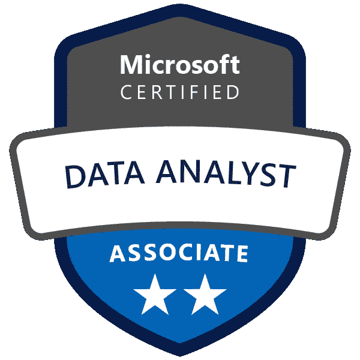

# 所以你想参加微软 DA-100 考试…

> 原文：<https://medium.com/analytics-vidhya/so-you-want-to-take-the-microsoft-da-100-exam-fa551523aa38?source=collection_archive---------11----------------------->

首先，祝贺我通过认证，嗯？谢谢，谢谢。

因此，在这篇文章中，我将分享我的考试经验，备考技巧，等等。

首先，**“考试 DA-100:使用 Microsoft Power BI 分析数据”**是一项微软认证，旨在验证企业使用 [Microsoft Power BI](https://powerbi.microsoft.com/en-us/) 最大化其数据资产价值所需的技能&知识。

基本上，如果你是一名一直在使用 **Power BI** &的数据分析师，你想让你的技能得到官方验证，这就是为你准备的考试。有关考试的更多信息，请点击[此处](https://docs.microsoft.com/en-us/learn/certifications/exams/da-100?WT.mc_id=DP-MVP-5003746)。

> 现在说说我的故事…

我一直知道我会在某个时候参加这个考试，但我不确定是什么时候。

我只是把它放在心里的某个地方，因为我的一部分害怕不及格，所以逃避是唯一的出路。

直到我被一个朋友严厉地推了一把，我才像*“是啊，终于到时间了。”*

# 准备

*   **经历:**如果我说我从开始学习使用**电笔**开始就一直在为这次考试做准备，会不会有点夸张？我不这么认为。我的意思是，到目前为止，我所学到的一切都可以算作有助于考试的经验。每次您使用 BI 工具，您都会更加熟悉其功能，提高&学习。这基本上就是你试图通过认证来证明的；你很擅长这个。所以使用这个工具，并对它感到舒适。但是这还不够…
*   学习对我帮助很大。看到了吧，考试的题目真的很刁钻。棘手但相对容易。这就是学习路径中提供的[学习资源](https://docs.microsoft.com/en-us/learn/paths/data-analytics-microsoft/?WT.mc_id=DP-MVP-5003746)发挥作用的地方。大多数答案都在里面，但是除非你从字里行间去体会，否则你不会知道。又结束了&。我读了 3 遍以上的资料，由于问题提出的方式，我仍然错过了一些答案，我不确定。所以很容易错过显而易见的东西，你必须阅读才能记住&理解&如果你必须学习资源超过 3 次，请这样做。
*   我参加了一个训练营。[训练营](https://foresightbi.com.ng/bootcamp/)是为了教会参与者如何用 Power BI 分析数据，并让他们为考试做好准备，所以这是值得的。课程遵循[学习指南](https://query.prod.cms.rt.microsoft.com/cms/api/am/binary/RE4qlRu)中的内容，因此学习是精确的。班级活动帮助我更好地理解我正在读的东西。所以，如果你在你能负担得起的地方找到类似的课程，不要犹豫。网上有成吨的；比如 Udemy。
*   在参加真正的考试之前，我参加了一次练习/模拟考试。如果你想有足够的信心参加考试，这一条是非常重要的。这有点像在实际购买之前去调查你想买的公寓。我第一次模拟考试失败了，这让我有点伤心，因为我以为我已经做好了进入考场的充分准备。显然不是。除了令人困惑的问题，考试界面也很奇怪；模拟考试模拟了主考试的环境，所以你可以感受一下主考的感觉。当我重考模拟试题时，我的成绩提高了，因为现在我不必浪费时间去理解如何回答一个问题。我还回顾了我从错误答案中学到的东西。所以我认为这是一个有用的准备步骤。如果你的课程/训练营包中有模拟测试，你可能会很幸运，因为这些模拟测试不是免费的。我在完成我之前提到的训练营之后做了我的测试，我不需要支付测试费用，因为测试已经准备好了。
*   **吃！因为我迟到了，所以在去考试中心之前我没有吃东西，但是在我进考场之前，我确定吃了一些东西。老实说，我觉得如果我没有吃那份点心，我的分数会更低。这是一个半小时的考试。你肯定需要食物。**

# 考试

*   考试总共有 56 道**题。**
*   问题分为 **3 个部分**
*   **第一部分** : 4 个问题(全部与单个案例研究相关)。一旦完成，您就不能再回到这一部分修改您的答案。
*   **第二个** : 48 题。同样，一旦完成&你点击提交，就不能回头查看答案。
*   **第三部分** : 4 个问题(全部与单个案例研究相关)。与上面 2 条的原理相同。
*   考试评分超过 1000 分。你至少需要 700 个标记才有资格获得徽章。
*   完成时间: **180 分钟。**

**注意:**你不能带任何东西进考场，不能带拍纸簿，不能带一瓶水。只有你自己&你的 ID

# 常见问题

1.  一定要在考试中心写考试吗？
    **Ans:** 没有，有一个选项可以写在家里/办公室。只要确保在整个考试期间有强大的互联网连接，没有噪音或干扰，周围没有物体&稳定的电源。如果这些都不确定呢？去一个考试中心。
2.  我如何找到我附近的考试中心？
    **Ans: a)** 只需在谷歌上输入“微软考试中心在【你所在的州】”。如果你想自己注册，微软会显示你所在地区的可用中心列表及其时间。
3.  考试要多少钱？
    **Ans:**【80 美元尼日利亚在写作时。因国家而异。

有关定价和时间安排的更多信息，请点击此处的[查看](https://docs.microsoft.com/en-us/learn/certifications/exams/da-100?WT.mc_id=DP-MVP-5003746)

最后一点:你可能永远不会 100%准备好，但无论如何你都需要接受。

别担心，你也会得高分的！

如果你还有任何问题，请通过我的推特发邮件给我。

*原载于 2021 年 2 月 26 日*[*https://foresightbi.com.ng*](https://foresightbi.com.ng/microsoft-power-bi/so-you-want-to-take-the-microsoft-da-100-exam/)*。*