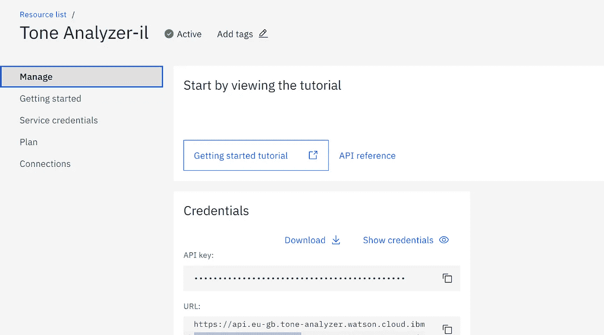
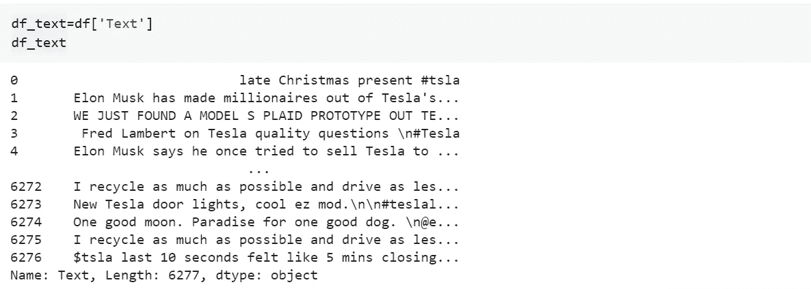

# 使用 Python 采集社交媒体

> 原文：<https://medium.com/analytics-vidhya/social-media-harvesting-using-python-a94f3a4d7baa?source=collection_archive---------8----------------------->

从社交媒体中收集非结构化数据，并对其进行分析以了解客户行为，这是企业集团多年来一直在做的事情。大数据和机器学习的出现只是促进了这一点，根据用户的参与度预测用户在社交媒体平台上的趋势变得很容易。你一定听说过类似的事情发生在剑桥分析公司

我们今天要做的是拿一个类似的用例，看看我们如何不仅从一个社交媒体平台收集数据，而且还做一些分析，以得出相同的结论。我们的用例是对**特斯拉进行分析。**

## 数据抓取

出于隐私考虑，几乎所有的社交媒体平台都屏蔽了许多允许访问公开发布数据的 API。一旦存在，就需要在给予开发者权限之前进行严格的审查。由于这个限制，我们将使用 github 上可用的抓取代码来抓取数据。该代码可在 https://github.com/Altimis/Scweet[获得](https://github.com/Altimis/Scweet)

它使用 selenium webdriver 从 twitter 中抓取数据。对于所有不熟悉 selenium webdriver 的人来说，它是一个帮助您自动化活动的包。因此，我们需要自动化的活动如下:

第一步:登录 twitter

第二步:搜索一个单词

在地址栏中可以看到被搜索的单词。

第三步:从列出的推文中收集数据

现在，让我们看看如何使用代码来实现它，代码的链接是共享的。它定义了所有的导入和类来完成这项工作。Selinium-webdriver 已经用于执行这项任务，并且使用 xpath 标识字段。不要害怕听到 xpath。它是一个 HTML 元素的层次路径，或者是在页面上找到一个 HTML 对象的确切位置的地址。根据屏幕截图中的以下步骤，为输入字段获取的 xpath 是

> /html/body/div[2]/div/div/div[2]/main/div/div/div[2]/form/div/div[1]/label/div/div[2]

如何获取输入元素的 xpath

克隆 github repo 后，创建一个新文件 **index.py** 并复制&仅将 repo 中**示例**笔记本中的刮线粘贴到其中。

在运行 py 文件之前添加您要搜索的关键字并修改日期，或者您可以继续使用 **Example.ipynb** 文件并使用 **scrape** 函数运行单元格。

对于步骤 1:登录——您需要在**中为您的 twitter 帐户指定用户名和密码。env** 文件。详细信息从该文件中获取，并使用登录字段的 xpath 填充到登录页面中，然后提交。

对于步骤 2:搜索一个单词—搜索 url 被设计为搜索具有特定文本和数据范围的单词。

utils.py 文件包含以下几行来创建搜索 url

> 路径= 'https://twitter.com/search？q = '+words+from _ account+to _ account+hash _ tags+end _ date+start _ date+lang+filter _ replies+' & src = typed _ query '

一旦变量被替换，看起来有点像:

> [https://twitter.com/search?q =(Tesla)% 20 直到%3A 2021-03-12% 20 自% 3a 2021-03-11% 20% 20-过滤器% 3a 回复& src=typed_query](https://twitter.com/search?q=(Tesla)%20until%3A2021-03-12%20since%3A2021-03-11%20%20-filter%3Areplies&src=typed_query)

不要担心这个，代码会替你做的，我只是解释后台发生的事情。

正在擦除的数据

对于步骤 3:抓取数据——使用 xpath 抓取列出的搜索结果，从一个页面抓取后，对下一个页面重复该过程，直到所有列出的 tweets 都被抓取。抓取后，数据被转储到**输出**文件夹中的文件中。

在收集的数据中，我们只关心用于分析的**文本**列。

输出文件夹中的抓取数据

我们可以使用 tableau 对相同的数据进行一些基本的分析，如下所示。

显示推文的频率

## 数据分析

我们已经准备好进行数据分析。我们有**文本**列，我们将对其进行分析，但文本消息本身不会传达任何重要信息。所以我们要做两件事:

*   分析推特的语气
*   使用 NLP 库查找推文中单词的含义

为了分析推文的语气，我使用了 IBM Cloud 的一项名为 Tone Analyser 的服务(IBM，2020)。您需要创建一个 IBM Cloud 帐户来使用它。这是不收费的，所以继续创建您自己的帐户。创建后，您可以在**管理**选项卡下看到 API 访问详情。

在**入门**选项卡中，您将获得所选语言的 SDK。我用的是 python SDK。下面给出了代码片段。

SDK 来调用音调分析器。

在**测试**变量中接收到响应，然后遍历该变量以生成从所有 tweets 中获得的情绪列表。收到的响应如下所示，包括句子 id、句子语气以及概率:

> {'sentence_id': 0，' text': 'Augmented- simple，clean look '，' tones': [{'score': 0.788656，' tone _ id ':' Joy ' }，{'score': 0.762356，' tone_id': 'analytical '，' tone _ name ':' Analytical ' }]} Joy Analytical { ' sentence _ id ':1，' text': ' with #NextGen #Animation '，' tones': []} {'sentence_id': 2，' text ':' exclusive on '，' tones ':[{ ' SCO

获得的情感或情绪列表用于绘制如下所示的图表。

推文中的观点

这向我们展示了用户发布了哪些关于**特斯拉**的推文。他们中的很多人似乎很悲伤，愤怒和害怕。

除了情感分析，我们还使用 NLP libraray——NLTK 来查找推文中使用的词语种类。但要做到这一点，首先要将 tweet 的句子按空格分开，所有标点符号和停用词都被删除。

仅提取文本字段

在空间上拆分单词

删除标点符号

删除停用词

所有的单词都保存在一个列表中。SnowballStemmer 将列表中的单词转换为它们的词根含义，并将其绘制在图表上。

SnowballStemmer 将单词转换为其词根含义

一旦完成，就可以计算出每个单词的频率，并绘制出图表。

这表明，在特斯拉的许多推文中，埃隆·马斯克的名字与比特币、汽车、购买等词一起出现。

同样，我们可以使用它来绘制推文中提到的顶级组织，或者检查推文中是否提到了任何其他人。

所以，这就是你如何从社交媒体中获取数据，并从中得出一些结论。这是一个非常简单的用例，为所有级别的用户设计，但是我确信它可以帮助你思考更多，甚至使用其他 ML 库和第三方 API 扩展它的功能。

页（page 的缩写）s——我没有把所有东西都填鸭式地灌输给读者，因为我想让读者自己去思考和设计。如果您需要任何帮助，请在 linkedin(Suraj Jeswara)或 insta(@theperkysun)上发表评论或联系我。

在你们离开之前，请不要忘记落下一些**掌声**和**跟我来**因为这将鼓励我做出更多贡献:)

## 参考

 [## 剑桥分析和脸书:丑闻和迄今为止的影响(2018 年出版)

### 特朗普竞选团队的数字顾问滥用数百万脸书用户数据的消息被披露，引发了一场…

www.nytimes.com](https://www.nytimes.com/2018/04/04/us/politics/cambridge-analytica-scandal-fallout.html)  [## IBM 云文档

### 编辑描述

cloud.ibm.com](https://cloud.ibm.com/docs/tone-analyzer/index.html?_ga=2.203119825.1373849354.1619036889-758115668.1616614728&_gac=1.87030250.1618755099.Cj0KCQjwse-DBhC7ARIsAI8YcWLGgburSVPU6I1CfiuICxDNwi3YT-C0S8CRFv0pZ8wSpft7DC8GhXAaAubhEALw_wcB&cm_mc_uid=05101399854316049438530&cm_mc_sid_50200000=72119711619036887851#about)  [## IBM 云

### 使用 190 多种独特的服务立即开始建设。

cloud.ibm.com](https://cloud.ibm.com/services/tone-analyzer/crn%3Av1%3Abluemix%3Apublic%3Atone-analyzer%3Aeu-gb%3Aa%2F9e8003632f7b4559b2d72dba62d24a14%3A7373c8d2-41fc-41ae-89a0-7c9531df0666%3A%3A?paneId=gettingStarted)