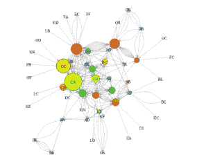

# R 中的社会网络分析

> 原文：<https://medium.com/analytics-vidhya/social-network-analysis-in-r-38fbf2512290?source=collection_archive---------7----------------------->

无论是在线网络，如 Linkedin 和 Twitter，还是离线的更传统的网络，如居住在社区的人们，对这些社交网络的分析，将人和信息联系起来，导致无数领域的新认识。它为我们提供了一种量化各个数据点之间的联系并以图形方式呈现它们的方法。

让我们看看 R 中的 SNA 以及一些例子。

输出

在这里，我们创建一个简单的图，并将其存储在 g 中。默认情况下，它是一个有向图(即边有方向)。要使它没有方向，可以加上‘directed = F’。我们绘制图形，并修改顶点和边的颜色，顶点大小(可选)。例如，节点 1 向 2 发送电子邮件，2 向 3 发送电子邮件，3 向 4 发送电子邮件，4 向节点 1 发送电子邮件。我们也可以借助另一个例子来看。在脸书，1 跟随 2，2 跟随 3，3 跟随 4，而在脸书，4 跟随 1。然而，如果它是一个无向图，这将意味着 1 跟随 2 和 4，2 跟随 1 和 3，3 跟随 2 和 4，等等。

g[]给出如下所示的 4x4 矩阵。这意味着第一个节点连接到第二个节点，第二个节点连接到第三个节点，第三个节点连接到第四个节点，第四个节点连接到第一个节点。

如果我们在图 g 中指定节点数(n)=7，前 4 个节点保持连接，其余 3 个节点在外部。

输出

这里我们创建另一个图 g1，并通过修改某些参数来定制它。为了借助于一个例子来理解这一点，Tina 和 Li 喜欢由 Disha 发布的一张照片，Heena 喜欢由 Tina 发布的一张照片，并且 Heena 和 Disha 都喜欢彼此在社交媒体上的照片。

节点之间的连接

## **网络测量**

度是一种中心性度量，给出每个节点拥有的链接或连接的数量。通过指定模式，我们可以获得入站和出站链接的数量。

我们还可以找到如图所示的图的直径、边密度、互易性、紧密度、介数和边介数。

计算边缘密度的另一种方法是使用公式:e count(G1)/(vcount(G1)*(vcount(G1)-1)，其中 ecount=5，vcount=4。

> 直径:顶点对之间的最大距离
> 
> 紧密度:对中心性的度量，等于图中一个节点和所有其它节点之间最短路径长度的总和
> 
> 介数:测量一个节点位于其他节点之间最短路径上的次数。

这里，我们读取一个由 290 个观测值和 4 列组成的数据文件，并创建一个包含前两列的数据框。例如，这可以是一个电子邮件网络，其中 AA 向 DD 发送邮件，Ab 向 DD 发送 mil，等等，或者列 1 可以代表 Twitter 帐户的 id，而列 2 表示关注 Twitter 帐户的人的 id。

输出

例如，有 35 个节点的度数小于 10。总的来说，我们可以说更多的节点具有更少的连接，但是很少的节点具有许多连接。

这里，我们通过将顶点颜色设置为彩虹(52)来定制绘制网络的布局，即 52 个顶点中的每一个都有不同的颜色；将顶点大小设置为度数的函数，即度数越大(连接数越多)，顶点的大小越大；以及选择一种布局。这是三种布局各自的外观。

我们可以看到，节点 CA 的大小最大，这意味着它的度数最高。

集线器有多个输出链接，而管理机构有来自集线器的输入链接。我们找到枢纽得分和权威得分，并绘制它们，如图所示。

社区检测用于检测密集连接的节点组。我们使用 cluster_edge_betweenness 函数在我们的网络中找到这些集群。

你可以在这里获得代码和数据集[。](https://github.com/HeenaR17/Social-Network-Analysis)