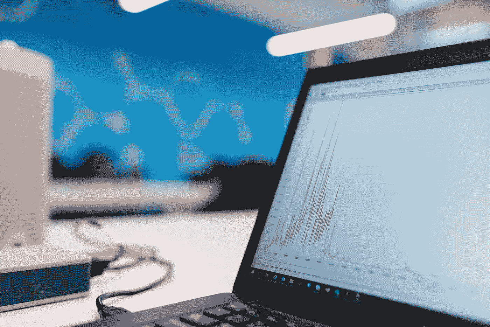
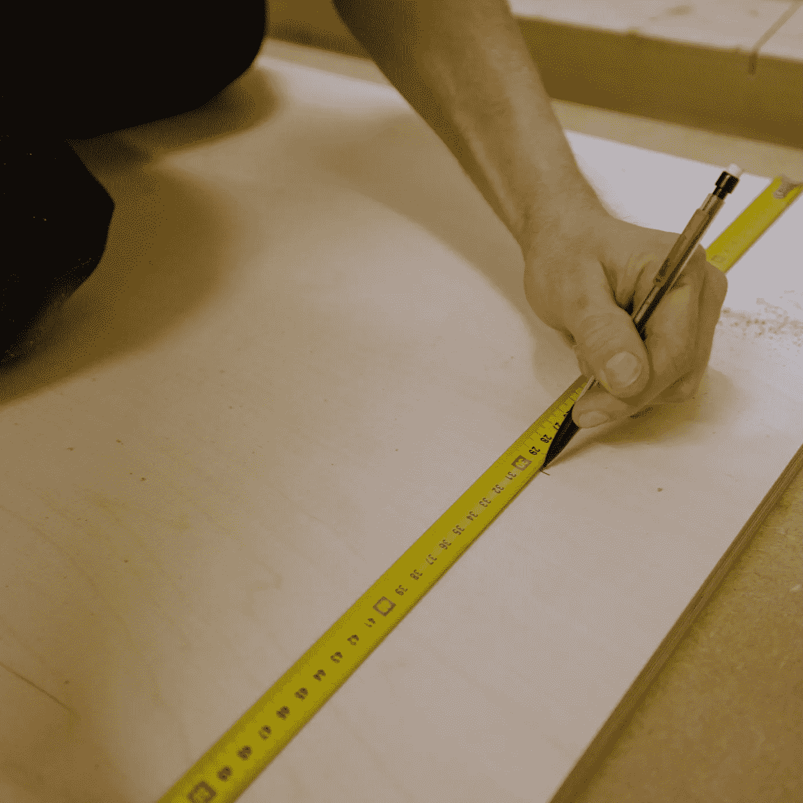
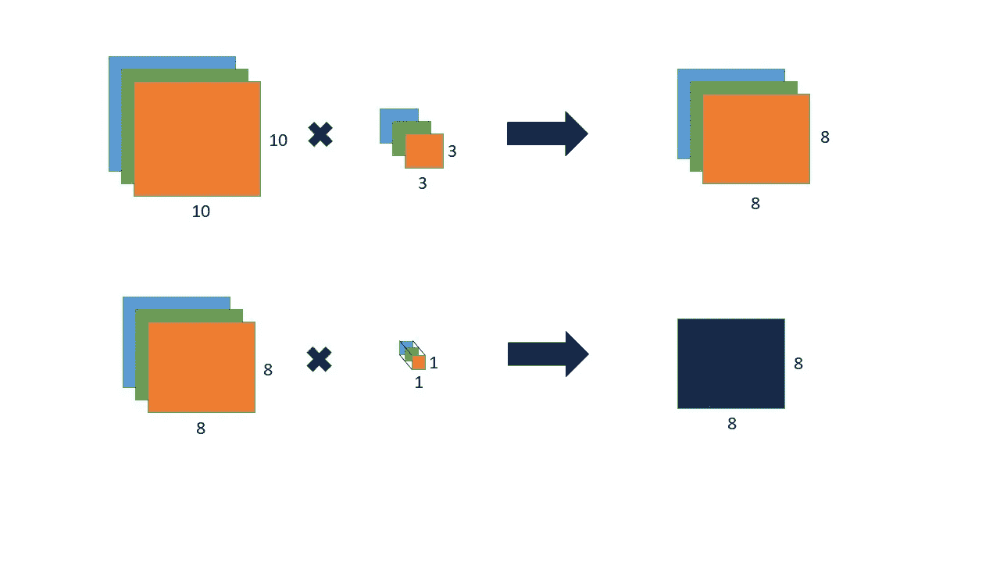

# 在边缘部署人工智能的软件优化

> 原文：<https://medium.com/analytics-vidhya/software-optimization-for-deploying-ai-at-the-edge-7fd7af633461?source=collection_archive---------8----------------------->

在 [Unsplash](https://unsplash.com/s/photos/software-graph?utm_source=unsplash&utm_medium=referral&utm_content=creditCopyText) 上拍摄的 [ThisisEngineering RAEng](https://unsplash.com/@thisisengineering?utm_source=unsplash&utm_medium=referral&utm_content=creditCopyText)

优化意味着提高系统的性能。如何衡量性能取决于场景，可能是精度、速度、功耗或其他因素。通常，您可以采取两种方法来提高系统的性能。可以用*硬件优化*，也可以用*软件优化*。比方说，你有一台 2009 年的台式机，当时它很普通。现在在 2021 年，那个系统的性能(速度)对你来说可能不够好。所以你可能会决定升级你机器的 CPU、内存或其他部分，这是硬件优化，或者你可能想使用轻量级的 Linux 发行版，而不是使用最新的 Windows 10，这是软件优化。因此，我们所说的软件优化是指

> 在不改变底层硬件的情况下，更改代码以提高其性能

在边缘设备中使用人工智能的情况下，软件优化涉及降低模型复杂性的技术和算法。在这篇文章中，我将简要地谈论一些为边缘应用程序优化 AI 模型的技术。

# 为什么要做软件优化

更换硬件成本高昂。甚至可能出现改变硬件极其困难的情况，例如，您的系统可能位于一个遥远且具有挑战性的位置，如森林、北极/南极、沙漠、海洋中部或火星！在这种情况下，软件优化会有所帮助。希望进行软件优化的另一个原因可能是为了释放资源，以便在同一硬件上容纳另一个应用程序。例如，假设您需要在系统中添加另一台摄像机。切换到更好的硬件是可能的，但你想买一台新电脑只是为了容纳第二个摄像头吗？你的客户可能会不高兴！因此，软件优化在许多情况下都很方便，有助于用更少的资源消耗做更多的事情。

# 优化的方法

## 缩小模型尺寸

由 [Valentina Giarre](https://unsplash.com/@valentinagiarre?utm_source=unsplash&utm_medium=referral&utm_content=creditCopyText) 在 [Unsplash](https://unsplash.com/s/photos/measuring-tape?utm_source=unsplash&utm_medium=referral&utm_content=creditCopyText) 上拍摄的照片

优化的一个方法是减小模型的大小。更大的型号需要更多的内存和计算能力。减少模型大小可以在几个方面帮助优化应用程序。

1.  较小的型号加载速度更快。因此，通过减小模型大小，我们可以减少加载时间。当应用程序在 CPU 上运行时，模型只加载一次，因此加载时间的减少可能不会起到很大的作用。但是，如果模型运行在集成的 GPU 或其他连接的加速器上，那么每次运行推理时都会加载模型，因此减少模型大小可以显著提高应用程序的性能。
2.  存储较小型号所需的空间更少。边缘设备通常资源有限。因此，通过缩小型号，您可以容纳其他型号、流程或功能，或者降低功耗。
3.  通过移除不重要的或冗余的参数来减小模型大小，从而改进推理时间。
4.  减小模型大小有助于更快地编译模型。所有 OpenVINO 加速器(GPU、VPU、FPGA 等)运行 OpenCL 内核，并在 CPU 上使用即时编译器编译，然后通过 PCI Express 或 USB 总线加载。这就是为什么只有 CPU 的推理系统启动更快，但基于 OpenCL 的推理系统可能需要 5-10 秒才能启动。

现在的问题是，我们如何能减少模型的大小。以下是一些方法。

**1。量化:**量化就是把高精度的权重转换成低精度的权重。在 OpenVINO 中，这些被称为数据类型。OpenVINO 支持 FP32 和 FP16 (32 和 16 位浮点)。此外，还有运行在 CPU 上的 INT8 类型。vpu 运行 FP16 型号。GPU 也偏爱 FP16。INT8 重量仅为 FP32 的 1/4。

**2。知识蒸馏:**这是一种由较大的模型(称为教师)训练较小的模型(称为学生)的技术。更大的模型通常获得更高的精度。当教师模型训练学生模型时，其知识被转移到学生模型，因此较小的模型也可以实现更高的准确度。

**3。模型压缩:**这是通过寻找在内存中表示权重的巧妙方法来实现的，这样我们只需要存储更少的值。有几种算法和技术可以做到这一点。一种这样的技术是重量共享。在这种技术中，我们试图让几个权重共享相同的值，从而减少将保存在存储器中的唯一值的数量。

## 减少操作次数

照片由[空气焦点](https://unsplash.com/@airfocus?utm_source=unsplash&utm_medium=referral&utm_content=creditCopyText)在 [Unsplash](https://unsplash.com/s/photos/tasks?utm_source=unsplash&utm_medium=referral&utm_content=creditCopyText) 上拍摄

我们可以通过用计算密集度较低的操作替换更复杂的操作来减少模型中的操作数量。这将导致推理时间和能量消耗的减少。让我们来看看减少操作次数的一些技巧。

**1。算法:**我们可以使用计算效率更高的层来代替复杂的运算。例如，卷积层是神经网络中最繁重的操作之一。我们可以用深度方向可分离的卷积来代替正常的卷积层，这将减少运算的数量，而不改变模型中的任何内部张量。一个*可分离卷积*是将标准卷积层分为两层的卷积层。首先，它应用深度方向卷积，然后应用点方向卷积。在正常卷积中，单个卷积滤波器在输入图像的整个深度上迭代(例如，3x3xC，其中 C 是通道号)，但在深度方向，滤波器一次通过一个通道。这意味着滤波器的数量将等于通道的数量，并且所得到的特征图将具有与输入图像相同的深度。然后在逐点卷积中，它将使用 1x1xC 内核，以便深度减少到 1。如果在正常卷积中，我们使用 N 个核，我们将使用 N 个逐点卷积来匹配两种情况下最终输出的深度。两种情况下的最终输出是相同的，但是所需的操作数量要少得多。在本文的后面部分，我已经给出了确定每种情况下的操作数的计算方法。

深度方向卷积(顶部)和点方向卷积(底部)

**2。下采样:**下采样是指减少参数的数量。我们可以在卷积层之间使用平均池或最大池来减少提供给后续层的参数数量。

**3。模型剪枝:**以上两种优化方法在训练时使用。模型修剪在训练之后完成。模型修剪减少了冗余的权重和网络。在模型剪枝中，首先对所有权重进行排序。根据您希望如何修剪模型，可以逐层或对整个网络进行排序。则设置阈值，并且通过设置为零来移除低于阈值的所有权重。然后在数据集上重新训练模型。模型修剪是一种强大的技术，它可以显著减小模型的大小，同时对准确性做出微小的牺牲。

# 何时进行这些优化

在实际投入时间和资源优化模型之前，首先要确保应用程序的瓶颈是模型的性能，而不是其他流程。如果不是这样，优化您的模型将不会给您的系统带来什么变化。例如，如果对传入图像的预处理花费了大量的时间，那么优化您的模型以减少推断时间对您的应用程序几乎没有影响。另一个例子是，如果你的模型只加载一次，那么减少 1-2 毫秒的加载时间不会有任何效果，但是如果你加载模型多次，那么这几毫秒的时间就会累加起来，你就会看到改进。还要确定你的用例是否会从优化中受益。如果您的系统正在读取街上行驶车辆的车牌号码，那么更快的推断时间肯定会有所帮助。但是如果您的系统正在读取停车场中停放的汽车的牌照号码，那么更快的推断可能对您的系统毫无用处。OpenVINO 有一些工具可以确定你系统的瓶颈在哪里。我将尝试在另一篇文章中介绍它们。

# 衡量绩效的指标

托马斯·凯利在 [Unsplash](https://unsplash.com/s/photos/meter?utm_source=unsplash&utm_medium=referral&utm_content=creditCopyText) 上的照片

我们需要能够测量应用优化技术后的性能改进。有几个指标可以用来做这件事。在本文的开头，我提到我们如何测量性能取决于需求或场景。对于边缘人工智能应用，我们可能关心两种类型的性能——软件性能和硬件性能。

为了测量软件性能，我们可以使用几个度量标准，如推理时间、准确性、模型大小、召回率和精确度等。您可以使用这些指标以巧妙的方式优化您的应用程序。假设您希望拥有一个具有高召回率和精确度的系统，例如，当某个东西从您的相机前面经过时，您希望以高召回率和精确度检测它是否是濒危动物，但是运行该模型的计算成本很高。您可以使用精度较低的较小模型来检查所有传入的帧，当它认为发生了感兴趣的事件(有东西从您的相机前面经过)时，它会触发较大的模型来分析该帧。你更小的模型只需要有更高的概率触发第二个模型。这样，您就不需要为所有不必要的帧运行重模型，并从您的系统中获得良好的结果。

一些硬件性能指标包括功耗、物理尺寸、系统成本、FLOPS、MAC 等。FLOP 是***Fl****oating****P****point****O****operation*。任何有浮点值的运算，如加法、乘法，都称为 FLOP。你的模型失败的次数越多，运行推理的能力和时间就越长。不要把人字拖和人字拖搞混了。在第一个例子中，小写的“s”用来表示复数。但在后一种情况下，大写的 S 表示第二。FLOPS 的完整形式是***Fl****oating****P****point****O****operations per****S****second*这是一个设备属性。FLOPs 表示一秒钟内你的设备可以执行多少次 FLOPS，其中 FLOPS 表示你的模型有多少次操作。MAC 运算是一个 **M** 乘法运算，后跟一个 **A** 加法运算。MAC 运算在神经网络中非常常见。在 NN 中，我们将权重与激活相乘，并将其与另一个权重和激活相乘相加，如下式所示:

A = w1 * a1 + w2 * a2 + w3 * a3 + …

所以通常情况下，1 MAC 等于 2 FLOPs。但在一些特殊的器件中，加法和乘法运算被融合成一次运算。在那些设备中，1 个 MAC 等于 1 个 FLOP。

## 计算卷积层的 MAC

让我们计算一个正常卷积层的 MAC 数量。(我假设你知道卷积层的基本工作原理。)假设我们有一个 10×10×3 的输入图像，内核大小是 3x3x3。输出形状将是 8x8x1。在起始位置，这个内核执行 3*3*3 乘法和加法或 MACs。它沿宽度移动 8 次，沿高度移动 8 次。所以一个内核执行的 MAC 总数是 3*3*3*8*8。假设我们有 128 个内核，那么 MAC 总数最终为 3*3*3*8*8*128 = 221，184。现在让我们计算可分离卷积的 MACs。对于 10x10x3 图像，我们有 3 个 3x3x1 滤波器，每个滤波器产生 8x8x1 输出。因此，在初始位置，滤波器执行 3 * 3 * 1 MACs。它沿宽度移动 8 次，沿高度移动 8 次，因此单个过滤器执行的 MAC 总数为 3*3*1*8*8。对于 3 个过滤器，总 MAC 数为 3*3*1*8*8*3 = 1728。然后，它使用 1x1x3 内核执行逐点卷积。所以类似的，执行逐点卷积的总 MAC 是 1*1*3*8*8 = 192。为了获得与正常卷积相同的深度 128，我们使用 128 个逐点卷积，因此总 MAC 为 192*128 = 24，576。因此，在正常卷积中，该模型需要执行 221，184 MACs，而在等效可分离卷积中，该模型只需执行(1，728 + 24，576) = 26，304 MACs！

# 结论

我希望我能够给你一些关于优化边缘应用的 AI 模型的不同技术的想法。这仍然是一个新的领域，每天都有越来越多的新技术被发现。因此，请关注最近的研究工作，以跟上新技术的发展。