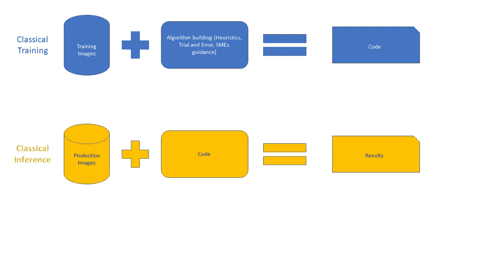
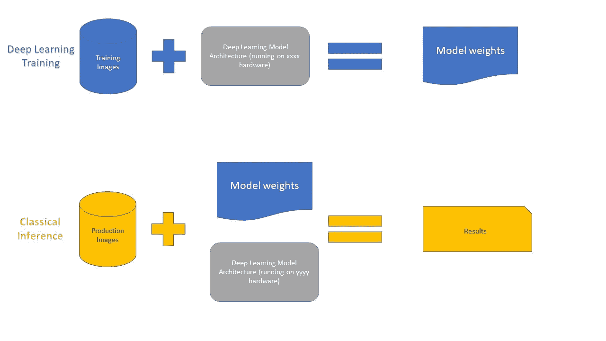

# 计算机视觉项目的解决方案架构

> 原文：<https://medium.com/analytics-vidhya/solution-architectures-for-computer-vision-projects-31754b4dad09?source=collection_archive---------3----------------------->

## 关于可用于部署计算机视觉解决方案的各种工程架构的文章

最近，一位同事与我讨论了他可以用来部署计算机视觉解决方案的各种架构。我们坐下来，创建了一个列表，我觉得在这里分享会很好。请分享你的想法。

*我们正在讨论部署基于深度学习的计算机视觉解决方案的最佳方式。有许多利弊需要考虑，这里列出了可供工程师使用的各种架构。*

# 介绍

计算机视觉技术可以大致分为各种不同的用例，如图像分类、对象检测、深度感知、图像生成等。像 OCR、人脸识别这样的需求通常可以归入这些模块中的一个。本文档列出了可用于部署这些用例的解决方案的各种体系结构。

一般来说，可以使用以下方法之一来设计解决方案。每个解决方案都有成本与性能的权衡，并选择适合您的解决方案。

1.  在 PC 上运行

*   CPU 与 GPU

2.视频流的集中处理

*   专用服务器
*   云 CPU、云 GPU、云 vpu
*   现成的解决方案

3.边缘计算选项

*   英特尔 OpenVino
*   高通·SNPE

此外，我将把计算机视觉的整个过程分成两部分。一个是模型训练，一个是模型推理。最有趣的方面发生在这两个领域。我在这里的讨论大部分限于推理。我也将简单地谈一下培训。

范围之外:关于单个算法/模型的优点/缺点的讨论超出了本次讨论的范围。除非这样的模型/算法不适合特定的架构，否则我将远离任何关于模型/算法比较的讨论。换句话说，如果你想知道《盗梦空间》和《Resnet》的对比，那么这篇文章不适合你。

# 术语的歧义消除

经典的计算机视觉算法:我把所有非深度学习算法都包括进来了。无论是用于改变颜色空间还是用于模式识别，如果它不是基于深度学习，我会将它们包括在“经典”的定义中

深度学习模型:不管用于构建它们的框架是什么(如 Pytorch、Tensorflow 或 plain C++)，如果模型使用基于感知器和 CNN 的方法，我将把它们称为深度学习模型。无论是你从零开始写的浅网络还是超深网络，对我来说都是深度学习的典范。

# 建筑流程

训练和推理的架构组件可以描述如下。类似于任何软件项目，训练 ala 开发在时间上与推理 ala 生产分开。

基于经典算法的系统

这是大多数软件开发人员所习惯的。在这种架构中，部署意味着将代码部署到生产环境中。

## 基于深度学习的系统

注意到区别了吗？

# 模特培训

# 经典算法

这种方法中的训练是所有开发人员都觉得最自然的古老方法。在这种架构中，模型是在启发式地识别算法的参数之后建立的。训练的人工制品是代码，(无论是 Python 还是 Java，还是优秀的 C 语言)。

# 深度学习模型

这种情况下的训练也相当简单。无论您是执行迁移学习还是从头构建网络，您都可以在本地或云的高性能机器上训练模型。利用 GPU 可以显著减少训练时间。参考这篇论文进行研究。[https://web . Stanford . edu/~ rezab/classes/CME 323/S16/projects _ reports/hedge _ us mani . pdf]

有研究论文探索深度学习的并行和分布式计算方法。但这还不是主流。因此，我不在这里进一步讨论它们。此外，本文的重点是推理。

# 模型推理

无论我们使用什么技术，都有一个地方可以捕捉图像并将其转换成色彩空间矩阵。(RGB、CMY 等)。这是一个数字表示，使监视器能够显示捕获的信息。推理就是要理解这些数字。

有多种方法可以对计算机视觉解决方案进行推理。硬件架构的选择对解决方案的资本支出、运营支出和质量有重大影响。仔细评估这些参数对于理解消费者的价值收益至关重要。

让我们看一下图像数据需要如何推理。离线图像处理(照片上传到云驱动器等。)并在以后处理，或者实时处理，其中来自摄像机的视频帧被连续处理。无论您的业务需求是什么，您都需要评估交付成功产品的成本影响。

有多种方法来设计产品。每种方法都有技术和财务影响。我在这里捕捉了一些。

# 风景

## 经典图像处理技术

**本地推理**

在这种情况下，摄像机直接连接到运行代码的机器。这在控制硬件和软件方面提供了很大的灵活性，但不可避免地受到主机硬件能力的限制。出于实际考虑，摄像机不能离主机太远。想象一下，运行 200/300 米长的摄像机线，以便可以对乘客进行面部识别。通过互联网流式传输视频帧解决了这个问题，但增加了额外的复杂性。此外，当有多个摄像机输入需要分析时，它不能很好地缩放。CPU 限制总是很快达到。

**云**

与本地机器相比，云提供了极大的简化。然而，云并不是“免费”的。这当然是负担得起的，但不是免费的。甚至可能不便宜。你必须仔细构建你的 lamba 函数等，以确保最佳的响应时间。

此外，在处理视频帧时，还必须考虑网络延迟。您的摄像头可能位于您的保时捷车头。但是，如果云服务器运行在几百英里以外的数据中心，那么您的解决方案就必须考虑网络延迟。

**深度学习技术**

一般来说，基于深度学习的模型可以为您的模型提供更好的准确性。然而，深度学习模型也很慢，CPU 饥饿和内存猪。业内有多种方法来解决这些问题，并提出一个漂亮的解决方案。

**本地 CPU**

深度学习解决方案可以在相机连接的同一台机器上运行。这对于图像不允许离开计算机(可能出于法律或隐私原因)的特殊活动来说是非常好的。在这种情况下，扩展成为一个挑战。随着深度学习模型的 CPU 大量数据处理，添加第二个和第三个摄像头将成倍增加成本。

**本地 GPU**

GPU 非常适合减少深度学习模型的计算时间。它们几乎神奇地提高了运行时性能。请注意，GPU 不会影响算法的性能。它们只会影响运行时性能。

*   NVIDIA GPUs:所有 GPU 中最著名的。使用 CUDA 编程，您可以利用 GPU 的强大功能。但是，CUDA 仅限于 NVIDIA GPUs。
*   英特尔 GPU:许多最新的笔记本电脑都在主板上集成了英特尔 GPU。唉，没人用。我参加了一个关于 OpenVINO 使用的英特尔培训项目，培训师承认“他们中的大多数可能都闲置在你的系统中”。这大约是 2020 年初。从那时起，英特尔已经投资了数百万美元来改变这一局面。

**云**

云 CPU 和 GPU 与我上面描述的本地 CPU 是一样的。除此之外，我从未听说过云中有英特尔 GPU。除了 NVIDIA GPUs，云上还有视觉处理单元和张量处理单元，它们将执行与 GPU 相同的功能，并减少您的延迟时间。

**边缘计算**

无论你是在本地网络还是云端处理深度学习，都不可避免地受到机器 CPU 能力的制约。增加 CPU 能力的成本是指数级的。此外，网络成本也会推高您的运营支出。有没有一种方法可以在不倾家荡产的情况下实现你的目标？

答案是像英特尔 Movidius(神经计算棒)，高通骁龙等专用设备。在这种情况下，推理处理被卸载到这些连接到计算机的专用设备上。它们有各种形状和设计，从集成到主板到即插即用 USB 接口棒。

使用一些特殊的编码，可以将深度神经网络的推理处理卸载到这些设备上，并保持 CPU 空闲。这些设备便宜、便携，更重要的是，提供了边缘计算设施。所以，与其把你的整个视频帧发送到云中的 CPU，不如在边缘设备上处理帧，只把推断结果发送到主服务器。因此，服务器不是处理整个图像，而是简单地处理图像中有一辆汽车、一只猫和一只老鼠的信息。这是非常简单的，也很容易控制你的预算。如果边缘设备损坏，更换它们也不会太贵。

但是，有一个问题。这些边缘设备无法处理你可能想到的任何随机神经网络。它们支持预定义的网络列表，如 Inception、YOLO 等。作为开发人员，你可以自由地进行迁移学习，并针对你选择的对象对它们进行训练。但是如果你想从头开始构建一个定制的网络，你可能需要在激活功能、层的类型等方面做出一些妥协。也就是说，这是一个动态发展的领域，竞争正在推动公司更快地创新。就个人而言，这是我对计算机视觉领域将如何发展的打赌。

# 常见的权衡

**响应速度与成本**

无论您选择哪种体系结构，总会有一个关于响应性与成本的权衡决策。我看到很多人都没有意识到这一点。所以，我就写在这里吧。

视频流是一系列图像。每个摄像机都有帧率。帧速率是每秒捕获的图像数量。帧速率越高，对象在屏幕上的移动就越真实。每秒 24 帧，你会得到我们在电视和电影中看到的真实动作。这对你来说意味着，当处理视频帧时，我们必须每秒处理 24 幅图像。现在，深度学习网络非常需要 CPU，处理一帧需要 3-4 秒。因此，当您处理一个帧时，队列中已经有 24 * 3–1 = 71 个帧。在几秒钟内，您正在处理一个已经过时几分钟的帧。你的解决方案不再是实时的了。迁移到 GPU 会让你的处理时间减少到一秒以内，但不是 1/24 秒(至少在写这篇文章的时候是这样)。无论你选择 CPU、GPU、VPU、TPU 还是 Edge 设备，这个问题依然存在。一种方法是仅处理每 n 个帧中的 1 个帧，并跳过剩余的帧。如果您正确选择了您的架构(考虑到上述所有选项)，您的 n 可以非常小，并且几乎是实时的。

**硬件的选择**

您选择的硬件将在更大程度上影响您的解决方案，而不仅仅是成本。GPU vs CPU vs Cloud Vs Edge 的选择也涉及到产品经理。为什么？在关于边缘计算的部分，我提到了涉及算法选择的妥协。这些选择会影响模型的准确性和有效性。这就是产品经理必须介入并权衡多少准确度损失是可接受的。

还有一个问题。一旦你选择了你的平台(CPU 或 GPU 或 VPU)，很难把它移植到另一个平台上。平台、语言和内部结构显然是互不兼容的。OpenCL 声称引入了互操作性，但尚未兑现承诺。在做出架构决策时，必须仔细考虑这些细微差别。