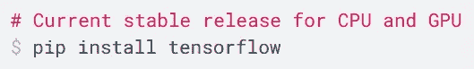
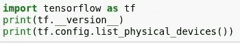
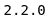
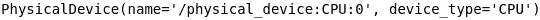
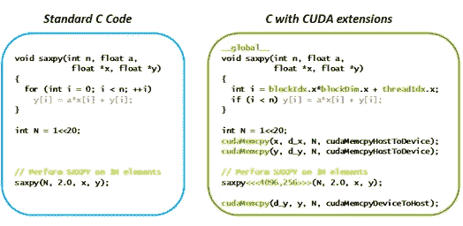
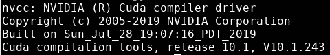
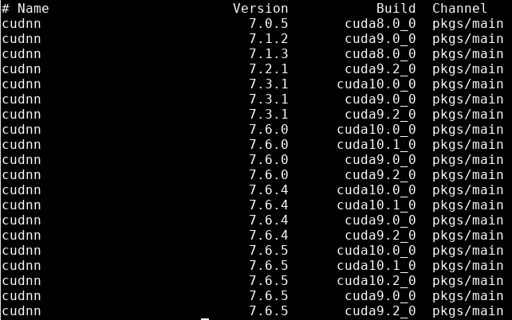
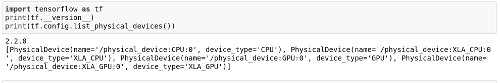

# TensorFlow 2 不使用 GPU 的解决方案

> 原文：<https://medium.com/analytics-vidhya/solution-to-tensorflow-2-not-using-gpu-119fb3e04daa?source=collection_archive---------0----------------------->

## 让 TensorFlow 2 代码或 Keras 代码在 GPU 上运行

本文通过解决*原因*和*调试/求解过程*来解决 tensorflow 2 (tf2)不使用 GPU 的问题。可能有其他的解决方法，但是我现在公布的是对我一直有效的解决方法。所以让我们开始吧。

您可能已经运行了以下命令，并希望它下载所有的依赖项，以便在 GPU 上运行。问题是，它没有，因此我们面临的 GPU 兼容性问题。

[链接](https://www.tensorflow.org/install)

# 解决此问题的主要步骤:

> I .确定张量流是否能够看到 GPU
> 
> 二。查看您的环境中是否安装了 cudnn 和 cudatoolkit
> 
> 三。验证是否安装了正确版本的 cudnn 和 cudatoolkit
> 
> 四。在安装 tensorflow 之前，请安装正确版本的 cudnn 和 cudatoolkit
> 
> 动词 （verb 的缩写）使用命令“pip install tensorflow-gpu”而不是“pip install tensorflow”
> 
> 不及物动词验证新安装的 tensorflow 是否在检测 GPU

> 重要提示:安装顺序很重要。
> 
> 假设:
> 
> 1.你用的是 nvidia-gpu
> 
> 2.您正在使用 conda 环境(Anaconda)

# **第一步:**确定张量流是否能够看到 GPU

命令:

输出:

*如果 tensorflow 没有检测到 GPU，您将只能看到 CPU 信息。*

# **第二步:cudnn 和 cudatoolkit**

命令:

> $ conda 列表

这个命令列出了当前 conda 环境中安装的软件包。**如果您没有看到***【cud nn】*或*【cuda toolkit】*软件包已安装，那么您需要安装它们。

如果你看到它们，它们需要是*正确版本*。在下一步中，我们将看到如何做到这一点，为什么需要这些。

# **第三步:**

那么这些依赖是什么，我们为什么需要它们？

*依赖关系:*

> 要在 gpu 上运行 tensorflow 2，必须安装 cudnn 和 cudatoolkit。此外，cudnn 和 cudatoolkit **的版本必须与您正在使用的 gpu** 的驱动程序兼容。

**cud nn(cud nn)是什么？**

> Tensorflow 核心是用 C++和 cuDNN 库写的
> 
> cuDNN 库是一个深度学习 GPU 加速库
> 
> cuDNN 库是使用 CUDA 构建的

**什么是 CUDA？**

***CUDA 不是语言，也不是 API*** 。不仅仅如此。CUDA 是一个并行计算平台和编程模型，使得使用 GPU 进行通用计算变得简单而优雅。[链接](https://blogs.nvidia.com/blog/2012/09/10/what-is-cuda-2/)

来自英伟达官网:[链接](https://blogs.nvidia.com/blog/2012/09/10/what-is-cuda-2/)

所以现在我们明白了为什么我们需要 cuDNN (cudnn)。

**我们为什么需要 cudatoolkit？**

***帮助执行 cuDNN/CUDA*** *。当我们在兼容 gpu 驱动版本的 coda 环境中安装 *cudatoolkit* 时，我们不需要安装完整的官方 cudatoolkit。[链接](https://www.programmersought.com/article/57794836777/)*

**我们如何知道兼容的版本？**

在终端中运行以下命令:

> $ nvcc -V

***【10.1 版】*** 帮你搞清楚兼容的 *cudnn* 版本。现在我们知道我们需要与 **10.1** 版本兼容的 *cudnn*

# 第四步:

**如何安装特定版本的 *cudnn* 和 *cudatoolkit* ？**

> 首先通过运行以下命令找出可安装的版本:

> $ conda 搜索 cudnn

> 使用此**，通过在终端**中运行以下命令来安装特定版本:

> $ conda install cud nn = 7 . 6 . 5 = cuda 10.1 _ 0

**该命令格式为:**conda install cud nn =***【版本】*** = ***【构建】*** 。“版本”是第二列中的数字，而“版本”是第三列中的数字，来自前面的命令输出。

***“构建”应该与我们运行“nvcc -V”命令得到的版本相匹配***

> ***上面的命令也会安装兼容版本的 cudatoolkit***

# 步骤五:

> 最后，使用这个命令安装 gpu 兼容的 tensorflow。

> $ conda 安装 tensorflow-gpu

> 注意这里我们有“tensorflow-gpu”而不是“tensorflow”

> 当我们运行这个命令时，它会找到与我们之前安装的 cudnn 和 cudatoolkit 兼容的 tensorflow 版本，并安装 tensorflow-gpu。

**注:****tensor flow 的最新版本是 2.4** (截止到撰写本文时)，是我们运行*‘pip install tensor flow’*时直接安装的，可能对 GPU 有效，也可能无效。但是当我们运行上面的命令时它安装了***tensor flow-GPU 2.2****版本。这个版本允许 tensorflow 检测 GPU 并使用它。*

**

# *第六步:*

> ***我们现在如何知道当前版本是否能够检测到 GPU 并在其上运行？***

*在脚本或终端中运行以下命令:*

**

*输出:*

**

> *所以现在正如你在输出中看到的， **GPU 被检测到。***

*我希望这有助于您解决 TensorFlow 2 与 nvidia-GPU 的兼容性问题。*

*参考资料:*

* [## 安装 TensorFlow 2

### 用 Python 的 pip 包管理器安装 TensorFlow。TensorFlow 2 软件包要求 pip 版本大于 19.0。官方…

www.tensorflow.org](https://www.tensorflow.org/install)  [## 使用 GPU | TensorFlow 内核

### TensorFlow 代码和模型将透明地在单个 GPU 上运行，无需更改代码。使用注释…

www.tensorflow.org](https://www.tensorflow.org/guide/gpu)  [## Tensorflow 2.0 不使用 GPU，而 Tensorflow 1.15 确实发出#34485 tensorflow/tensorflow

### 系统信息我是否编写了自定义代码(而不是使用 TensorFlow 中提供的股票示例脚本):否…

github.com](https://github.com/tensorflow/tensorflow/issues/34485)  [## 为您的 GPU 安装 TensorFlow 和 Anaconda

### 在不使用 Docker 的情况下，我在 GPU 上使用 TensorFlow 2.0 时遇到了一些问题。有时我的 cuda 版本不兼容…

yann-leguilly.gitlab.io](https://yann-leguilly.gitlab.io/post/2019-10-08-tensorflow-and-cuda/)  [## CUDA、CUDNN、CUDA 驱动程序、CUDA 工具包和 NCVV 有什么区别？-程序员…

### 我的主题是深度学习。我需要在 GPU 上运行程序。但是，题目的概念有点模糊…

www.programmersought.com](https://www.programmersought.com/article/57794836777/)*