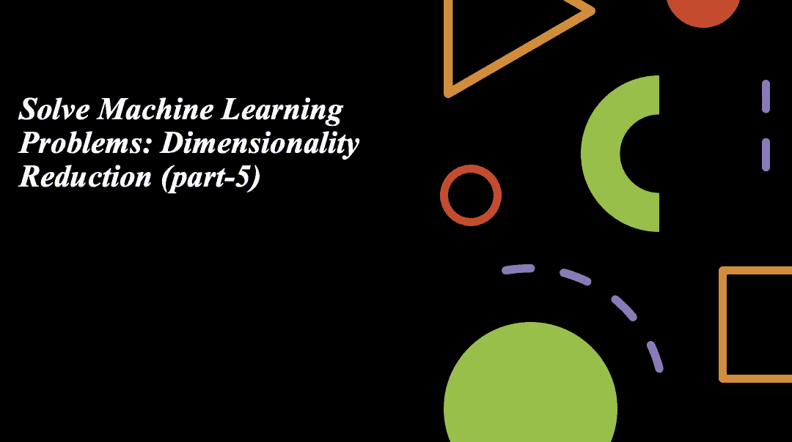
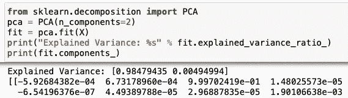
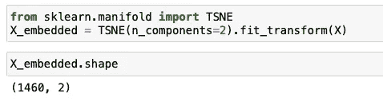
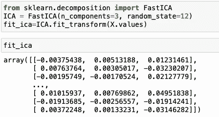
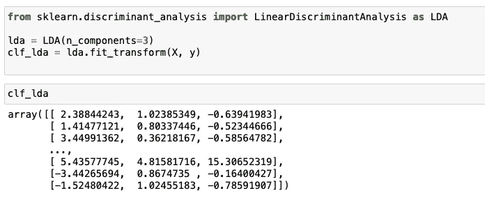

# 解决机器学习问题:降维(第五部分)

> 原文：<https://medium.com/analytics-vidhya/solve-machine-learning-problem-dimensionality-reduction-part-5-cf7676b20164?source=collection_archive---------27----------------------->

# 介绍

在有大量变量的情况下，很难对数据集进行可视化和推断。因此，这些技术试图从该数据集中提取一个子集，它可以捕获由原始变量集显示的正常数量的信息。因此，如果我们有一个 X 维的数据集，我们可以将其转换为 Y 维的子集。这就是所谓的降维。

降维可以是线性的，也可以是非线性的，这取决于所用的方法。素线性方法，称为主成分分析

## **主成分分析**

它的工作条件是，当高维空间中的数据被映射到低维空间中的数据时，低维空间中数据的方差应该是最大的。构建数据的协方差矩阵。计算这个矩阵的特征向量。第一个主成分考虑了原始数据的可能变化。之后每个随后的分量具有最高的可能方差。

第二主分量必须与第一主分量正交。

在上面的例子中，我们使用 PCA 并选择 3 个主成分，并给出方差。

## t 分布随机邻居嵌入

t-SNE 用于将高维数据分解成 2 或 3 维数据，并且还可视化高维数据。算法计算高维空间和低维空间中的实例对之间的相似性度量。它试图保持从高维空间到低维空间的相似性。

相似性度量在高维空间通过高斯分布计算，在低维空间通过单自由度的 t 分布计算。
Kullback-Liebler 散度(KL)是一种计算两个概率分布之间距离的度量。我们可以使用梯度下降来最小化 KL 成本函数。

上图我们可以看到 t-sne 后 X 的形状。

## **独立成分分析**

独立分量分析(ICA)基于信息论，也是应用最广泛的降维技术之一。PCA 和 ICA 的主要区别在于 PCA 寻找不相关的因素，而 ICA 寻找独立的因素。如果两个变量不相关，这意味着它们之间没有线性关系。如果它们是独立的，就意味着它们不依赖于其他变量。

该算法假设给定变量是一些未知潜变量的线性混合物。它还假设这些潜在变量是相互独立的，即它们不依赖于其他变量，因此它们被称为观察数据的独立成分。

1.  互信息最小化
2.  非高斯性最大化

运行 ICA 后的输出显示在上面的图片中。

## 线性判别分析

LDA 背后的一般概念非常类似于 PCA，而 PCA 试图找到数据集中方差最大的正交分量轴，LDA 的目标是找到优化类别可分性的特征子空间，并且为了服务于这个目的，它需要类别标签。

运行 LDA 后的输出显示在上面的图片中。

## 结论

我们已经讨论了降维技术。大量的输入特征会导致机器学习算法的性能不佳。降维是与减少输入特征数量有关的一般研究领域。降维方法包括特征选择、线性代数方法。我希望这篇博客对你有所帮助。谢谢你的时间。