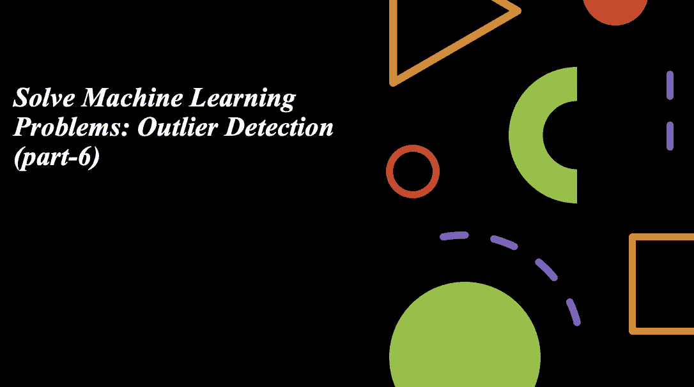
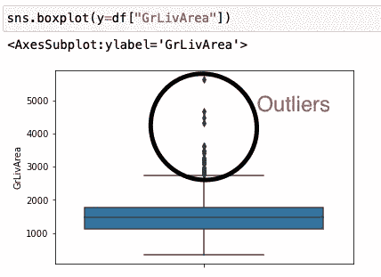
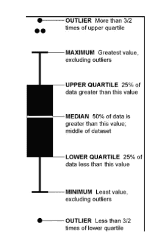
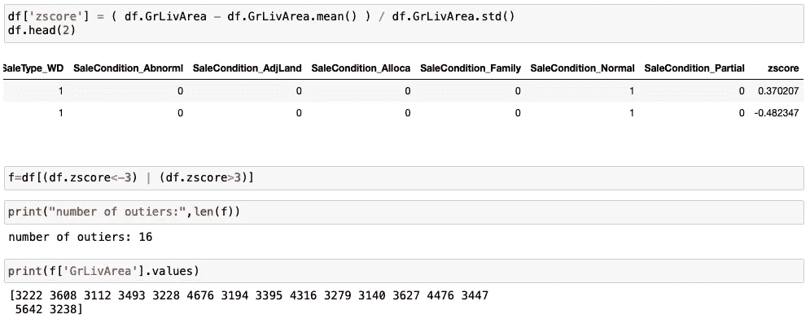
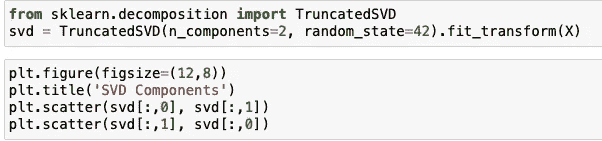
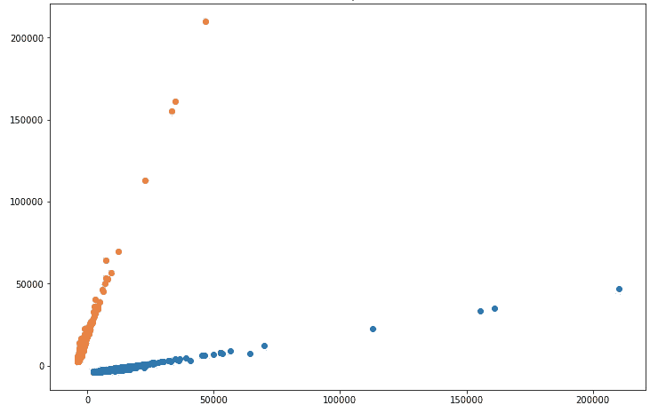
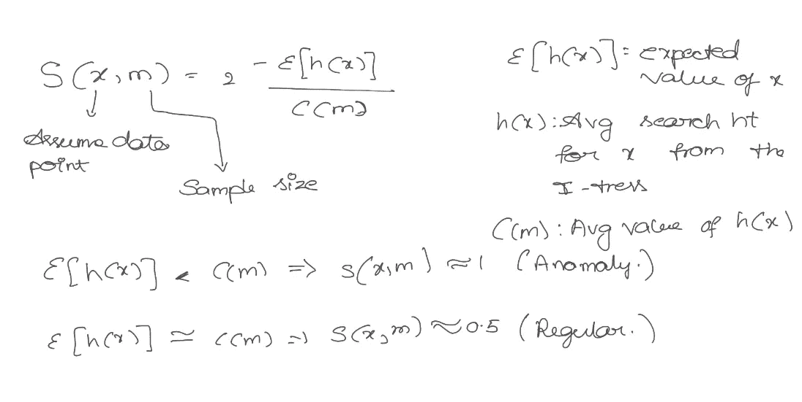
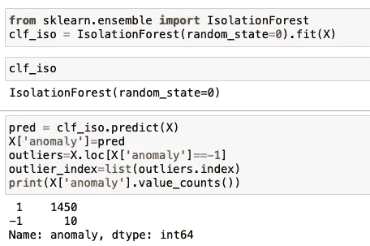
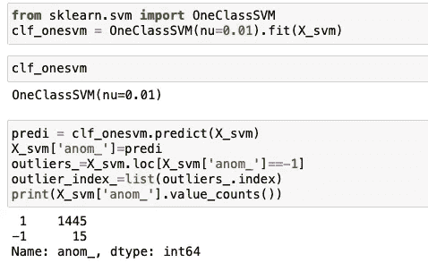

# 解决机器学习问题:离群点检测(第 6 部分)

> 原文：<https://medium.com/analytics-vidhya/solve-machine-learning-problem-outlier-detection-part-6-387eb02befaa?source=collection_archive---------13----------------------->

# 介绍

识别异常值对每个数据科学家来说都很重要。它有助于检测异常数据点或不符合正确模式的数据。从机器学习的角度来看，离群点检测和离群点处理的工具非常重要，因为它们对预测模型有很大的影响。

离群点是远离其他观察点的观察点。异常值可能是由于测量中的可变性，或者它可能表明实验误差。

异常值是最极端的观察值，可能包括样本最大值或样本最小值，或者两者都包括，这取决于它们是极高还是极低。然而，样本的最大值和最小值并不总是异常值，因为它们可能不会异常远离其他观测值。

## 箱形图

一种可视化变量分布的方法是箱线图。这次我们将以“销售价格”为例。方框的底部和顶部分别表示第一个四分位数和第三个四分位数，方框内的线表示中位数。

箱线图不像左图那样直观，但它以自己的方式传达了很多信息。右侧图像解释了如何读取箱线图。很快，您可以看到，在较高的范围内，车库区域有许多异常值，并且大部分区域在 0 到 3000 平方英尺之间。

## z 分数

这种方法假设变量具有高斯分布。它代表观察值偏离平均值的标准偏差数。在这里，我们通常将异常值定义为 z 得分的模数大于阈值的点。这个阈值通常大于 2 或 3。

我们可以在上图中看到异常值的数量和值。

## 主成分分析

它的工作条件是，当高维空间中的数据被映射到低维空间中的数据时，低维空间中数据的方差应该是最大的。构建数据的协方差矩阵。计算这个矩阵的特征向量。第一个主成分考虑了原始数据的可能变化。之后每个随后的分量具有最高的可能方差。第二主分量必须与第一主分量正交。

使用 PCA 后，我们可以看到上图中的异常值。

## 隔离森林

隔离林是一种基于树的异常检测算法。它基于对正常数据的建模，以这种方式隔离数量很少且在特征空间中不同的异常。从数据集中，它随机选择一个特征，并沿山脊随机划分一个数据点。

数据集中的异常值数量为 10，其余为常规数据。

## 一等 SVM

当对一个类进行建模时，该算法捕获多数类的密度，并将密度函数极值上的示例分类为异常值。SVM 的这种改型被称为一级 SVM。虽然 SVM 是一种分类算法，一类 SVM 也是一种分类算法，但它可用于发现回归和分类数据集的输入数据中的异常值。
该类提供了“ *nu* ”参数，该参数指定数据集中离群值的近似比率，默认为 0.1。在这种情况下，我们将它设置为 0.01，通过一点点尝试和错误发现。

数据集中的异常值数量为 15 个，其余为常规数据。

## 结论

在这篇博客中，我们发现了如何使用异常值检测和去除来提高机器学习预测建模性能。需要在构建模型时做出考虑或丢弃异常值的有争议的决定。离群值会极大地偏离/改变拟合估计和预测。分析师可以根据自己的最佳判断来决定是否有必要处理异常值以及如何处理。我希望这篇博客对你有所帮助。
谢谢你的时间。