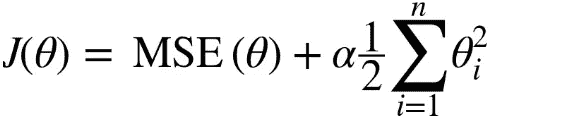

# 解决机器学习问题:回归和模型选择(第七部分)

> 原文：<https://medium.com/analytics-vidhya/solve-machine-learning-problem-regression-model-selection-part-7-4b58bd65c6d8?source=collection_archive---------5----------------------->

# 介绍

在前面的部分中，我们已经讨论了数据预处理、EDA、特征选择和清理。现在，我们将讨论模型选择，在此之前，我们需要了解一些更多的信息和指标。

## 均方误差(mean square error)

均方误差表示数据集中原始值和预测值之间的平方差的平均值。它测量残差的方差。

## 均方根误差

均方根误差是均方误差的平方根。它测量残差的标准偏差。

## R2

决定系数或 R 平方表示线性回归模型所解释的因变量中方差的比例。这是一个无标度分数，即无论数值大小，R 平方的值都小于 1。

## 平均绝对误差

平均绝对误差表示数据集中实际值和预测值之间绝对差值的平均值。它测量数据集中残差的平均值。

## k 倍

提供训练索引以将数据分成训练测试集。将数据集分割成 k 个连续的折叠。然后，每个折叠被用作一次验证集，而 k-1 个剩余折叠来自训练集。

**K** 表示细分数*(相等)*。
**折**表示每个 k 的每个块。

首先，我们需要导入所需的库，然后导入数据集，然后执行 EDA 来了解数据。接下来清理数据，然后进行数据预处理，然后对数据进行特征选择和降维技术，使数据准备好使用 K-fold。
以上信息和技巧在我之前的部分。现在我们将进行 K 折叠。

## 线性回归

线性回归可能是统计学和机器学习中最著名和最容易理解的算法之一。线性回归是线性模型，例如，假设输入变量(x)和单个输出变量(y)之间的线性关系的模型。更具体地说，y 可以从输入变量(x)的线性组合中计算出来。

当只有一个输入变量(x)时，该方法被称为简单线性回归。当有多个输入变量时，统计学文献通常将该方法称为多元线性回归。

## 里脊回归

岭回归是线性回归的正则化版本:正则化项被添加到成本函数中。这迫使学习算法不仅要适应数据，还要保持模型权重尽可能小。请注意，正则化项应该仅在训练期间添加到成本函数中。模型定型后，您希望使用未规范化的性能度量来评估模型的性能。

超参数 *α* 控制你想要正则化模型的程度。如果 *α* = 0，那么岭回归就是线性回归。如果 *α* 非常大，那么所有的权重都非常接近于零，结果是一条平坦的线。

## **套索回归**

最小绝对收缩和选择算子回归(简称 Lasso 回归)是线性回归的另一个正则化版本:就像岭回归一样，它在成本函数中添加了一个正则化项，但它使用权重向量的 l1 范数，而不是 l2 范数的一半平方。

Lasso 回归的一个重要特征是，它倾向于完全消除最不重要的要素的权重(将其设置为零)。Lasso 回归自动执行特征选择并输出一个稀疏模型(具有很少的非零特征权重)。

## 支持向量机回归

SVM 算法非常通用:它不仅支持线性和非线性分类，还支持线性和非线性回归。诀窍是颠倒目标:SVM 回归不是试图在两个类之间拟合最大可能的街道，同时限制边界违规，而是试图在街道上 T11 拟合尽可能多的实例，同时限制边界违规。它由超参数 *ε* 控制。

## **决策树**

在回归树中，使用每个独立变量将回归模型拟合到目标变量。在此之后，对于每个独立变量，数据被分割成几个点。在每个这样的点，预测值和实际值之间的误差被平方，以获得“误差平方和”(SSE)。SSE 跨变量进行比较，具有最低 SSE 的变量或点被选为分割点。这个过程递归地继续。

在剪枝中，策略是首先分裂成许多区域，以便我们获得一棵非常大的树，让我们说 To (T not ),然后剪枝它以获得具有最小错误率的更小的子树。这种通过减少错误进行修剪的过程称为成本复杂性修剪。

## 随机森林

随机森林是一种集成技术，能够通过使用多个决策树和一种称为 Bootstrap and Aggregation(通常称为 bagging)的技术来执行回归和分类任务。这背后的基本思想是在确定最终输出时结合多个决策树，而不是依赖单个决策树。
随机森林有多个决策树作为基础学习模型。我们从数据集随机执行行采样和特征采样，为每个模型形成样本数据集。

## XGB 极限梯度提升

XGBoost 是构建监督回归模型的强大方法。通过了解它的(XGBoost)目标函数和基础学习者，可以推断出这种说法的正确性。目标函数包含损失函数和正则项。它说明了实际值和预测值之间的差异，即模型结果与实际值的差距。XGBoost 中回归问题最常见的损失函数是线性的。

集成学习涉及训练和组合单个模型(称为基础学习器)以获得单个预测，XGBoost 是集成学习方法之一。XGBoost 期望基础学习器在剩余部分都是差的，这样当所有的预测被组合时，差的预测被抵消，而更好的预测被累加以形成最终的好预测。

## 堆积回归

它基于一个简单的想法:与其使用琐碎的函数(如硬投票)来聚合集合中所有预测者的预测，为什么我们不训练一个模型来执行这种聚合，这样的集合在新的实例上执行回归任务。底部三个预测器中的每一个预测不同的值，然后最终的预测器(称为混合器，或元学习器)将这些预测作为输入，并进行最终预测。

为了训练搅拌机，一个常见的方法是使用一套坚持。让我们看看它是如何工作的。首先，将训练集分成两个子集。第一子集用于训练第一层中的预测器。接下来，第一层预测器用于对第二(保留)集进行预测。这确保了预测是“干净的”，因为预测者在训练期间从未见过这些情况。现在，对于拒绝集合中的每个实例，有三个预测值。我们可以使用这些预测值作为输入特征来创建新的训练集，并保持目标值。blender 在这个新的训练集上被训练，因此它学习在给定第一层的预测的情况下预测目标值。

## KNN

k-最近邻(KNN)算法是一种监督最大似然算法，可用于分类以及回归预测问题。但在工业上主要用于分类预测问题。KNN 是一种懒惰学习算法和非参数学习算法。

k-最近邻(KNN)算法使用“特征相似性”来预测新数据点的值，这进一步意味着新数据点将根据其与训练集中的点的匹配程度来分配值。

**比较所有算法的 r2 和 RMSE 值**

r2 评分比较

RMSE 评分比较

从上面的图中，我们可以看到所有具有 insample 和 outsample 的模型的 r2 得分和 RMSE 得分，其中决策树在 insample 上具有较高的 r2 得分，而在 outsample 上没有，因此我们不打算选择决策树模型，其中随机森林和 XGBoost 在 in sample 和 out sample 中都具有下降得分，但是随机森林的得分比 XGBoost 高。因此，我们将使用 RF 模型，对维持样本进行预测。

在对维持样本执行之后，随机森林的 R2 分数是 0.95，接近于 1。意味着它是一个很好的模型，表现非常好。

## 结论

在本文中，随机森林回归模型是该数据集上的最佳模型。因此，如果比较不同回归模型之间的预测精度，那么 RMSE 是一个更好的选择，因为它计算简单且可微分。但是，如果您的数据集有异常值，则选择 MAE 而不是 RMSE。此外，线性回归模型中预测变量的数量由 R 的平方决定。我希望这篇博客对你有所帮助。谢谢你的时间。