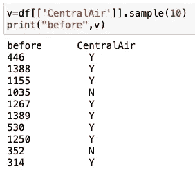

# 解决机器学习问题:数据预处理(第三部分)

> 原文：<https://medium.com/analytics-vidhya/solve-machine-learning-problems-data-preprocessing-part-3-4988d17ae235?source=collection_archive---------23----------------------->

# 介绍

这是 EDA 之后，数据挖掘之前的中间步骤。为了通过数据挖掘从数据集中获取价值，我们需要首先准备或预处理数据。它涉及数据清理、转换和简化。

## 正常化

规格化在 0.0 和 1.0 之间缩放特征，保持它们彼此的比例范围。具有至少一个非零分量的每个样本独立于其他样本被重新缩放，使得其范数等于 1。

我们可以看到标准化前后的数组 X 值。

## 标准化

标准化通常意味着值的范围被“标准化”,以测量该值与其平均值的标准偏差。标准化会转换您的数据，使结果分布的平均值为 0，标准差为 1。

正态分布的范围是[-1，1]，均值=0。与标准化不同，标准化没有边界范围。因此，即使您的数据中有异常值，它们也不会受到标准化的影响。

## **maxabscaler**

Max Abs scaler 将数据缩放到[-1–1]的范围内，并且不改变分布的形状。最大 Abs 缩放器的作用与最小-最大缩放器相似。

## 对数变换

对数转换是最流行的转换技术之一。它主要用于将偏态分布转换为正态分布/非偏态分布。因为日志功能是为处理大数而配备的。

虽然我们的收入栏有从 110000 到 241000 的极值，但现在的对数值大约在 11.60 到 12.38 之间。

## 多项式特征

生成一个新的特征矩阵，该矩阵由阶数小于或等于指定阶数的特征的所有多项式组合组成。例如，如果输入样本是二维的并且形式为[a，b ]，则 2 次多项式特征为[1，a，b，a，ab，b]。

## **处理文本和分类属性**

我们省略了像 CentralAir 这样的分类属性，因为它是一个文本属性，所以我们不能计算它的中值。无论如何，大多数机器学习算法更喜欢与数字打交道，所以让我们将这些文本标签转换为数字。

如您所见，CentralAir 列包含文本形式的数据。我们可以观察到有两个类别，Y & N。要将分类值转换成数字数据，我们可以使用 sklearn.preprocessing 中的 **LabelEncoder()、OneHotEncoder()** 类。

## **标签编码器**

用 0 和 n_classes-1 之间的值对目标标签进行编码。

在应用 LabelEncoder()后，我们可以看到“N”为 0，“Y”为 1

## **OneHotEncoder**

将分类特征编码为一个独热数值数组。这个转换器的输入应该是一个类似数组的整数或字符串，表示类别特征所取的值。为每个类别创建一个二进制列，并返回稀疏矩阵或密集数组。

我们可以在右图中看到稀疏矩阵。

## 结论

每种特征转换技术都有自己的特点，我们可以利用这些特点来改进我们的模型。然而，就像建立预测模型的其他步骤一样，选择正确的缩放器也是一个试错过程，没有一个最佳缩放器每次都有效。我希望这篇博客对你有所帮助。谢谢你的时间。