# 解决机器学习问题:EDA(第一部分)

> 原文：<https://medium.com/analytics-vidhya/solve-machine-learning-problems-eda-part-1-761f1828a465?source=collection_archive---------5----------------------->

# 介绍

EDA 是可视化和分析数据以从中提取洞察力的过程。换句话说，EDA 是为了更好地理解数据集而总结数据的重要特征的过程。

在本文中，我们将通过分析此处 可用的 ***房屋数据集，向您介绍 EDA 的过程。我们将讨论一些用于 EDA 的常用方法，并让您知道如何应用它们从原始数据中提取有意义的见解。***

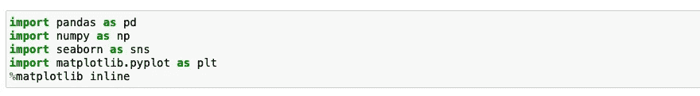

导入库

使用 pandas 和 head 命令加载数据集以查看顶行数据

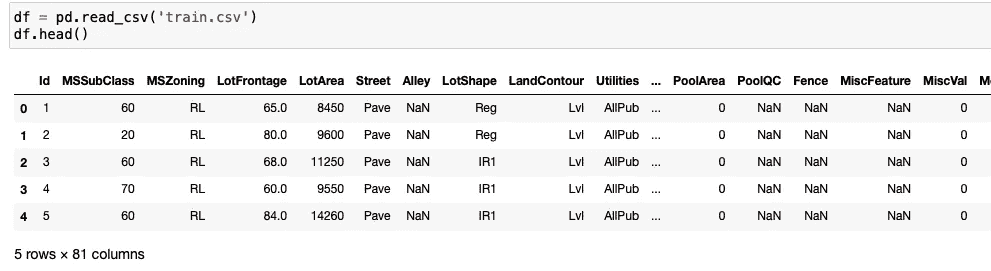

使用 info 命令查看特征、数据类型和信息。
查看数据集，我们可以看到一些特征与我们的分析无关，因为缺少太多的值。让我们删除 Nan 列和 Id。

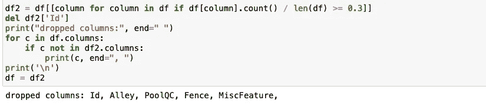

现在，让我们对这个数据集应用 describe()方法并查看结果。它显示平均值、标准偏差、四分位数以及最大值和最小值的描述。

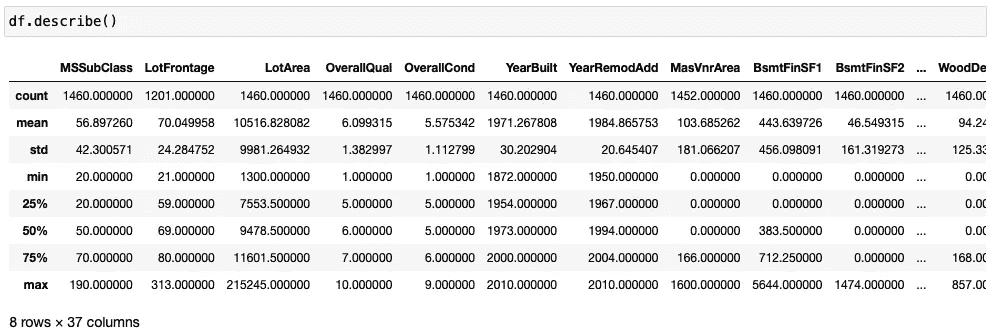

# EDA 技术

## **散点图**

这是表示单变量数据的最简单的方法:只需绘制每个单独的数据点。

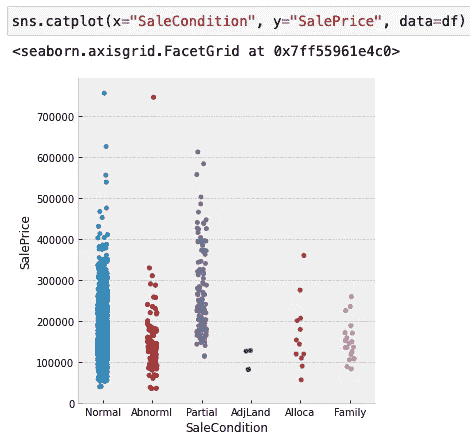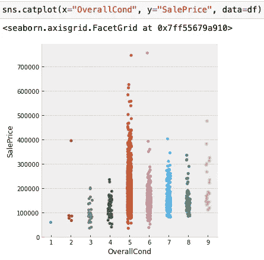

在左图中，我们可以看到当销售状况正常时的异常值，当销售状况不正常时的销售数量较少，而正常时的销售数量较多。在右边的图中，当房屋的整体状况被评定为 5 时，销售额增加。随着评级的提高，房子的最低价格也在提高。

## **直方图**

直方图提供了数据分布的第一手概览。如果除以数据点的总数，就会得到一个*相对频率直方图。*

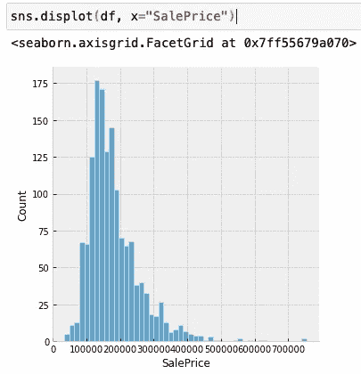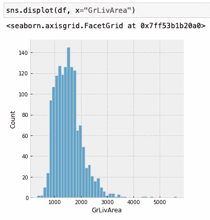

两个图遵循相同的分布。在左图中，异常值出现在 50k 以上。在右图中，异常值出现在 4k 平方英尺以上。

## **核密度估计**

为了获得平滑的*概率密度*，即描述在任何给定间隔内发现事件的可能性的曲线，可以使用*核密度估计* (KDE)的技术。

KDE 地块有很多优势。数据的重要特征很容易辨别(集中趋势、双峰、偏斜)，并且它们提供了子集之间的简单比较。

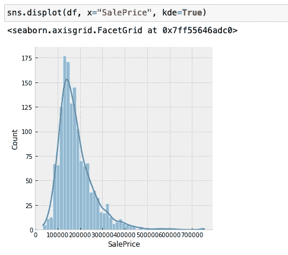

有了这些信息，我们可以看到价格向右倾斜，一些异常值在 500，000 以上。

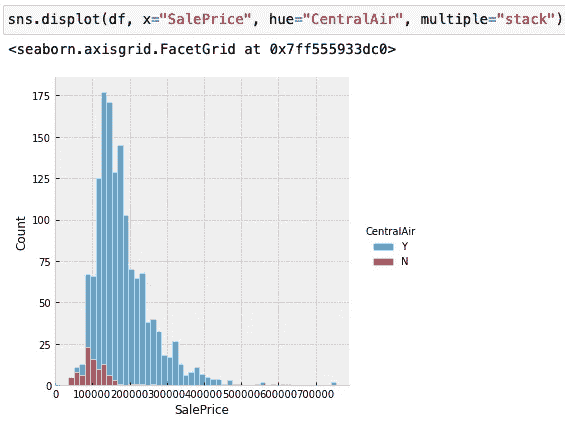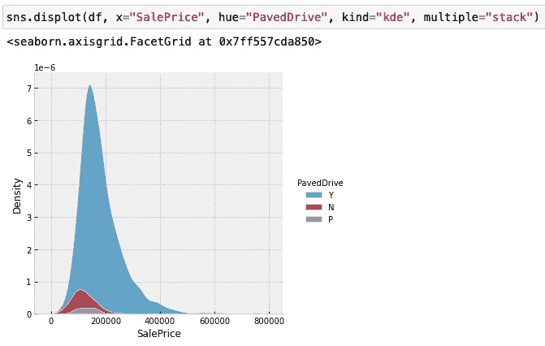

在左边的图中，我们可以清楚地看到 centralac 的房子比其他的房子更平均。在右图中，我们可以说 y 的均值大于 n 和 p。

## **箱线图**

另一种可视化变量分布的方法是箱线图。这次我们将以“销售价格”为例。方框的底部和顶部分别表示第一个四分位数和第三个四分位数，方框内的线表示中位数。

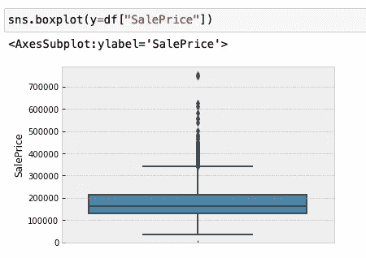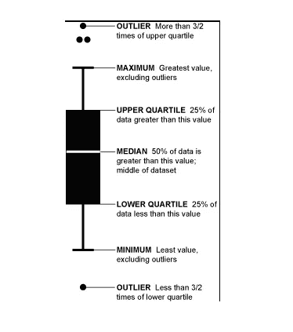

箱线图不像左图那样直观，但它以自己的方式传达了很多信息。右侧图像解释了如何读取箱线图。很快，您可以看到 Saleprice 的一些异常值在较高范围内，大多数价格在 0 到 350，000 美元之间。

## **小提琴剧情**

小提琴图与盒须图的作用相似。它显示了数量数据在一个(或多个)分类变量的几个级别上的分布，以便对这些分布进行比较。

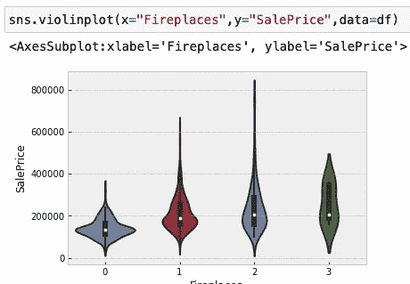

上面的图清楚地显示了随着壁炉数量的增加，房子的最小、最大和中间值也在增加。

## 相互关系

相关矩阵是显示变量之间相关系数的表格。表格中的每个单元格显示了两个变量之间的相关性。相关矩阵用于汇总数据，作为更高级分析的输入，以及作为高级分析的诊断。

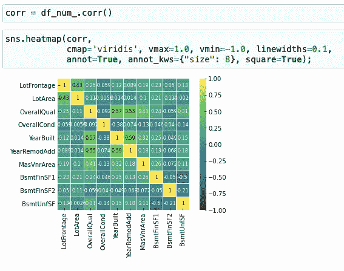

从左上角到右下角的 1.00s 的线是主*对角线*，这表明每个变量总是与自身完美相关。该矩阵是对称的，主对角线上方示出了相同的相关性，是主对角线下方的相关性的镜像。

## 二元直方图

二元直方图将数据归入矩形中，矩形平铺在图中，然后用填充颜色显示每个矩形中的观察计数(类似于热图())。

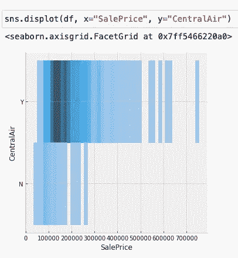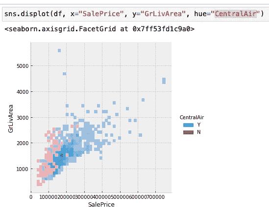

在左图中，我们可以看到有中央空调的房子比没有中央空调的房子价格要高，没有中央空调的房子价格最高在 25 万左右。
在右图中，我们可以看到线性，分配一个色调变量将使用不同的颜色绘制多个热图或等高线集。对于二元直方图，只有当条件分布之间的重叠最小时，这种方法才有效

## 绘制联合分布和边际分布

第一个是 jointplot()。其用两个变量的边际分布来扩充二元关系或分布图。

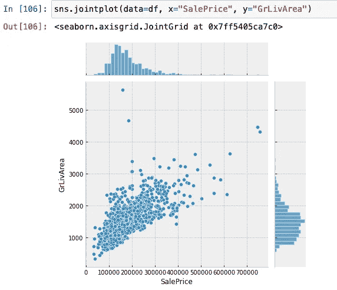

在上图中，我们可以看到两个特征之间的线性关系。

## 绘制多个分布图

pairplot()函数提供了联合分布和边际分布的类似混合。然而，pairplot()并不关注单个关系，而是使用“小倍数”方法来可视化数据集中所有变量的单变量分布及其所有成对关系

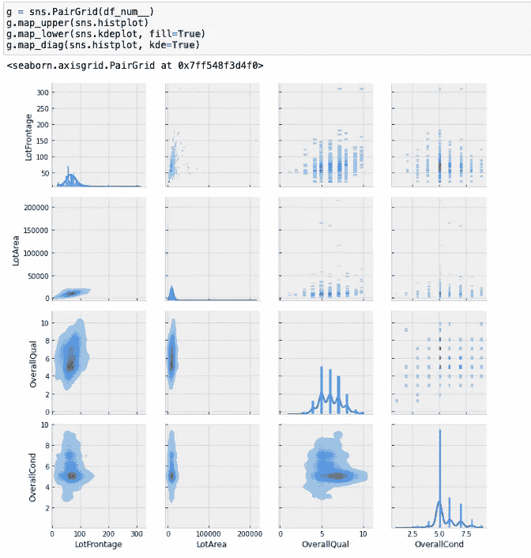

# 结论

通过探索性的数据分析，您将对您的数据有更好的理解，这将使您更容易选择您的模型、属性，并对其进行整体优化。