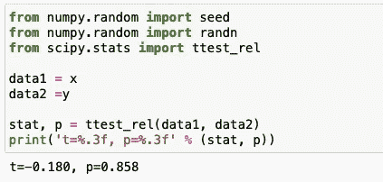

# 解决机器学习问题:假设检验(下)

> 原文：<https://medium.com/analytics-vidhya/solve-machine-learning-problems-hypothesis-testing-part-2-25c07755613c?source=collection_archive---------11----------------------->

# 介绍

假设检验是统计学中的一个基本步骤。假设检验评估关于总体的两个互斥陈述，以确定哪一个陈述最受样本数据支持。当我们说一个发现具有统计学意义时，这要归功于假设检验。

假设检验是一种统计方法，用于利用实验数据进行统计决策。假设检验基本上是我们对总体参数的一种假设。

罗纳德·科斯说“ ***拷问数据，它会向任何东西承认*** ”。对于这些数据，**假设检验**可以用来解释和得出关于使用样本数据的人群的结论。

在数据科学中，建模过程的一个关键部分是首先提出一个重要的问题或假设。例如，我们可以说“不同的汽车每天使用公共停车场。”这个陈述的框架让我们看起来像是在宣告它是真实的。

# 一个样本

在一个样本测试中，我们将样本的平均值与预期的总体平均值进行比较。现在我们来看一个房价值的例子。
这里人口的期望平均数是 190000 美元。因此，为了检验这种说法是真是假，我们可以取一个样本，进行一次样本测试。

# **双向**

双向检验是一种统计检验，其中分布的临界区域是双侧的，并检验样本是大于还是小于某个范围的值。如果被测样品落入任何一个关键区域，则接受替代假设，而不是零假设。

## **T 检验:**

因为在大多数情况下，总体均值及其方差是未知的，所以在分析样本数据时，通常使用 *t* 分布。分布的一个非常常见的应用是计算平均值的置信区间

H0: 𝒰 = 19 万
哈:𝒰 ≠19 万

阿尔法=5%

## **P 值:-**

当研究问题的零假设(H 0)为真时， **P 值**或计算概率是发现观察结果或更极端结果的概率——极端的**定义**取决于假设如何被检验。如果你的 P 值小于选择的显著性水平，那么你拒绝零假设

在上面的测试中，由于 P 值大于α，未能拒绝零假设。

## z 测试:

z 分数是用先前输入的某些群体参数计算的。最重要的是，为了计算 z 值，我们需要总体均值和总体标准差。单样本 z 检验允许我们查看特定的一段/一组数据是否实际上来自更大的数据总体。当样本量大于 30 时，我们可以使用 z-检验

H0: 𝒰 = 19 万
哈:𝒰 ≠19 万

阿尔法=5%

在上面的测试中，因为 p 值大于α，所以未能拒绝零假设。

# **单程**

统计假设的检验，其中拒绝区域仅在抽样分布的一侧，称为单向检验。

## z 测试:

h0:𝒰≥190000
ha:𝒰\u 190000

阿尔法=5%

在上面的测试中，因为 p 值大于α，所以未能拒绝零假设。

# 两个样本

双样本检验是对两个随机样本的数据进行的检验，每个样本来自不同的给定总体。测试的目的是确定这两个群体之间的差异是否具有统计学意义。

## 双样本 t 检验

H0:均值(x)=均值(y)哈:均值(x)≠均值(y)

阿尔法= 0.05

在上面的测试中，因为 p 值大于α，所以未能拒绝零假设。

# 基于比例的样本

在这些情况下，我们感兴趣的是检查比例。例如，17%的样本符合某个特征，而其余的则不符合。这可以是将单个样本与某个期望值进行比较的测试，或者是比较两个不同样本的测试。

**注意:**这些测试仅在**只有两个**可能选项时有效；而如果一个选项的概率是 ***p*** ，那么另一个的概率一定是 ***(1 — p)*** 。

# 单样本 z 检验

将样本中的比例与预期值进行比较
我们期望超过 80%的答案是肯定的，所以我们的

H0 =*Y 的 80%
哈≦*Y 的 80%**

我们抽样了 400 个测试，发现了 373 个 Y

在上面的测试中，拒绝了零假设，因为 p 值小于α。

# 双样本 z 检验

比较两个样品之间的比例
我们有两个样品——A 和 b。

H0 =两个种群的比例相同哈≠两个种群的比例不同

我们从一个群体中抽取了 400 个测试样本，发现了 373 Y
;从另一个群体中抽取了 500 个样本，发现了 463 Y

在上面的测试中，因为 p 值大于α，所以未能拒绝零假设。

## 卡方检验

将样本中某些变量的计数与预期分布进行比较。在这个测试中，我们有一个跨类别的预期数据分布，我们希望检查样本是否与此匹配。

批次类型常规的预期分布为 65%，轻微不规则为 30%，中度不规则为 3%，不规则为 2%。

在上面的测试中，由于 p 值大于α，无法拒绝零假设。

## 单向安诺娃:

单向 ANOVA 检验两个或更多组具有相同总体均值的零假设。该试验适用于两组或更多组的样本，样本大小可能不同。例如，loftshape 是否影响销售价格，可以通过收集各种 lotshape 类别的销售价格平均值进行 Annova 检验。

H0 =四个样本的平均值相同哈≠四个样本的平均值不同
α= 0.05

在上面的测试中，因为 p 值大于α，所以未能拒绝零假设。

## 结论

以上是一些关键的统计测试，可用于任何机器学习项目。这些测试可用于正态性验证，建立变量之间的关系和样本之间的差异。因此，对于有抱负或正在实践的数据科学家来说，了解不同种类的统计测试非常重要。我希望这篇博客对你有所帮助。
谢谢你的时间。