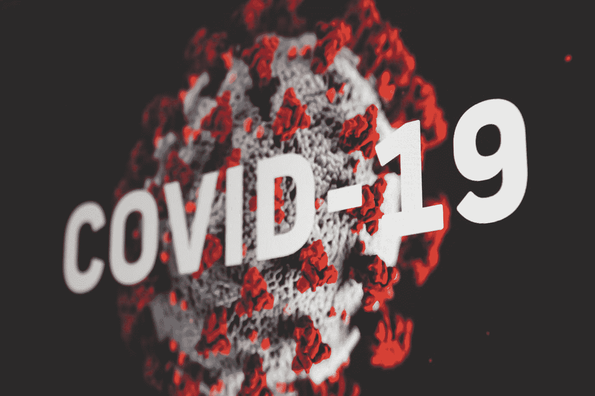
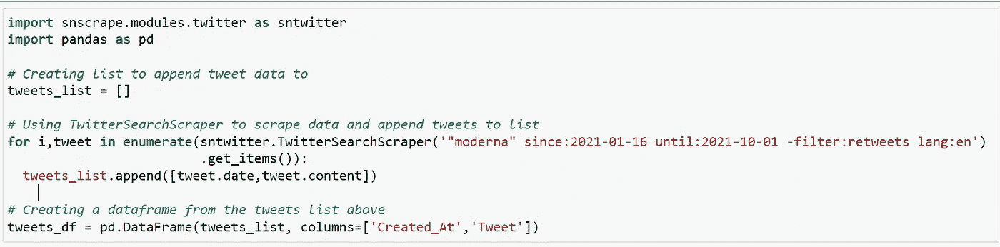
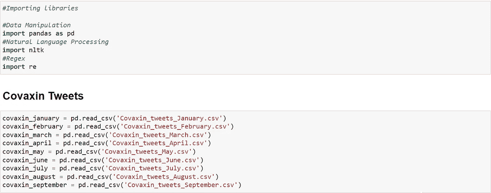

# 用自然语言处理解决新冠肺炎疫苗难题

> 原文：<https://medium.com/analytics-vidhya/solving-covid-19-vaccine-dilemma-using-nlp-bc4732844e0b?source=collection_archive---------2----------------------->

马丁·桑切斯在 [Unsplash](https://unsplash.com?utm_source=medium&utm_medium=referral) 上的照片

# 问题陈述

目前，没有关于不同新冠肺炎疫苗的公众情绪的详细比较分析。由于缺乏这种分析，人们不知道已经接种了特定疫苗的人的情绪。他们也不知道哪种疫苗在接种人群中最有名。

将新闻文章分类为不同类别的疫苗有助于用户检索用户需要的新闻，并且他们不必阅读整篇文章来了解文章所谈论的内容，但是目前我们没有任何这样的新闻文章分类可以对疫苗进行必要的分类。

长文章需要时间阅读，用户没有太多时间浏览整篇文章，因此文章摘要是当前的需要。

# 需要解决问题

对疫苗情绪的不了解已经在未接种疫苗的人群中造成了他们应该接种哪种疫苗的困惑，并且目前他们不能基于已接种疫苗的人群的数据来决定他们对特定疫苗的积极或消极程度，除非完成了情绪分析。通过公众情绪分析，我们将了解哪种疫苗在公众中最有名，以及人们中正面和负面情绪的百分比。

新闻文章应该分类到不同类别的疫苗中。必须有一个机器学习模型可以告诉你这篇特定的新闻文章是否与 Covaxin、Covishield、Moderna、辉瑞或 Sputnik-V 有关。

把新闻文章概括成几行可以节省读者的时间。给定文章，机器学习模型必须总结并返回关于文章的重要事实。应该向用户提供一个连贯流畅的摘要，只包含给定文章中的要点。

# 项目范围

我们的项目范围是帮助公众通过与疫苗相关的情感来决定哪种疫苗最适合他们。文章分类将帮助公众检索相关的疫苗文章。

# 关于数据

我们使用了**文本(自然语言)数据**进行分析。

对于**情感分析**，使用 Python3 中的 Snscrape 库从 Twitter 收集推文。从 1 月 16 日到 9 月 30 日，我们提取了 4，10937 条 Covaxin 的推文、15，46595 条 Moderna 的推文和 3，89271 条 Covishield 的推文。

对于**文章分类**，新闻文章分别通过美汤和 API 从《印度时报》和《纽约时报》报废。我们提取了 Moderna 的 1200 篇新闻，辉瑞的 1200 篇新闻，科瓦欣的 920 篇新闻，科威希尔的 400 篇新闻，Sputnik-V 的 220 篇新闻。

推文中没有缺失值，但新闻文章中很少有缺失值。数据是纯粹真实的，因为我们自己已经收集了数据，没有对数据进行任何处理，从而不会导致偏见。

数据非常适合执行自然语言处理任务，如情感分析和文章分类。

# 推文报废

使用 Snscrape 删除推文

Snscrape 库需要我们想要的 tweets 的关键字，自日期和截止日期，删除转发和语言为英语。

这是 Moderna 的演示语法。同上，摘录了科瓦欣和科威希尔的推文。

# 物品报废

《印度时报》关于 Covishield、Covaxin、Moderna、Pfizer 和 Sputnik-V 的文章被使用 **BeautifulSoup** 图书馆删除。

## 印度时报

以下代码片段用于从《印度时报》官方网站上摘录所有与 Sputnik-V 相关的新闻文章。同样，其他疫苗的新闻文章也可以很容易地提取出来，只需相应地更改链接地址。

每种疫苗都遵循相同的方法，所有疫苗都保存在单独的 excel 文件中。

## 纽约时报

**纽约时报 API** 被用来摘录新闻文章。关于 Covaxin、Covishield 和 Sputnik-V 的文章没有摘录，因为《纽约时报》关于这些疫苗的文章很少。这就是为什么《纽约时报》的 API 只被用来摘录关于 Moderna 和辉瑞的文章。

提取后，文章存储在数据框中，并保存在 excel 文件中。

# 清理推文

读取 CSV 文件

从推文栏中提取推文

清理推文

对每个月的推文应用干净推文功能

为已清理的推文创建“推文清理”栏

将清理后的推文保存在 CSV 文件中

这个特殊的代码片段显示了 Covaxin tweets 的清理。Covishield 和 Moderna 采用了类似的程序。

# 新闻文章清洗

使用 clean_text()函数通过删除具有不必要值的条目、删除重复条目来清理新闻文章，然后最终清理的新闻文章被标上报纸名称和疫苗名称。

**每种疫苗都遵循同样的方法** **新闻文章**

# 公众情绪分析

情感分析是一种自然语言处理技术，用于确定数据是积极的、消极的还是中性的。情感分析通常对文本数据进行，以帮助企业监控客户反馈中的品牌和产品情感，并了解客户需求。

在这个项目中，我们将使用自然语言处理来分析公众情绪。

我们将分析与不同疫苗相关的公共推文，如 **Covaxin、Covishield 和 Moderna** 以获取人们的情绪。通过这个，我们将了解哪种疫苗在公众中最有名，以及人们对疫苗的积极和消极情绪的百分比。

我们还将对印度不同地区(如北区、东区、西区、南区、东北区)与 Covishield 和 Covaxin 相关的印度人进行情感分析，并尝试找出哪个地区在印度最受欢迎。

**1。导入所需的库**

**Pandas** 库用于数据操作和分析 **NLTK** (自然语言工具包)库用于处理文本数据。它包含用于标记化、解析、分类、词干、标记和语义推理的文本处理库。

**2。** **读取清理后的推文**

干净的推文保存在 CSV 文件中。我们将使用熊猫来读取 CSV 文件。通过删除用户名、标签、特殊字符、标点符号、多余的空格、表情符号来清理推文，除了字母和数字之外的所有内容都会被删除。

**3。** **利用 NLTK 的 VADER 情感分析模型获取情感**

**VADER(用于情感推理的效价感知词典)**是用于文本情感分析的模型，其对情感的极性(积极/消极)和强度(强度)都敏感。它在 NLTK 包中提供，可以直接应用于未标记的文本数据。

***我们也可以使用亚马逊领悟(AWS 服务)来寻找感悟***

**4。** **检索推文的极性得分**

**极性得分**提供提供给它的句子的正、负、中和复合得分。

推文的所有极性分数都作为“分数”列添加到数据帧中。它包含百分比分数，表明推文是积极的、消极的还是中性的，它还包含复合分数(或总分数)。如果综合得分大于 1，则表示积极情绪，如果小于 1，则表示消极情绪。

创建复合列是为了从极性得分字典中检索复合得分(或总得分)。如果大于 1，表示积极情绪，如果小于 1，表示消极情绪。

**5。** **将情绪得分分为强阳性、弱阳性、中性、强阴性、弱阴性。**

为了对它们进行细分，我们选择了一个范围

**>积极情绪**

*   大于或等于 80%但小于或等于 100%的分数—强阳性
*   大于 0%但小于 80%的分数—弱阳性

**>消极情绪**

*   小于或等于-80%但大于或等于-100%的分数—强负值
*   低于 0%但高于-80%的分数—弱阴性

**>中立**

*   等于 0%分数—中性

所有情感细分都存储在数据帧的情感列中。现在使用这个情感栏，我们可以找出每个情感类别的总数。

分类计数被转换成百分比值，从而易于解释并更便于可视化。

这就是我们如何从自然语言数据中导出情感的。

**同样的方式，我们也为 Covishield 和 Moderna 做过。**

## **印度科瓦辛和科威希尔德的纬向观点**

我们把印度分成了 5 个主要的区域

*   北区
*   东区
*   西区
*   南区
*   东北区

**为了执行这些区域的公众情绪分析，读取这些区域的 Covaxin 和 Covishield 的清理后的推文，稍后遵循与上述相同的方法。**

# 公众情绪分析报告

## **1。Covishield**

这份报告指出，人们对柯西菲尔德的看法有 34%是积极的，18%是消极的，48%是中立的。通过表示不同大小的积极情绪和消极情绪的环形图和金字塔图，我们可以清楚地看到 Covishield 积极情绪多于消极情绪。

为了更深入地了解疫苗情绪，我们绘制了代表情绪细分的条形图，我们可以看到，人们大多是积极的，因为强烈的消极情绪在数量上可以忽略不计，而与强烈的积极情绪和微弱的积极情绪相比，微弱的消极情绪非常少，图标矩阵也更多地代表积极情绪，而不是消极情绪。

**对比不同疫苗**，

与柯华新相比，柯华新的积极情绪较少，

与 Moderna 相比，Covishield 的积极情绪较少，

**结论——与其他疫苗相比，Covishield 没有那么好**

## 2.Covaxin

该报告指出，人们对科瓦欣的看法有 42%是积极的，19%是消极的，39%是中立的。

我们可以清楚地看到，通过像甜甜圈和金字塔图这样代表不同大小的积极和消极情绪的图表，Covaxin 积极情绪远远多于消极情绪。

为了更深入地了解疫苗情绪，我们绘制了代表情绪细分的条形图，我们可以看到，人们大多是积极的，因为强烈的消极情绪在数量上可以忽略不计，而弱消极情绪与强烈的积极情绪和弱积极情绪相比非常少，图标矩阵也更多地代表积极情绪，而不是消极情绪。

**对比不同疫苗**，

与 Covishield 相比，Covaxin 的“积极情绪”更多

与 Moderna 相比，Covaxin 的积极情绪稍低，

**结论——与其他疫苗相比，Covaxin 更好**

## 3.现代

这份报告指出，现代人的情绪有 44%是积极的，27%是消极的，29%是中立的。

我们可以清楚地看到，现代的积极情绪远远多于消极情绪，通过像甜甜圈和金字塔图这样代表不同大小的积极情绪和消极情绪的图形来表示。

为了更深入地了解疫苗情绪，我们绘制了代表情绪细分的条形图，我们可以看到，人们大多是积极的，因为强烈的消极情绪在数量上可以忽略不计，而弱消极情绪与强烈的积极情绪和弱积极情绪相比非常少，图标矩阵也更多地代表积极情绪，而不是消极情绪。

**对比不同疫苗**，

与 Covishield 相比，Moderna 的“积极情绪”更高

与柯华新相比，Moderna 的“积极情绪”没有增加多少

**结论——与其他疫苗相比，Moderna 效果更好**

## **区域明智情绪分析报告**

**地区明智情绪分析报告**指出，在印度北部地区，对 Covaxin 的积极情绪高于 Covishield。在东区，与 Covishield 相比，Covaxin 更受欢迎。与此相比，在东北区，Covishield 比 Covaxin 有更多正面的喜好度。

在西区，公众的情绪比 Covishield 更倾向于 Covaxin。在南区，与 Covishield 相比，公众的情绪也更倾向于 Covaxin。

**总之，我们可以看到，印度人的总体情绪更倾向于 Covaxin，这是事实，因为它有 81%的高有效率和灭活疫苗类型。**

## **疫苗情绪比较报告**

我们可以得出结论，在疫苗中， **Moderna** **的积极情绪最高，而 Covishield 的积极情绪最低。但可华欣也是如此，因为在现有的不同疫苗中，它拥有总体良好的正面情绪和最少的负面情绪。**

# **新闻文章分类**

所有五篇干净的新闻文章被连接在一个数据帧(疫苗)中。

总共有 3238 篇新闻文章。

一个简单的分组显示了每种疫苗的实例数。有五类**科瓦欣、科威希尔、辉瑞、莫德纳、**和**斯普特尼克。**

这是一个**多类分类任务。**

数据被分成 **80 %的训练和 20 %的测试**，并为 **TF-IDF 矢量器**和模型构建构建了一个管道。使用分类模型，如**朴素贝叶斯、随机森林分类器、线性支持向量分类器、**和 **XgBoost 分类器**，并以**准确率**作为评价指标。

在这些模型中 **XgBoost 分类器表现最好**。

## 模型结构

1.  **朴素贝叶斯分类器:(准确率:- 60%)**

**2。** **线性支持向量分类器:(准确率:- 65%)**

**3。** **随机森林分类器:(准确率:- 63%)**

**4。** **XgBoost 分类器:(准确率:- 68%)**

## **型号对比**

**推论**:我们发现 XgBoost 的表现优于所有模型，准确率约为 68%，因此我们将继续使用 XgBoost 并调整其参数。

在**超参数**之后，XgBoost 分类器的调谐精度**从 68%提高到 75%。**

# **新闻文章摘要**

文本摘要用于将冗长的文本总结成几行文本。新开发的库**拥抱脸**用于文本摘要。

**Transformers** (以前称为 pytorch-transformers 和 pytorch-pretrained-bert)为自然语言理解(NLU)和自然语言生成(NLG)提供通用架构(bert、GPT-2、罗伯塔、XLM、DistilBert、XLNet…)，拥有 100 多种语言中超过 32 种预训练模型以及 TensorFlow 2.0 和 pytorch 之间的深度互操作性。为此目的使用了变压器。

总结管道已创建。我们已经设置了摘要的最大长度和最小长度。我们将最大长度设置为 130 个单词，最小长度设置为 50 个单词。

**显示文本摘要的例子如下所示:**

这就是如何执行文章摘要。

# **项目部署**

我们已经在 Heroku 平台上部署了我们的项目。

链接到我们的项目:——[**https://covid-vaccines-sentiment.herokuapp.com/**](https://covid-vaccines-sentiment.herokuapp.com/)

**首页**

**目标页面**

**舆情分析页面**

疫苗情绪比较页面

**新闻文章分类页面**

**新闻文章分类页面(结果)**

**新闻总结页面**

**总结流程运行**

**总结文章页面(结果)**

**新冠肺炎追踪者页面**

**4。**限制**限制**

我们项目的限制是，我们提取的推文是从 2021 年 1 月 16 日(印度开始接种疫苗的日子)到 2021 年 9 月 30 日。我们没有考虑 10 月和 11 月。

此外，我们提取的用于比较印度 Covishield 和 Covaxin 的推文(按地区)来自特定的持续时间，即 2 周(2021 年 8 月 4 日至 2021 年 4 月 16 日)。由于这一点，人们的每一种情绪都不包括在分析中。新闻文章分类也是如此——文章也只提取 2 周。

**结论**

在对报告进行全面分析后，我们发现与 Covaxin 和 Moderna 相比，Covishield 的积极情绪较少，因此受欢迎程度较低。我们的分析还表明，就积极和消极情绪而言，Covishield 是最不受人们欢迎的疫苗。这可能是由于与该疫苗相关的血液凝固报告。

另一方面， **Covaxin 是最受人们欢迎的疫苗**可能是由于其高有效率(81%)。对 Moderna 和 Covaxin 的正面评价数量几乎相等。与 Moderna 相比，Covaxin 的受欢迎程度更高，因为其负面情绪较少。

谈到印度，只有两种疫苗即 Covaxin 和 Covishield 被批准用于紧急情况。如果我们考虑印度的五个主要地区，那么在北部、西部和东部地区，与 Covishield 相比，Covaxin 更受欢迎。对于东北部地区，Covishield 比 Covaxin 更受欢迎。对于南区来说，他们的受欢迎程度几乎是相等的。

**建议:**看知名度，可以在印度引进 Moderna。

**未来工作**

*   除了 Twitter，还可以在基层进行试点研究，通过问卷或采访了解公众对疫苗的看法。
*   机器学习技术可以切换到深度学习技术，例如 RNN(递归神经网络)与 LSTM(长短期记忆)相结合，以获得更好的分类精度。

**参考书目&参考文献**

*推特*。【在线】。可用:【https://twitter.com/. 【访问时间:2021 年 4 月 27 日】。

[2]“新闻:美国新闻，印度头条新闻，美国选举新闻，商业新闻，体育和国际新闻:印度时报”，*印度时报*。【在线】。可用:[https://timesofindia.indiatimes.com/.](https://timesofindia.indiatimes.com/.)【访问时间:2021 年 4 月 27 日】。

[3]《纽约时报国际版——突发新闻、美国新闻、世界新闻、视频》，*《纽约时报》*。【在线】。可用:[https://www.nytimes.com/international/.](https://www.nytimes.com/international/.)【访问时间:2021 年 4 月 27 日】。

[4]“Tweepy 文档”， *Tweepy 文档— tweepy 3.10.0 文档*。【在线】。可用:[https://docs.tweepy.org/en/latest/.](https://docs.tweepy.org/en/latest/.)【访问时间:2021 年 4 月 27 日】。

[5]“XGBoost 文档”， *XGBoost 文档—XGBoost 1 . 5 . 0—快照文档*。【在线】。可用:[https://xgboost.readthedocs.io/en/latest/.](https://xgboost.readthedocs.io/en/latest/.)【访问时间:2021 年 4 月 27 日】。

[6] P. Pandey，“在 Python 中使用 VADER 简化情感分析(关于社交媒体文本)， *Medium* ，2019 年 11 月 8 日。【在线】。可用:[https://medium . com/analytics-vid hya/simplizing-social-media-opinion-analysis-using-Vader-in-python-f 9 e 6 EC 6 fc 52 f。【访问日期:2021 年 4 月 27 日】。](/analytics-vidhya/simplifying-social-media-sentiment-analysis-using-vader-in-python-f9e6ec6fc52f.)

[7]“汇总管道”，*管道—变压器 4.5.0.dev0 文档*。【在线】。可用:[https://hugging face . co/transformers/main _ classes/pipelines . html # transformers . summaryizationpipeline .](https://huggingface.co/transformers/main_classes/pipelines.html#transformers.SummarizationPipeline.)【访问时间:2021 年 4 月 27 日】。

# Github 项目

 [## GitHub-pulkitkhandelwal 29/Covid-疫苗-情绪-分析:机器学习项目(NLP…

### 此时您不能执行该操作。您已使用另一个标签页或窗口登录。您已在另一个选项卡中注销，或者…

github.com](https://github.com/pulkitkhandelwal29/Covid-Vaccines-Sentiments-Analysis) 

# Github 档案

1.  普尔基特·汉德尔瓦尔—[https://github.com/pulkitkhandelwal29](https://github.com/pulkitkhandelwal29)
2.  普拉迪姆·斯里瓦斯塔瓦—[https://github.com/Pradyumn-30](https://github.com/Pradyumn-30)

# Linkedin 个人资料

1.  普尔基特·汉德尔瓦尔—[https://www.linkedin.com/in/pulkit-khandelwal-27a7b0215/](https://www.linkedin.com/in/pulkit-khandelwal-27a7b0215/)
2.  https://www.linkedin.com/in/pradyumn-srivastava-bb671516a/T2