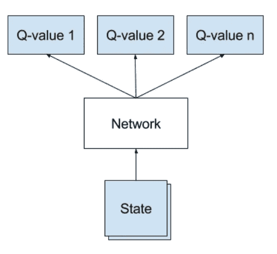
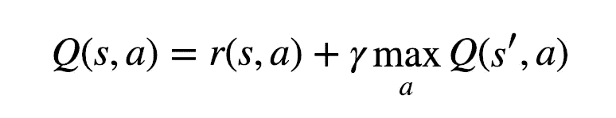
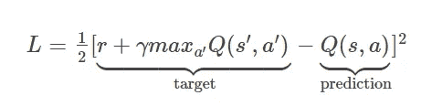
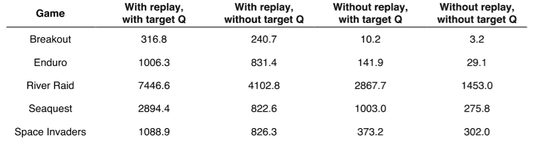
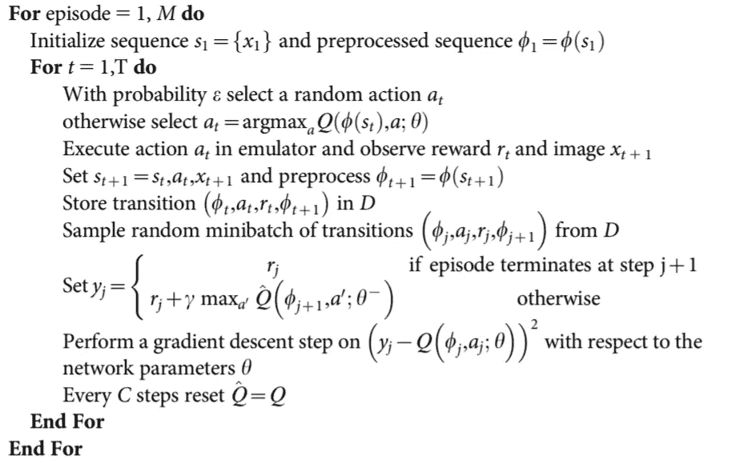
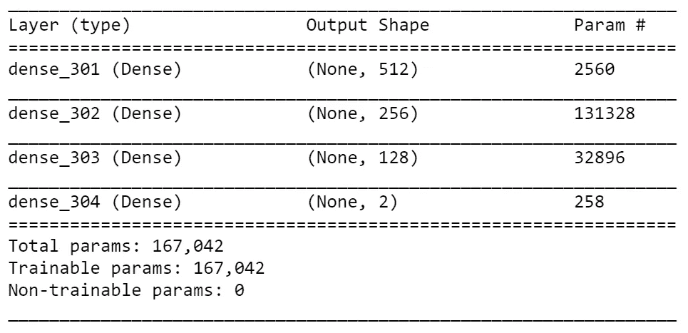
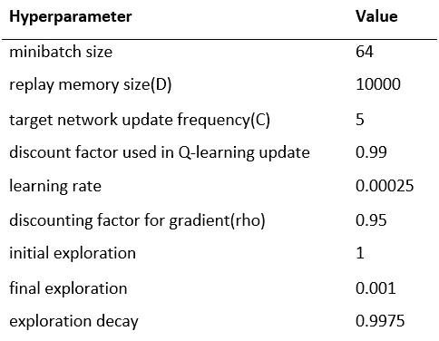
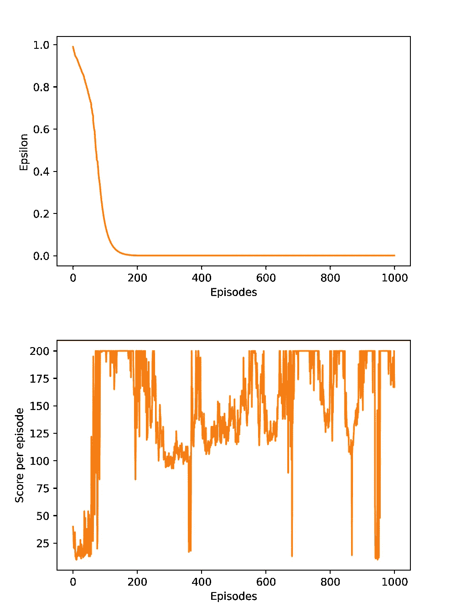
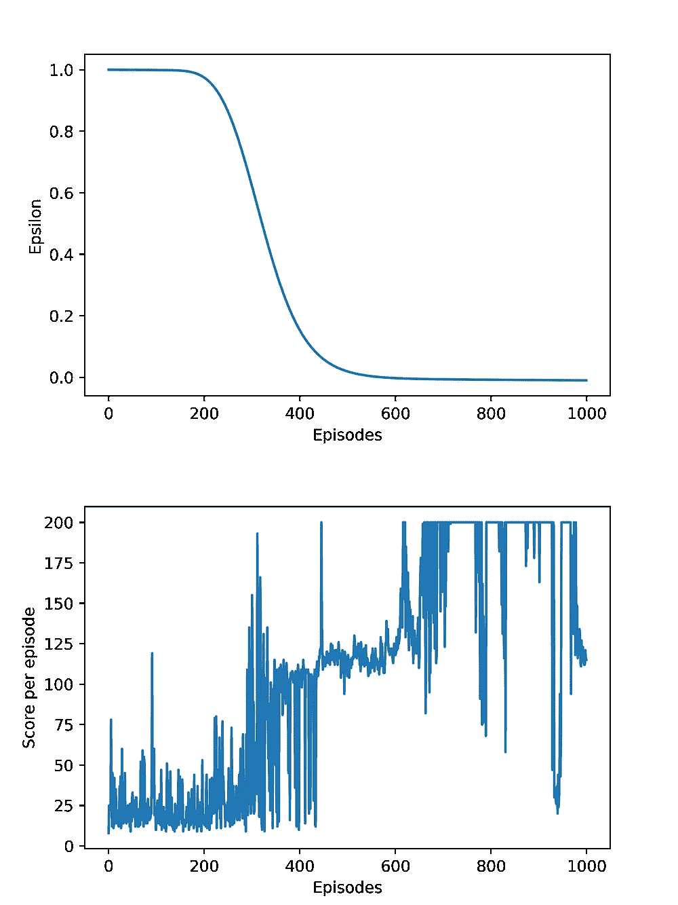
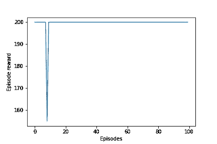

# 用强化学习解决开放人工智能的横向问题(下)

> 原文：<https://medium.com/analytics-vidhya/solving-open-ais-cartpole-using-reinforcement-learning-part-2-73848cbda4f1?source=collection_archive---------6----------------------->

在第一篇 [**教程**，](/analytics-vidhya/q-learning-is-the-most-basic-form-of-reinforcement-learning-which-doesnt-take-advantage-of-any-8944e02570c5)中，我介绍了最基础的强化学习方法，叫做 **Q-learning** 来解决侧翻问题。由于它的计算限制，它工作在简单的环境中，其中状态的数量相对较少。

在更复杂的环境中，为每个动作计算、存储和更新 **Q 值**要么是不可能的，要么是非常低效的**。这就是**深度 Q 网**发挥作用的地方。**

亨特·哈里特在 [Unsplash](https://unsplash.com?utm_source=medium&utm_medium=referral) 拍摄的照片

# **背景信息**

深度 Q 学习是 DeepMind 团队在 2013 年的[**用深度强化学习玩雅达利**](https://arxiv.org/pdf/1312.5602.pdf) 论文中引入的。第一个类似的方法是在 1992 年使用 TD-gammon 实现的。算法达到了一个**超人**级别的玩双陆棋。不过，这种方法并不适用于国际象棋、围棋或跳棋等游戏。

DeepMind 在 7 款雅达利游戏中有 3 款超过了人类的表现，使用了**原始** **图像**和所有游戏的相同超参数。这是在更普通的学习领域的一个突破。

DQN 的基本思想是它结合了 Q 学习和深度学习。我们去掉了 Q 表，而使用神经网络来代替**逼近**动作值函数(Q(s，a))。状态被传递到网络，作为输出，我们接收每个动作的估计的 **Q 值**。

DQN 建筑

为了训练网络，我们需要一个目标值，也称为基本事实。问题是，我们如何在实际上没有标记数据集的情况下评估**损失函数**？

嗯，我们**使用贝尔曼方程在运行中创建**目标值。

贝尔曼方程和损失函数 L

这个方法叫做**自举**。我们正试图**根据另一个估计来估计**某事。本质上，我们通过估计**未来**Q(s’，a)来估计**当前**动作值 Q(s，a)。

当使用一个网络来预测两个值时，问题就出现了。类似于狗抓自己的尾巴。权重被更新以使**预测**更接近目标 Q 值。尽管如此，目标值也将**向前移动**，因为我们使用相同的网络。

解决方案已经在 DeepMind 论文 [**中提出，通过深度强化学习**](https://web.stanford.edu/class/psych209/Readings/MnihEtAlHassibis15NatureControlDeepRL.pdf) **进行人级控制。**我们的想法是使用一个独立的网络来预测目标值。每 C 个时间步，来自策略网络的权重被复制到**目标网络**。它为算法提供了更大的稳定性，因为我们的网络不是试图追逐一个不稳定的目标。

为了使神经网络工作，我们需要四个值状态，行动(A)，回报(R)，未来状态(S’)。这些值存储在重放记忆向量中，然后随机采样进行训练。这个过程叫做**体验回放**，也被 [DeepMind](https://arxiv.org/pdf/1312.5602.pdf) 引入。

首先，我们使用了一种受**生物学**启发的机制，称为经验重放，它对数据进行随机化处理，从而消除观察序列中的相关性，并平滑数据分布的变化。为了执行体验重放，我们存储代理的体验 et=(st，at，rt，st+1)

使用经验重放和目标网络的结果[3]

> 具有经验回放和目标网络的深度 Q 学习培训流程:

[3]

# **实施细节**

1.  **环境**

> 一根杆子通过一个非驱动关节连接到一辆小车上，小车沿着一条无摩擦的轨道移动。通过对推车施加+1 或-1 的力来控制该系统。钟摆开始直立，目标是防止它翻倒。杆保持直立的每个时间步长提供+1 的奖励。当柱子偏离垂直方向超过 15 度，或者手推车偏离中心超过 2.4 个单位时，该集结束。[4]

2.**网络**

该架构基于具有 **Relu** 激活功能的**全连接层**。输出层是一个全连接层，每个**动作**有**两个**输出。
和强化学习中的很多论文一样，我使用了 **RMSProp** 优化器。

3.**超参数**

4.**代码**

在 [**Github**](https://github.com/maciejbalawejder/ReinforcementLearning-collection/tree/main/DQN) **上有剧情的版本。**

*   **定义车型**

*   **经验回放**

*   **ε用系数和用 a，b，c 参数来控制函数的形状**

*   **选择一个动作**

*   **训练功能**

*   **训练循环**

*   **测试回路**

## 结果

左边的第一个图显示了在发作期间每次迭代中**ε**值的衰减。右图显示了由三个参数定义的ε函数，以实现阶跃函数形状。

在剧集中获得最高分与 epsilon 值密切相关。当动作的随机性降低时，神经网络开始训练。保持最小值是为了防止随机状态转换记忆，也称为过拟合。

训练图

使用上图右侧的模型对 100 集进行测试

使用英特尔酷睿 i5–10210 u CPU 的培训过程大约需要 4 个小时，该模型似乎可以解决环境问题。

# 丰富

与大多数突破模型不同，这里描述的问题是使用**低维输入**，它使用原始图像作为输入，然后提取所有特征。然而，这是一个很好的平台来理解深度 Q 学习的想法是多么美好和强大。

为了减少训练时间，我会尝试不同形状的 **epsilon 的**函数。另一个重要的超参数是目标模型更新频率。可以用软更新*、*来代替，其中我们不立刻更新目标网络，而是频繁且非常少的更新【5】。

此外，对重放记忆中的经验进行优先排序可以提高训练过程的有效性[6]。

如果你想看我的其他项目检查我的 [**中**](https://maciejbalawejder.medium.com/) 和[**Github**](https://github.com/maciejbalawejder)**简介。**

# ****参考文献****

**[1] [https://arxiv.org/pdf/1312.5602.pdf](https://arxiv.org/pdf/1312.5602.pdf)**

**[2] [https://neuro.cs.ut.ee/demystifying-deep-reinforcement-learning/](https://neuro.cs.ut.ee/demystifying-deep-reinforcement-learning/)**

**[3] [https://web.stanford.edu/class/psych209/Readings/MnihEtAlHassibis15NatureControlDeepRL.pdf](https://web.stanford.edu/class/psych209/Readings/MnihEtAlHassibis15NatureControlDeepRL.pdf)**

**[4] [https://gym.openai.com/envs/CartPole-v0/](https://gym.openai.com/envs/CartPole-v0/)**

**[5] [https://arxiv.org/abs/2008.10861](https://arxiv.org/abs/2008.10861)**

**[6] [https://arxiv.org/abs/1511.05952](https://arxiv.org/abs/1511.05952)**