# 解决机器学习中的优化问题

> 原文：<https://medium.com/analytics-vidhya/solving-optimization-problems-in-machine-learning-4573c436bbc9?source=collection_archive---------2----------------------->

## 使用梯度下降和随机梯度下降算法

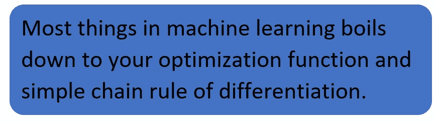

来源:作者图片

# **什么是优化？:**

优化，简单来说就是通过各种算法使成本或损失函数最小化的过程。这是通过找到算法正在优化的损失函数(或成本函数)的最小值来实现的。

在本文中，我们将讨论如何使用两种流行的算法优化损失函数——梯度下降和随机梯度下降。但在此之前，让我们了解一些概念，如微分，极大值和极小值。

# **微分&最大值/最小值:**

早期，当数据较少且损失函数易于求解时，我们使用微分和链式法则来优化损失函数，以解决优化问题。微分是我们在第 11 节数学课上学到的概念

> 通常，99%的机器学习优化依赖于微分&最大值/最小值

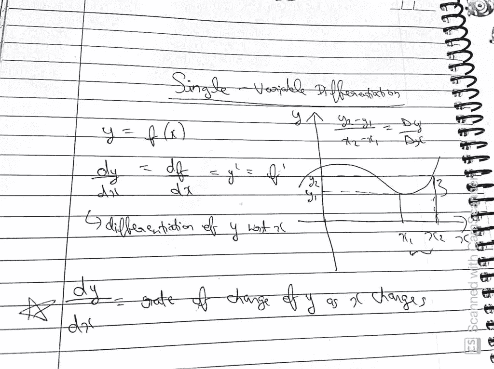

来源:作者图片

dy/dx 是 x 变化时 y 的变化率，即 x 变化时 y 变化多少。

链式法则是机器学习的另一个重要法则

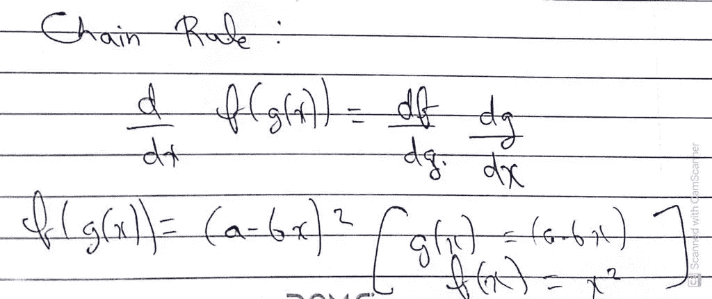

来源:作者图片

**在机器学习中，求导有助于计算丢失率 wrt 相对于权重变化率的变化率**

最大值/最小值:最大值和最小值是函数的极值，最大值是最大的，而最小值是最小的。

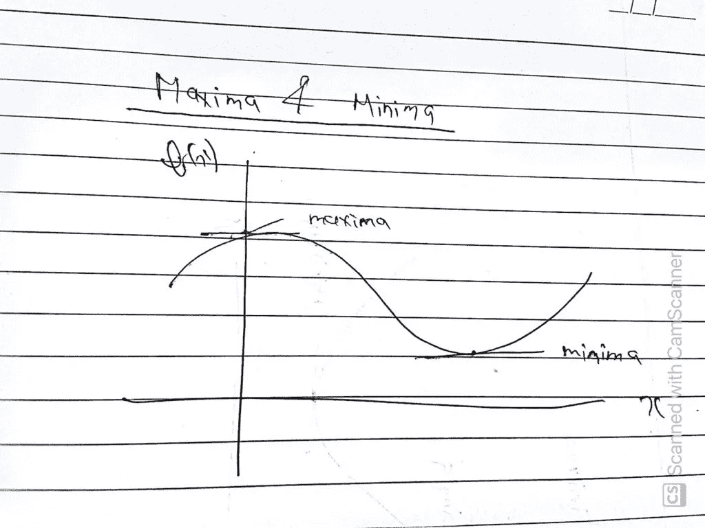

来源:作者图片

**最大值和最小值时斜率= 0**

在某些情况下，没有最大值或最小值。在某些情况下，可能有多个最小值和最大值。

可以有多个局部最小值和最大值，但只有一个全局最小值/最大值。

# **需要优化算法？:**

对于某些函数，很难求解微分，即 df/dx = 0，因为数据很大或函数太复杂。所以在这里，我们将使用类似**梯度下降的计算机算法。**

例如，解决逻辑损失方程是不容易的。

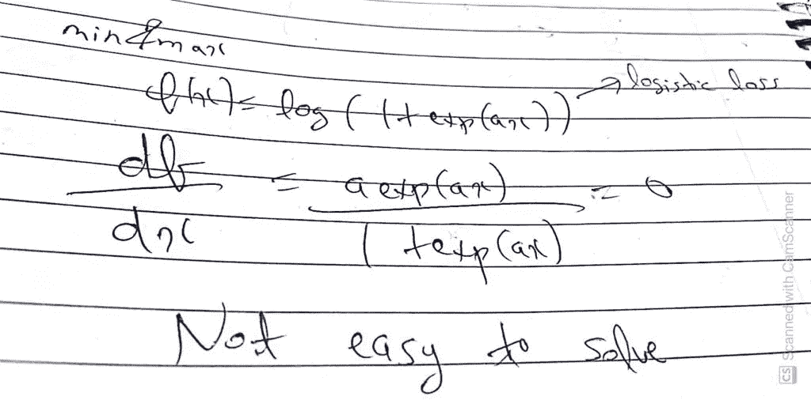

来源:作者图片

# 梯度下降:

这是一种**迭代**优化算法，很容易在现代计算机中实现。在机器学习中，梯度下降的目标是最小化损失函数。

**几何直觉:**

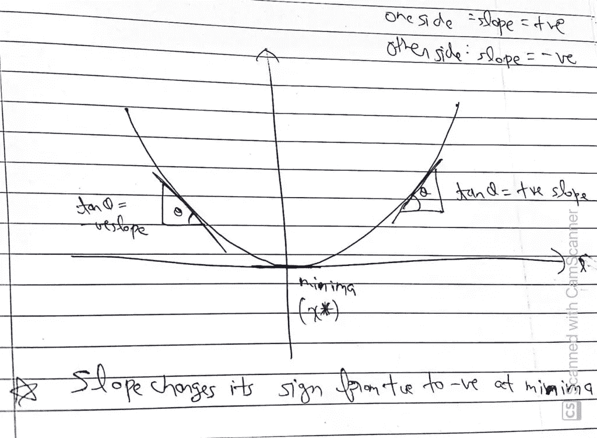

来源:作者图片

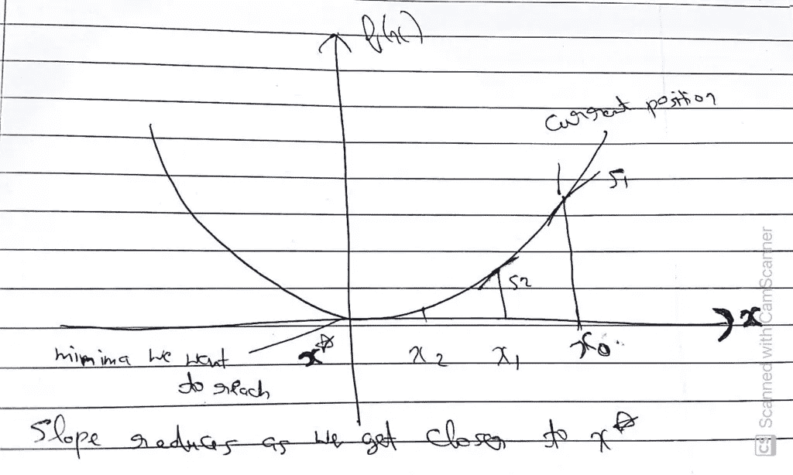

来源:作者图片

斜率在最小值时从+ve 变为-ve。其次，随着我们越来越接近最小值，即 x*，斜率不断减小。

在机器学习中，我们的目标是实现最大精度和最小误差，因此梯度下降通过帮助我们到达损失最小的最小值点来实现这一点。

让我们看看梯度下降实际上是如何工作的？

1.  随机选取初始值 Xo。
2.  计算局部最小值的公式如下:

Xᵢ = (Xᵢ-₁)-r[df/dx)在 Xᵢ-₁

这是更新功能

3.我们会在 X₀.找到 X₁ = X₀-r[df/dx](r 是这里的学习率，下面我们会了解。现在，让我们假设 r=1。这里 df/dx 无非就是梯度*。*

4.现在 X₁算出来会比 Xo 少

5.当差异(Xᵢ-Xᵢ-₁)很小时，即当 xᵢ-₁、xᵢ收敛时，我们将停止迭代，并宣布 X* = Xᵢ

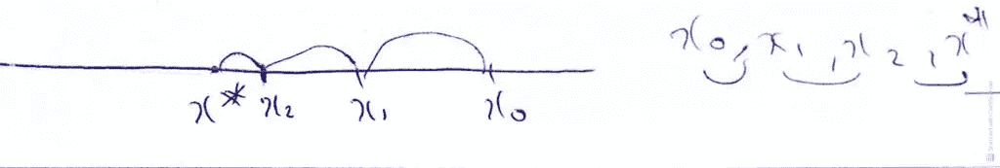

来源:作者图片

# 学习率:

学习率是一个超参数，必须仔细选择以达到最小点。它必须随着每次迭代而改变，否则如果保持不变，我们就会陷入振荡。我们可以在下面的图片中看到一个例子。这里，当 r =1 时，我们可以看到它在 X = -0.5 和 X = 0.5 之间振荡。

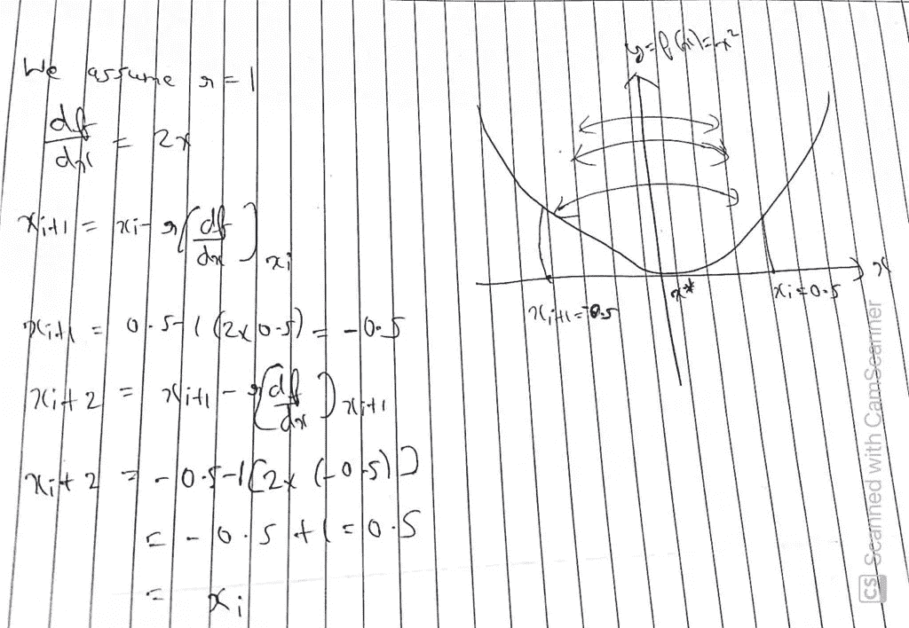

来源:作者图片

处理它的技术之一是在每次迭代中减少“r”。

# 线性回归的梯度下降；

在线性回归中，我们的任务是找到最符合数据点的最佳直线/平面。我们通过一个数学公式找到它，这是一个优化问题。

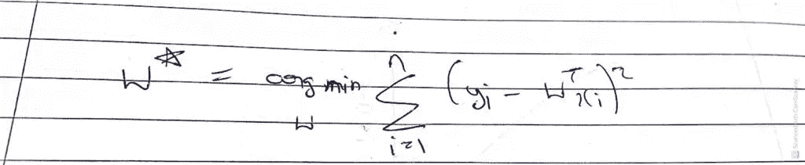

来源:作者图片

我们这里假设没有截距项 xo，也没有使用正则化。

现在对线性回归应用梯度下降算法:

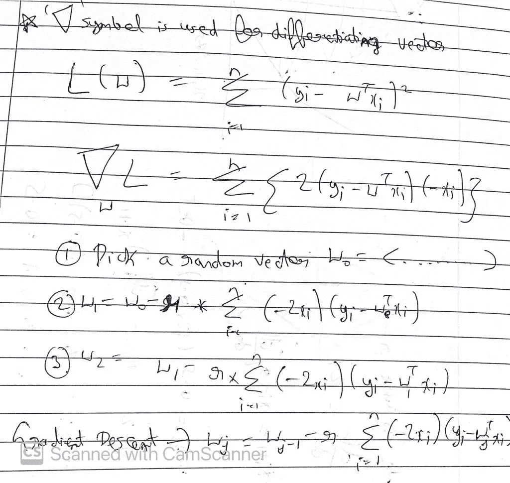

来源:作者图片

这里也是一样，我们不断更新权重“w ”,直到差异太小，在那里我们得到我们的最优 w*。

此外，我们将像上面一样在步骤 3 中更改“r”。

但是，当 n 很大时，我们面临一个问题，因为这个过程太耗时。完成一次迭代和更新 w 需要很多时间，此外，当 n 较大时，数据可能无法放入 RAM，因此我们可能会遇到内存问题。

# 随机梯度下降；

它是机器学习中最重要的优化算法。由于梯度下降算法的缺点，将其改进为随机梯度下降算法。

在 SGD 中，我们选择随机数量的点，而不是整个数据集。这节省了我们的时间，也避免了内存问题。

**线性回归中的新币:**

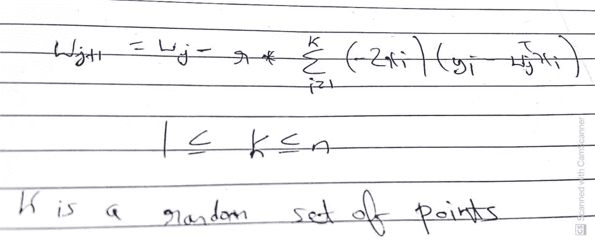

来源:作者图片

当我们从 n 个点中随机选择 k 个点时，这是无替换采样，我们将数据集分成批次，并将这些批次输入到模型中。

唯一的区别是 SGD 以批处理方式加载数据和更新权重。GD 一次搞定。

# 结论:

总之，优化是通过各种算法最小化成本或损失函数的过程。最重要的算法是随机梯度下降法。在深度学习中，它被扩展到 Adam，Adagrad，我们将在即将到来的博客中探索这一点。