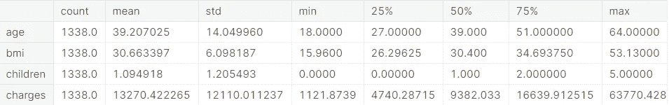
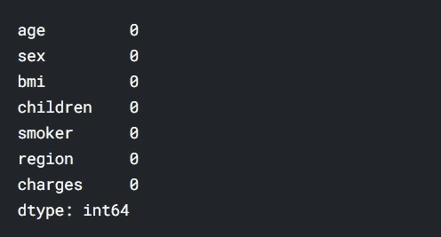
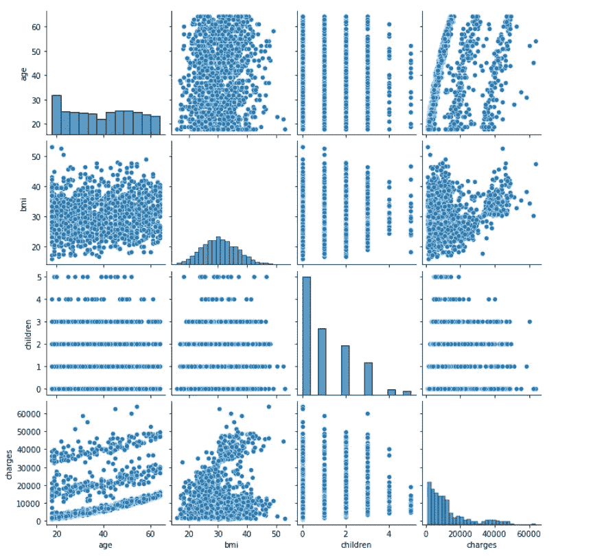
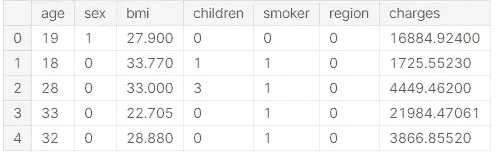
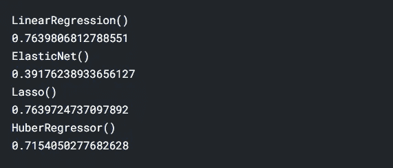
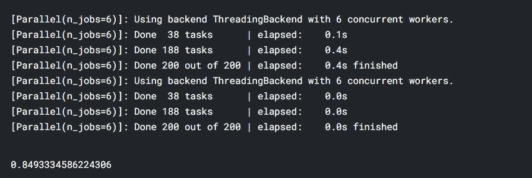
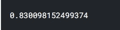
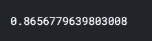
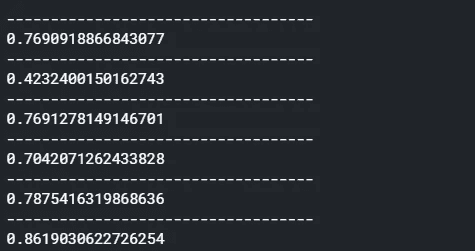

# 解决回归问题

> 原文：<https://medium.com/analytics-vidhya/solving-regression-problems-9cbd516a51a?source=collection_archive---------14----------------------->


由[肯德尔](https://unsplash.com/@hikendal?utm_source=medium&utm_medium=referral)在 [Unsplash](https://unsplash.com?utm_source=medium&utm_medium=referral) 上拍摄的照片

```
Dataset Used: [https://www.kaggle.com/mirichoi0218/insurance](https://www.kaggle.com/mirichoi0218/insurance)
My Noteboo[k: https://www.kaggle.com/tanishsawant2002/regression-85-score](https://www.kaggle.com/tanishsawant2002/regression-85-score)
```

数据集描述:(摘自 Kaggle)

# 语境

Brett Lantz 的 Machine Learning with R 是一本介绍使用 R 进行机器学习的书，据我所知，Packt Publishing 不会在网上提供其数据集，除非你购买这本书并创建一个用户帐户，如果你从图书馆借阅这本书或从朋友那里借书，这可能会是一个问题。所有这些数据集都在公共领域，但只需要一些清理和重新编码，以符合书中的格式。

# 内容

列

*   年龄:主要受益人的年龄
*   性别:保险承包商性别，女，男
*   bmi:身体质量指数，提供对身体的了解，体重相对于身高相对较高或较低，
    体重的客观指数(kg / m ^ 2)使用身高与体重的比率，理想值为 18.5 至 24.9
*   儿童:健康保险覆盖的儿童人数/受抚养人人数
*   吸烟者:吸烟
*   地区:受益人在美国的居住区，东北，东南，西南，西北。
*   费用:由健康保险支付的个人医疗费用

# 承认

数据集可在 GitHub [这里](https://github.com/stedy/Machine-Learning-with-R-datasets)获得。

# 灵感

你能准确预测保险费用吗？

好了，关于数据集已经说得够多了，现在让我们开始研究熊猫吧。

让我们将数据作为熊猫数据框架导入

```
df = pd.read_csv("/kaggle/input/insurance/insurance.csv")
df.head(10) 
```


输出

我通常喜欢将列名存储为列表。(因为某些功能将来可能会改变)。

```
cols = list(df.columns)
```

描述数字特征

```
df.describe().T
```



输出

检查缺少的值

```
df.isna().sum()
```



输出

dataset🥳🥳中没有缺失值

通过使用 [seaborn 的](https://seaborn.pydata.org/) pairplot 函数，我们可以快速查看每个特性之间的关系。

(Seaborn 是基于 [matplotlib](https://matplotlib.org/) 的 Python 数据可视化库。它提供了一个高层次的界面来绘制有吸引力的和信息丰富的统计图形。)

```
import seaborn as sns
import matplotlib.pyplot as pltsns.pairplot(df)
plt.show()
```



配对图

通过观察数据集，可以清楚地看到“性别”、“地区”和“吸烟者”是字符串数据类型列，可以进行热编码。

Panda 的 get_dummies()方法可以用于此目的。

```
df["sex"] = pd.get_dummies(df["sex"])
df["smoker"] = pd.get_dummies(df["smoker"])
df["region"] = pd.get_dummies(df["region"])
df.head()
```



现在数据被很好地编码了。

我们已经完成了预处理，准备开始构建模型。

但是等等，还有一个更关键的步骤。(分割数据集)

除了“费用”之外的所有列都可以添加到功能表中。

```
X = df[set(cols)-set(["charges"])]
y = df["charges"]
```

将数据分为训练和测试:

```
from sklearn.model_selection import train_test_split

X_train, X_test, y_train, y_test = train_test_split(X, y, test_size=0.33)
```

建筑模型:

在这里，我将许多模型添加到阵列中，以便于比较性能。一般来说，回归得分用 [r2_score](https://scikit-learn.org/stable/modules/generated/sklearn.metrics.r2_score.html) 或误差平方来衡量。

```
from sklearn import linear_model

reg = linear_model.LinearRegression()
elas = linear_model.ElasticNet()
lasso = linear_model.Lasso()
huber = linear_model.HuberRegressor()

models = [reg, elas, lasso, huber]

print(reg)for model **in** models:
    print(model)
    model.fit(X_train, y_train)
    print(model.score(X_test, y_test))
```



模型名称:分数

**使用 RandomForestRegressor:**

```
from sklearn.ensemble import RandomForestRegressor

rr = RandomForestRegressor(n_estimators=200, n_jobs = 6, verbose = True)
rr.fit(X_train, y_train)
rr.score(X_test, y_test)
```



**使用 XGBRegressor:**

```
xgb = XGBRegressor()
xgb.fit(X_train, y_train)
xgb.score(X_test, y_test)
```



得分

**xbgrf 回归器:**

```
 from xgboost import XGBRFRegressor

xgbrf = XGBRFRegressor()
xgbrf.fit(X_train, y_train)
xgbrf.score(X_test, y_test)
```



得分

检查 r2_score:

r(决定系数)回归得分函数。

最佳得分可能是 1.0，也可能是负数(因为模型可能会任意恶化)。忽略输入特征，始终预测 y 的期望值的常数模型的 R 值为 0.0。

```
from sklearn.metrics import r2_scorefor model in models:
    print("-----------------------------------")
    print(r2_score(y_test, model.predict(X_test)))
```



输出

结论:

**XBGRFRegressor 给出了最好的 r2_score。**

这就是我们需要做的一切😃。

恭喜你！我们已经成功地建立了一个预测医疗费用的模型。🎉🎊