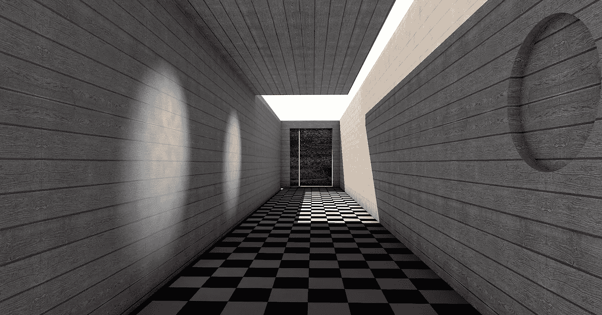
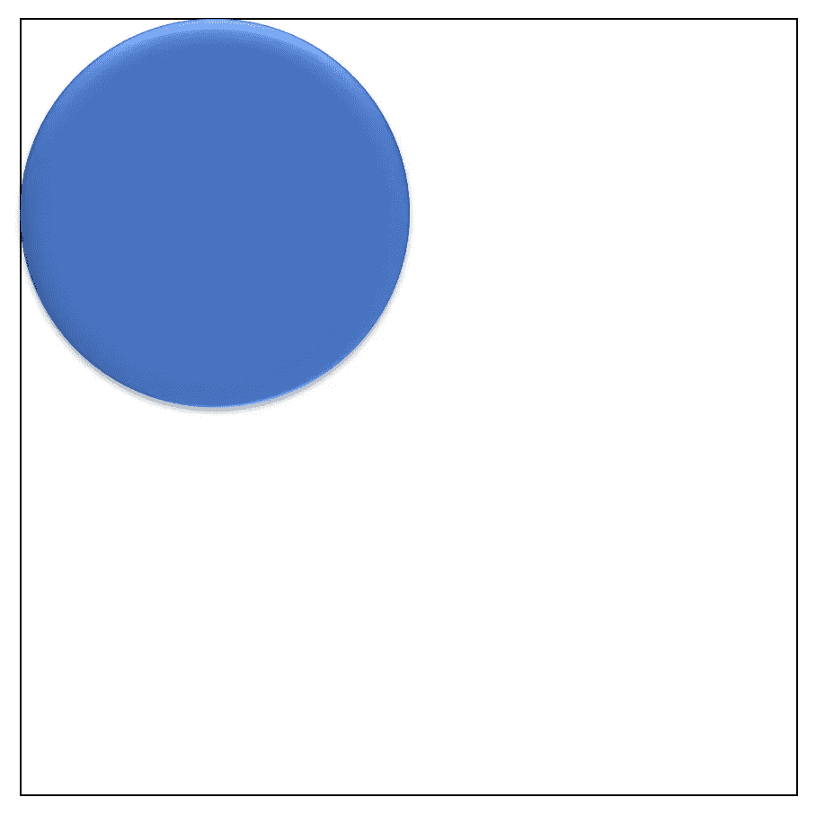
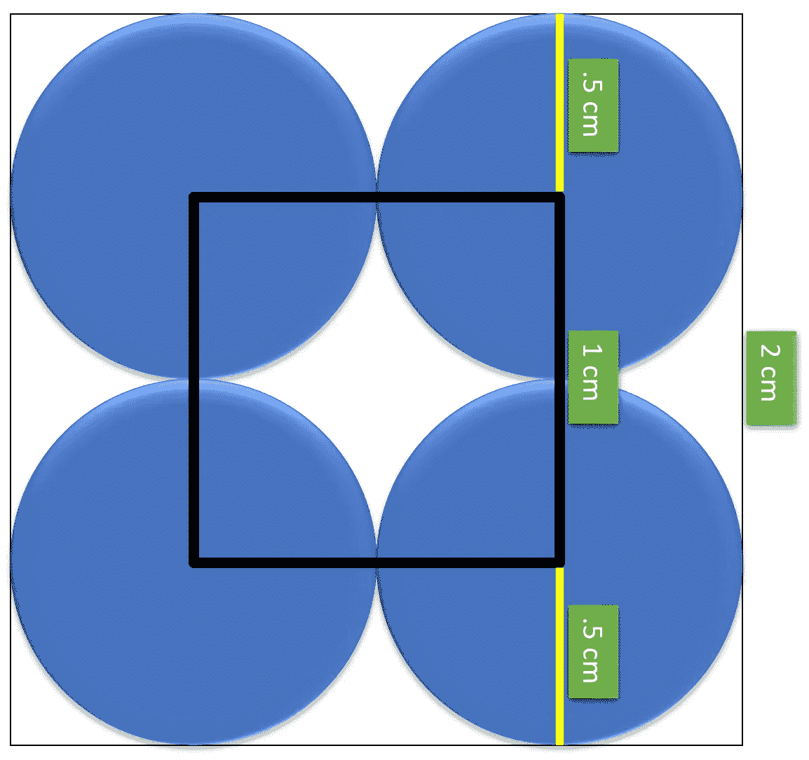

# 解决棋盘上的硬币难题—第一部分

> 原文：<https://medium.com/analytics-vidhya/solving-the-coin-on-a-chessboard-part-1-e7d213d93f9?source=collection_archive---------2----------------------->

## 分析方法

图片由 [PIRO4D](https://pixabay.com/users/piro4d-2707530/?utm_source=link-attribution&utm_medium=referral&utm_campaign=image&utm_content=1702543) 来自 [Pixabay](https://pixabay.com/?utm_source=link-attribution&utm_medium=referral&utm_campaign=image&utm_content=1702543)

# 问题

> 一枚直径为 1 的硬币被扔在一个无限大的棋盘上，棋盘上有 2 面的正方形。
> 
> 硬币落在同时接触到黑色和白色的位置上的几率有多大？

说真的，在你继续阅读之前，先试着解决这个问题。你的第一想法是什么？以下是我的一些想法:

1.  我们如何处理无限大的棋盘？
2.  黑白方块真的重要吗？
3.  两枚硬币可以并排放入一个正方形中。
4.  硬币是一个圆，所以一个正方形有四个三角形的角，如果不与另一个正方形重叠，这个圆就不可能接触到。

快速谷歌搜索表明，这是一个在高声誉公司常见的面试问题，所以它可能会对你有用。

# 解决办法

事实证明，我最初的一些想法实际上是解决这个问题的正确途径。这里是我们应该开始的第一个地方。让我们忘记无限板，把它缩小到只有 1 平方。现在，让我们在正方形的左上方画一个直径为 1 的圆，同时确保它不出界。

接下来，让我们在其他角落再画 3 个圆。我们现在有 4 个直径大小为 1 的圆，它们都位于棋盘正方形的边界内。巧合的是，我们也有 4 个中心组成一个正方形。

我们创造的这个广场非常有趣。硬币所有可能的中心都在这个正方形内，不会与较大正方形的边界重叠。如果硬币的中心落在内部方块之外，它将与另一个棋盘方块重叠，或者换句话说，硬币将接触到黑色和白色的方块。

因此，要解决我们的问题，我们需要找到不包括内圆面积的外部正方形的面积，并除以较大正方形的面积。

> 硬币接触黑白的概率=(棋盘方格的面积-内部方格的面积)/棋盘方格的面积

*   棋盘正方形的面积= 2 = 4
*   内正方形的面积= 1 = 1(半径的长度= 0.5，因此从外正方形到内正方形的距离= 0.5，这些距离中有 2 个加起来等于 1)
*   *硬币碰到黑色&白色* = (4 — 1)/4 = **.75** 的概率

# 结论

在我们的例子中，无限长的棋盘并不重要，因为所有的方格大小相等，而且它们也彼此相邻。因此，硬币落在同时接触到黑色和白色的位置上的概率是 0.75。

现在，0.75 只是这个问题的假设的可能答案。但是，当我们通过使用计算机视觉和蒙特卡罗模拟进行多次实际运行时，会发生什么呢？请继续关注这个问题的第二部分！

Ronel Sylvester 是 Predmatic 的 ML 工程师，在音频分类、深度学习、计算机视觉/图像处理和预测方面拥有丰富的经验。Predmatic 是一家基于数据科学和人工智能的咨询公司，提供高影响力和可扩展的业务解决方案。

[T3【https://www.linkedin.com/company/predmatic/】T5](https://www.linkedin.com/company/predmatic/)