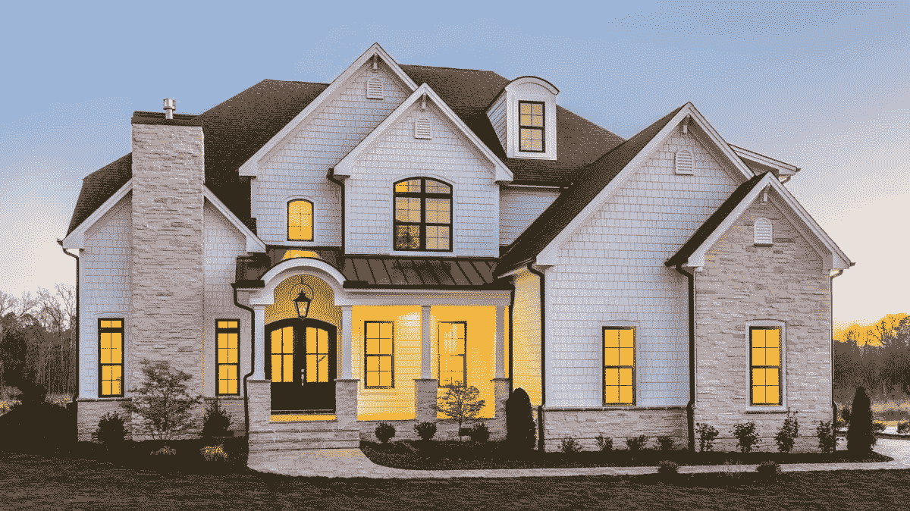
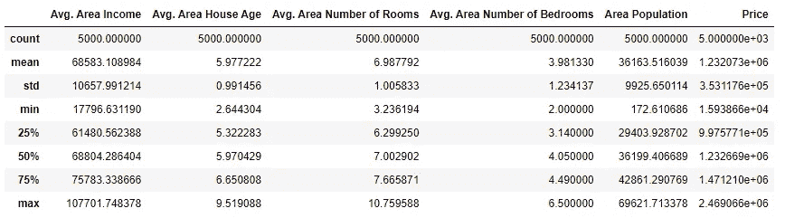
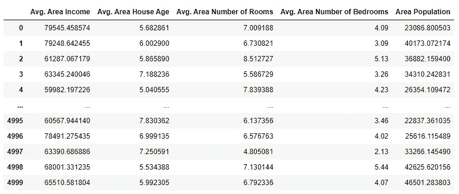
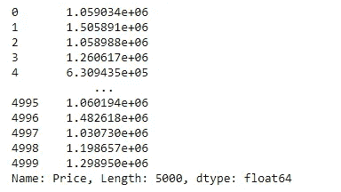
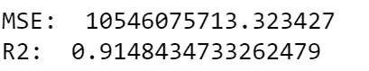

# 解决你的第一个回归程序——房价预测

> 原文：<https://medium.com/analytics-vidhya/solving-your-first-regression-program-house-price-prediction-bc31a0fe9e7b?source=collection_archive---------6----------------------->

因此，在本文中，我们将解决预测房价的第一个回归程序。



首先，你得准备好环境。我上传了一个 YouTube 视频来指导你安装 Python 和 iPython (Jupyter 笔记本)。

现在打开命令窗口，开始安装我们将在这个项目中使用的包。我们在之前的[文章](https://omaratef3221.medium.com/starting-guide-to-artificial-intelligence-part-2-e411d8335e4f)中讨论过这些包。现在首先我们将通过编写这个命令来安装 pandas 库。

> pip 安装熊猫

现在我们将安装 Numpy 库。

> pip 安装数量

然后，我们将通过键入以下命令来安装 sci-kit learn

> pip 安装 scikit-学习

现在我们准备好出发了！

首先，我们将从 [Kaggle](https://www.kaggle.com/vedavyasv/usa-housing) 下载数据集美国住房。

现在，将这些文件保存在笔记本所在的同一文件夹中，以便我们在 Jupyter 笔记本中使用这些文件时一切都变得简单。

打开笔记本后，首先，我们将开始读取数据，我们将使用 pandas 库读取数据，首先，我们将使用 import 语句读取 pandas 库，然后我们将读取如下所示的文件。

现在，在阅读数据之后，我们必须在继续机器学习部分之前探索一下。首先，我们将检查数据集每个要素的数据类型。

这段代码的输出如下所示:

```
Avg. Area Income                float64
Avg. Area House Age             float64
Avg. Area Number of Rooms       float64
Avg. Area Number of Bedrooms    float64
Area Population                 float64
Price                           float64
Address                          object
```

这意味着我们在这个数据集中有 6 个特征，我们在机器学习中称之为“独立变量”。我们只有一个产量，即价格“因变量”。上图中显示的数据类型表明所有变量都是 float64，除了地址是一个对象，这是有意义的，因为它是一个描述房子地址的字符串。

*   平均值。地区收入:是居住在这个地区的人们的平均收入。
*   平均值。地区房屋年龄:是该地区房屋的平均年龄。
*   平均值。面积房间数:是该地区房屋的平均房间数。
*   平均值。卧室面积数:是该地区房屋的平均卧室数。
*   地区人口:该地区的人口。
*   地址:是房子的地址。

现在，为了简单起见，我们将不使用字符串数据类型，我们将使用下面的代码删除行地址:

上面的代码不会有任何输出，但是如果您想确保它工作正常，只需在单独的单元格中键入数据并检查输出。

现在，我们将使用下面的代码研究基本的统计属性:

这一行的输出将是一个包含数据集详细信息的表。不同的详细信息，如每列的最大和最小数量、计数、平均值和标准偏差。此外，下限和上限百分点。



任何机器学习任务中最常见的问题之一是缺少值。收集的数据通常会有一些错误和一些缺失值。可能是由于任何原因，特别是机器学习数据是非常大量的数据，所以它们大多是使用 web 报废或任何自动化方法收集的。所以处理缺失值有几种方法。我们将在接下来的博客中讨论如何处理缺失的价值观。现在，我们可以使用以下代码来检查丢失的值:

输出将是:

```
Avg. Area Income                0
Avg. Area House Age             0
Avg. Area Number of Rooms       0
Avg. Area Number of Bedrooms    0
Area Population                 0
Price                           0
dtype: int64
```

幸运的是，这个数据集没有任何缺失值，但是请记住，这种情况不会经常发生！

现在我们可以从机器学习的第一部分开始，这是一个监督学习项目，所以在任何 ML 监督学习项目中，数据都要拆分成训练和测试。培训中的数据应该与测试中的数据完全不同。这和你教孩子的方式一模一样。你可以通过一些图片教他猫和狗的区别。然后当你想测试他的时候，你不能用你以前教他的图片来测试他！不然会被认为是出轨，没有意义！

因此，数据应该分为训练输入、训练输出、测试输入和测试输出。

首先，让我们划分训练和测试的输入和输出。下面的代码将把数据分成输入(x)和输出(y)。

因此，第一行使用 iloc 函数，该函数将获取一部分数据并将其存储在值 x 中。冒号(:)表示所有行，第二个参数表示第一列中最后一列之前的一行(-1)。-1 表示除最后 1 外，-2 表示除最后 2 外，以此类推。

第二行代码将获取所有行，只获取最后一列，即输出列。

那么，让我们看看 X 和 Y 是什么样子的，只需在单元格中键入每个变量的名称，它就会自动显示出来。

x:



y:



因此，数据被分为输入和输出。现在让我们将培训和测试分开。通常情况下，训练量应该大于测试量。大多数情况下，训练占数据的 70%，测试占 30%。我们之前下载的 Sklearn 包提供了一个简单易用的函数来拆分数据，如下所示，首先，我们必须导入一个名为 train test split 的函数，我们将要求 python 导入它，然后我们将使用它。

第一行是从这个包中导入一个特定的函数，第二行是使用带有 3 个主要参数的函数，并输出输入序列(x_train)、输入测试(x_test)、输出序列(y_train)和输出测试(y_test)。它有 3 个参数，分别是 x，y，测试数据大小是 0.3 (30%测试)。

现在，我们将建立一个线性回归模型。该模型将是简单的，将只是根据我们之前谈到的数据预测房价。

首先从 sklearn 包中导入线性回归函数，然后创建一个新模型，从而构建模型:

然后，我们将使用如下所示的拟合函数来训练模型。

现在我们有了一个训练有素的模型。所以现在我们必须在测试数据上测试我们的模型。在 ML 中，我们使用术语(预测)。以下代码将预测测试输入的输出:

变量 predicted_result 将与存储在 y_test 中的实际结果进行比较。然后我们可以提取模型预测的准确性。我们将检查输出的均方误差(MSE)和 R2 变量，该变量显示预测数据和真实数据是如何分散和匹配在一起的，我们需要最低的均方误差和最高的 R2:

所以我们从包中导入了两个函数来获得 MSE 和 R2。结果如下:



MSE 误差太高，但这是意料之中的，因为我们比较的工资显然是一个很高的数字，然而，R2 是 91%，这意味着我们的模型表现非常好。

现在我们已经建立了一个线性回归模型，ML 不是那么简单，但这是一个开始。后面的文章会有更多的模型和更高级的解释。