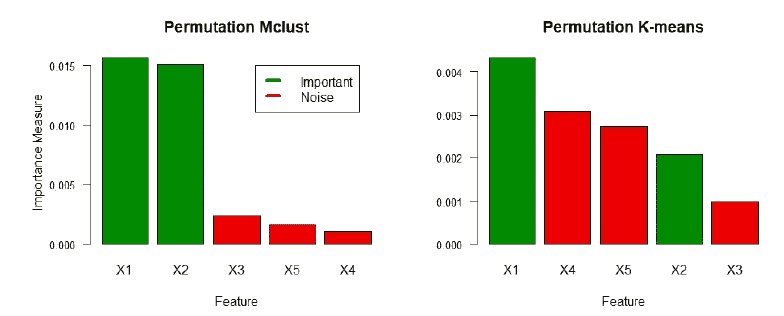

# 专业环境中数据可视化的一些考虑

> 原文：<https://medium.com/analytics-vidhya/some-considerations-for-data-visualization-in-professional-settings-b6a030d41aa4?source=collection_archive---------15----------------------->

阿列克斯·多罗霍维奇在 [Unsplash](https://unsplash.com/s/photos/data-visualization?utm_source=unsplash&utm_medium=referral&utm_content=creditCopyText) 上的照片

数据可视化在专业环境中非常重要。它已经存在很长时间了。甚至在数据即软件和工具如 Tableau 出现之前，人们就使用 Excel 和 PowerPoints 来制作壮观的仪表盘和报告。不管使用什么工具，当我们在专业环境下制作报告时，总有一些简单但重要的考虑因素。在这篇文章中，我将根据我的经验来讨论其中的一些。

**显示什么**:就像我们生活中做的大多数事情一样，决策在数据可视化中也是必不可少的。在数据可视化中，我们需要决定表示数据的最佳方式。有时候一张简单的桌子就足够了。在其他情况下，我们使用图表:条形图、饼图、散点图、直方图等。但并不是所有的方法在每种情况下都有用。根据数据的性质(例如，离散或分类)和信息量(维度/变量的数量)，我们必须决定正确的图表类型。但是，在选择图表类型时，受众是一个关键的考虑因素。例如，如果观众不习惯箱线图，使用其他东西可能是更好的主意，即使箱线图可能最适合该数据集。

**一致性:**如果你使用的数据是针对拥有大量图表的大量受众，那么在图表/页面/幻灯片之间保持一致是非常重要的。例如，我曾经为客户准备报告，其中包括公司层面、品牌层面和 SKU 层面的销售数据(以及其他数据),细分为不同的销售区域和分销渠道。尽管负责 A 区的人对 B 区发生的事情兴趣不大，但高级管理层对各区域的表现非常好奇。其中一些演示和报告很大(超过 100 张幻灯片)。想象一下，一位高级经理在看完第 10 张幻灯片后看第 80 张幻灯片，如果图表中竞争对手的颜色不一致，他们会非常困惑。

**格式:**我说的格式是指报表结构。有时，您的受众已经习惯了某种格式，他们更希望不同时期的格式和图表类型都相同。这对于定期报告尤其重要。原因之一可能是人们不喜欢改变。但最重要的是，如果格式保持不变，那么观众将不得不花更少的时间和精力来理解格式，而可以专注于故事。

**少花钱多办事:**对观众来说，把事情简单化总是个好主意。与其让观众浏览文本，不如用图表来描述故事，这样更容易捕捉。对于我的研究项目，我决定用柱状图展示我的实验结果。然而，如果我不对两种类型的特征使用不同的颜色(绿色和红色)，读者将不得不通读文本来理解它的意思。取而代之的是，用不同的颜色来标记重要的和不重要的特征，这使得读者能够立刻捕捉到信息。

这是一个非常简单的例子，但类似的想法可以应用到其他案例中，以确保受众轻松快速地掌握信息。

**即兴:**你可能会问，如果数据可视化有这么多考虑(或限制)，那么有没有办法展示我的数据可视化技巧。显而易见的答案是视情况而定。如果你正在做一个一次性的报告/陈述，并且听众和你的组织允许你发挥创造力，那么你可以尽可能地即兴发挥。然而，如果观众喜欢固定格式，那么即兴创作就困难得多。在这种情况下，您可以包含一个高级摘要页面，在其中展示您的数据可视化技能。

现代数据可视化工具和软件使得分析师很容易在短时间内做出惊人的可视化。尽管这个领域有很多创新和技术进步，你的观众仍然是中心。我不想让他们看到什么。而是他们想看什么。它一直都是这样，没有理由相信它会在不久的将来改变。