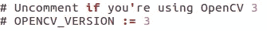
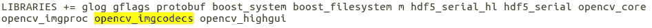

# 在 Ubuntu 16.04 上安装 Caffe 的一些错误和解决方法

> 原文：<https://medium.com/analytics-vidhya/some-errors-and-solutions-for-installing-caffe-on-ubuntu-16-04-3e4eb6160ea?source=collection_archive---------16----------------------->

[Caffe](https://caffe.berkeleyvision.org/) ，深度学习框架。这是一个伟大的框架，然而在安装过程中，它设法让我质疑生命的意义(LOL)。还有很多我认为没有包括在内的小错误，因为当我写这篇文章时，我的第一次安装经历已经过去了几个月。

这里是我遇到的一些错误，希望其中一些能帮助到阅读这篇文章的人。所有这些错误都发生在安装 Caffe 的“make all”过程中。

*澄清一下:我正在安装的 CPU 版本是 Caffe，使用的 OpenCV 版本是 2.4.10。如果您使用 OpenCV 3+，情况可能会有所不同。*

# **1)没有找到 make:protocol:Command**

完整的错误日志:

> protocol src/caffe/proto/caffe . proto
> make:protocol:找不到命令
> Makefile:638:目标的配方。“build _ release/src/caffe/proto/caffe . Pb . cc”未能通过
> make:* * * *[。build _ release/src/caffe/proto/caffe . Pb . cc]错误 127

解决方案:在终端中运行' sudo apt-get install libprotobuf-dev '。

然后，再次“清除”和“全部清除”。

# **2)致命错误:boost/function.hpp:没有这样的文件或目录**

完整的错误日志:

> CXX。包含的文件中的 build _ release/src/caffe/proto/caffe . Pb . cc
> CXX src/caffe/solvers/SGD _ solver . CPP
> 。/include/caffe/SGD _ solvers . HPP:7:0，
> 来自 src/caffe/solvers/SGD _ solver . CPP:4:
> 。/include/caffe/solver.hpp:3:30:致命错误:boost/function.hpp:没有这样的文件或目录
> 编译终止。
> Makefile:581:目标配方。' build _ release/src/caffe/solvers/SGD _ solver . o '未能通过
> make:* * * *[。build _ release/src/caffe/solvers/SGD _ solver . o]错误 1

解决方案:在终端中运行' sudo apt-get install-no-install-recommendes libboost-all-dev '。

然后，再次“清除”和“全部清除”。

# **3)致命错误:cblas.h:没有这样的文件或目录**

完整的错误日志:

> CXX。包含的文件中的 build _ release/src/caffe/proto/caffe . Pb . cc
> CXX src/caffe/solvers/SGD _ solver . CPP
> 。/include/caffe/util/math _ functions . HPP:11:0，
> from。/include/caffe/layer.hpp:12，
> from。/include/caffe/net.hpp:12，
> 来自。/include/caffe/solver.hpp:7，
> from。/include/caffe/SGD _ solvers . HPP:7，
> from src/caffe/solvers/SGD _ solver . CPP:4:
> 。/include/caffe/util/mkl _ alternate . HPP:14:19:致命错误:cblas.h:没有这样的文件或目录
> 编译终止。Makefile:581:目标的配方。' build _ release/src/caffe/solvers/SGD _ solver . o '未能通过
> make:* * * *[。build _ release/src/caffe/solvers/SGD _ solver . o]错误 1

解决方案:在终端中运行' sudo apt-get install lib atlas-base-dev '。

然后，再次“清除”和“全部清除”。

# 4)找不到-lopencv_imgcodecs

完整的错误日志:

> /usr/bin/ld:找不到-lopencv_imgcodecs
> collect2:错误:ld 返回 1 退出状态
> Makefile:572:目标的配方。' build _ release/lib/lib caffe . so . 1 . 0 . 0-rc5 '未能通过
> make:* * * *[。build _ release/lib/lib caffe . so . 1 . 0 . 0-rc5]错误 1

这实际上发生了，因为我使用 OpenCV 2+。“opencv_imgcodecs”仅在 OpenCV 3+中需要和可用。

**对于 OpenCV 2+用户:**

请确保“Makefile.config”文件中的“OPENCV_VERSION := 3”已被注释:

然后，打开“Makefile”文件，按 Ctrl+F 检查库中是否有“opencv_imgcodecs ”,如下图所示。取出来应该就没事了。

如果您碰巧包含了“opencv_imgcodecs ”,请删除它(对于 OpenCV 2+)

# 5) NVCC 致命错误:不支持的 GPU 架构“compute_20”

完整的错误日志:

> NVCC src/caffe/solvers/adagrad _ solver . Cu
> nvcc 致命:不支持的 gpu 架构' compute _ 20 '
> NVCC src/caffe/solvers/SGD _ solver . Cu
> nvcc 致命:不支持的 gpu 架构' compute_20'
> Makefile:607:目标的配方'。' build _ release/cuda/src/caffe/solvers/rms prop _ solver . o '失败

在这种情况下，由于不支持“compute_20”，只需转到“ *Makefile.config* ”文件，删除 CUDA_ARCH 的这两行:

> -gencode arch=compute_20，code = sm _ 20 \
> -gen code arch = compute _ 20，code=sm_21 \

# **结论？**

好了，这就是我现在收集的所有错误。请告诉我，如果你遇到了这里没有提到的错误，我会在有空的时候尽力找到解决方法。干杯！

Caffe 官方安装指南链接:[https://caffe.berkeleyvision.org/installation.html](https://caffe.berkeleyvision.org/installation.html)